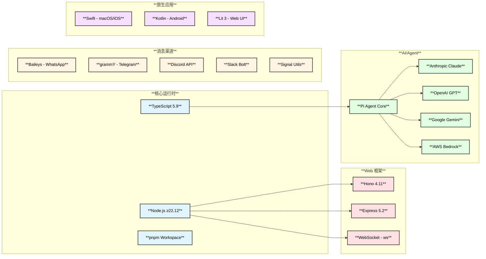
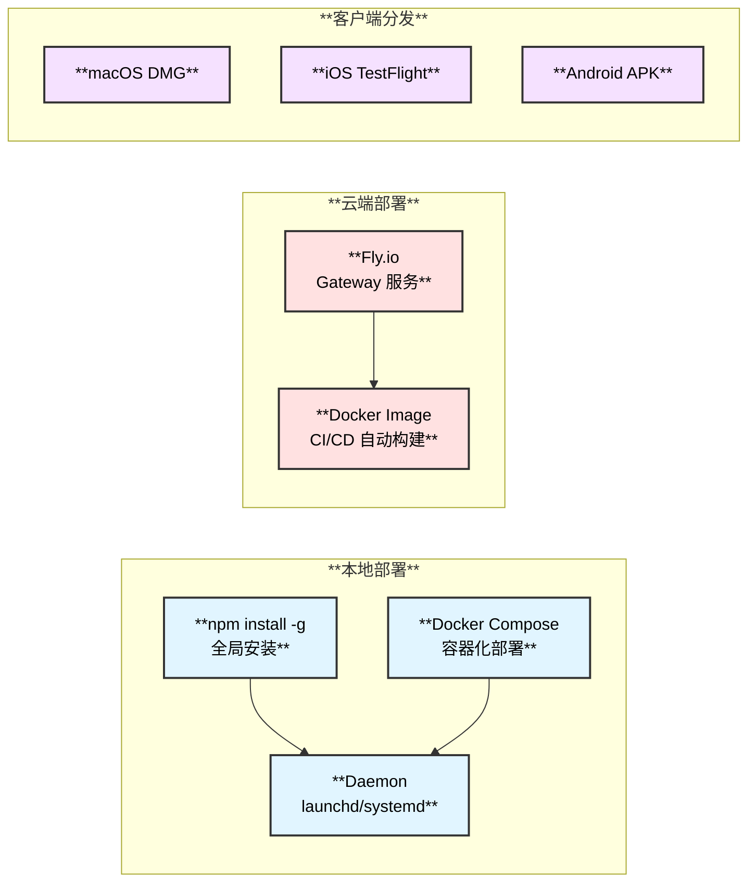

# OpenClaw 概述与架构

## 1. 项目简介

OpenClaw 是一个**个人 AI 助手平台**，支持在本地设备上运行，通过多种消息渠道（WhatsApp、Telegram、Slack、Discord、Signal、iMessage 等）与用户交互。它提供 Gateway WebSocket 控制平面、多 Agent 路由、语音唤醒、Canvas 可视化等功能，并拥有强大的插件/扩展系统。

| **属性** | **详情** |
|:---:|:---:|
| **版本** | 2026.2.6-3 |
| **运行时** | Node.js ≥22.12.0（ESM） |
| **语言** | TypeScript 5.9.3 |
| **包管理** | pnpm 10.23.0（Workspace） |
| **构建工具** | tsdown |
| **测试框架** | Vitest |
| **部署方式** | npm / Docker / Fly.io / 原生 App |

## 2. 技术栈总览



## 3. 整体架构图

```mermaid
graph TB
    subgraph "**客户端层 Client Layer**"
        CLI[**CLI 命令行**]
        WEB[**Web Control UI<br/>Lit 3 + Vite**]
        MAC[**macOS App<br/>SwiftUI**]
        IOS[**iOS App<br/>SwiftUI**]
        AND[**Android App<br/>Kotlin Compose**]
    end

    subgraph "**网关层 Gateway Layer**"
        GW[**Gateway Server<br/>WebSocket + HTTP**]
        PROTO[**Protocol<br/>JSON Frames**]
        AUTH[**认证模块<br/>Token/Password/DeviceSig**]
    end

    subgraph "**Agent 核心层**"
        AGENT[**Pi Agent Runtime<br/>多模型支持**]
        TOOLS[**工具系统<br/>Web Search / Browser / Fetch**]
        SKILLS[**Skills 系统<br/>SKILL.md 自动发现**]
        SESSION[**会话管理<br/>JSONL Transcript**]
    end

    subgraph "**渠道层 Channel Layer**"
        TG[**Telegram<br/>grammY**]
        WA[**WhatsApp<br/>Baileys**]
        DC[**Discord**]
        SL[**Slack<br/>Bolt**]
        SIG[**Signal**]
        IM[**iMessage**]
        MORE[**Matrix / Teams<br/>Feishu / LINE ...**]
    end

    subgraph "**插件与扩展层**"
        PLUGIN[**Plugin Registry<br/>插件注册中心**]
        HOOK[**Hook System<br/>生命周期钩子**]
        EXT[**Extensions<br/>extensions 目录**]
        MEM[**Memory<br/>LanceDB / Core**]
    end

    subgraph "**基础设施层**"
        CONFIG[**Config Manager<br/>Zod Schema**]
        MEDIA[**Media Pipeline<br/>图片/音频/视频**]
        CRON[**Cron Scheduler<br/>定时任务**]
        DAEMON[**Daemon Manager<br/>launchd/systemd**]
        INFRA[**Tailscale / DNS<br/>网络基础设施**]
    end

    CLI --> GW
    WEB --> GW
    MAC --> GW
    IOS --> GW
    AND --> GW

    GW --> PROTO
    GW --> AUTH
    GW --> AGENT

    AGENT --> TOOLS
    AGENT --> SKILLS
    AGENT --> SESSION

    AGENT --> TG
    AGENT --> WA
    AGENT --> DC
    AGENT --> SL
    AGENT --> SIG
    AGENT --> IM
    AGENT --> MORE

    GW --> PLUGIN
    PLUGIN --> HOOK
    PLUGIN --> EXT
    PLUGIN --> MEM

    AGENT --> CONFIG
    AGENT --> MEDIA
    GW --> CRON
    GW --> DAEMON
    GW --> INFRA

    style CLI fill:#e1f5ff,stroke:#333,stroke-width:2px,color:#000
    style WEB fill:#e1f5ff,stroke:#333,stroke-width:2px,color:#000
    style MAC fill:#e1f5ff,stroke:#333,stroke-width:2px,color:#000
    style IOS fill:#e1f5ff,stroke:#333,stroke-width:2px,color:#000
    style AND fill:#e1f5ff,stroke:#333,stroke-width:2px,color:#000

    style GW fill:#ffe1e1,stroke:#333,stroke-width:2px,color:#000
    style PROTO fill:#ffe1e1,stroke:#333,stroke-width:2px,color:#000
    style AUTH fill:#ffe1e1,stroke:#333,stroke-width:2px,color:#000

    style AGENT fill:#e1ffe1,stroke:#333,stroke-width:2px,color:#000
    style TOOLS fill:#e1ffe1,stroke:#333,stroke-width:2px,color:#000
    style SKILLS fill:#e1ffe1,stroke:#333,stroke-width:2px,color:#000
    style SESSION fill:#e1ffe1,stroke:#333,stroke-width:2px,color:#000

    style TG fill:#fff3e1,stroke:#333,stroke-width:2px,color:#000
    style WA fill:#fff3e1,stroke:#333,stroke-width:2px,color:#000
    style DC fill:#fff3e1,stroke:#333,stroke-width:2px,color:#000
    style SL fill:#fff3e1,stroke:#333,stroke-width:2px,color:#000
    style SIG fill:#fff3e1,stroke:#333,stroke-width:2px,color:#000
    style IM fill:#fff3e1,stroke:#333,stroke-width:2px,color:#000
    style MORE fill:#fff3e1,stroke:#333,stroke-width:2px,color:#000

    style PLUGIN fill:#f5e1ff,stroke:#333,stroke-width:2px,color:#000
    style HOOK fill:#f5e1ff,stroke:#333,stroke-width:2px,color:#000
    style EXT fill:#f5e1ff,stroke:#333,stroke-width:2px,color:#000
    style MEM fill:#f5e1ff,stroke:#333,stroke-width:2px,color:#000

    style CONFIG fill:#fffacd,stroke:#333,stroke-width:2px,color:#000
    style MEDIA fill:#fffacd,stroke:#333,stroke-width:2px,color:#000
    style CRON fill:#fffacd,stroke:#333,stroke-width:2px,color:#000
    style DAEMON fill:#fffacd,stroke:#333,stroke-width:2px,color:#000
    style INFRA fill:#fffacd,stroke:#333,stroke-width:2px,color:#000
```



## 4. 目录结构概览

```text
openclaw/
├── src/                          # 核心 TypeScript 源码（2500+ 文件）
│   ├── cli/                      # CLI 命令注册与解析
│   ├── commands/                  # 命令实现（agent, channels, models...）
│   ├── gateway/                   # Gateway WebSocket 服务器
│   │   ├── protocol/             # 协议定义（JSON Schema）
│   │   ├── server/               # 服务器实现
│   │   └── server-methods/       # Gateway 方法处理器
│   ├── agents/                    # Agent 运行时与会话管理
│   │   ├── tools/                # 工具实现（web-search, browser, fetch...）
│   │   ├── skills/               # Skills 系统
│   │   └── pi-embedded-runner/   # Pi Agent 嵌入式运行器
│   ├── channels/                  # 渠道抽象层
│   │   └── plugins/              # 渠道插件系统
│   ├── plugins/                   # 插件运行时与注册中心
│   ├── hooks/                     # Hook 系统
│   │   └── bundled/              # 内置 Hooks
│   ├── browser/                   # 浏览器自动化（Playwright + CDP）
│   ├── config/                    # 配置管理（Zod Schema）
│   ├── media/                     # 媒体处理管道
│   ├── cron/                      # 定时任务调度
│   ├── daemon/                    # 守护进程管理
│   ├── infra/                     # 基础设施（网络、安全、DNS）
│   └── plugin-sdk/                # 插件 SDK
├── extensions/                    # 插件扩展目录
│   ├── bluebubbles/              # iMessage via BlueBubbles
│   ├── matrix/                   # Matrix 协议
│   ├── msteams/                  # Microsoft Teams
│   ├── feishu/                   # 飞书
│   ├── memory-lancedb/           # LanceDB 记忆系统
│   ├── copilot-proxy/            # GitHub Copilot 代理
│   └── ...                       # 更多扩展
├── skills/                        # 内置 Skills 目录
│   ├── weather/                  # 天气查询
│   ├── github/                   # GitHub 集成
│   ├── notion/                   # Notion 集成
│   ├── spotify-player/           # Spotify 控制
│   └── ...                       # 50+ Skills
├── apps/                          # 原生应用
│   ├── macos/                    # macOS 菜单栏应用（Swift）
│   ├── ios/                      # iOS 应用（SwiftUI）
│   ├── android/                  # Android 应用（Kotlin）
│   └── shared/                   # 共享 Swift 框架
├── ui/                            # Web Control UI（Lit 3 + Vite）
├── packages/                      # 工作区子包
├── docs/                          # 文档（Mintlify，600+ 文件）
├── scripts/                       # 构建、测试、部署脚本
└── test/                          # 测试工具与配置
```

## 5. 核心功能一览

| **功能模块** | **说明** | **关键路径** |
|:---:|:---|:---|
| **Gateway 服务器** | WebSocket + HTTP 控制平面，管理所有客户端连接 | `src/gateway/` |
| **Agent 运行时** | 基于 Pi Agent Core 的多模型 AI 代理 | `src/agents/` |
| **Web 搜索** | Brave Search / Perplexity Sonar 搜索引擎集成 | `src/agents/tools/web-search.ts` |
| **浏览器自动化** | Playwright + CDP 浏览器控制 | `src/browser/` |
| **Skills 系统** | SKILL.md 格式的自动发现与执行 | `src/agents/skills/` |
| **插件系统** | 可扩展的插件注册中心，支持 Tools/Hooks/Channels | `src/plugins/` |
| **多渠道支持** | 15+ 消息渠道（Telegram、WhatsApp、Discord 等） | `src/channels/` |
| **原生应用** | macOS/iOS/Android 原生客户端 | `apps/` |
| **配置管理** | Zod Schema 验证的分层配置 | `src/config/` |
| **媒体处理** | 图片、音频、视频的统一处理管道 | `src/media/` |
| **定时任务** | Cron 调度器 | `src/cron/` |
| **守护进程** | launchd/systemd 集成 | `src/daemon/` |

## 6. 部署架构


