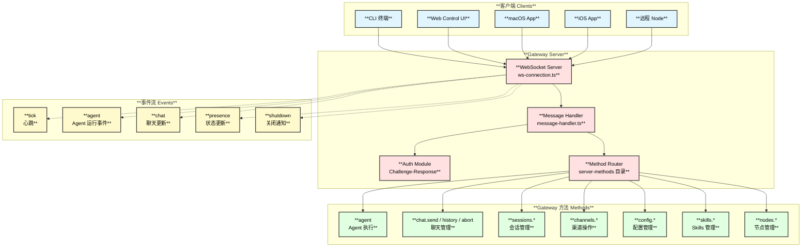
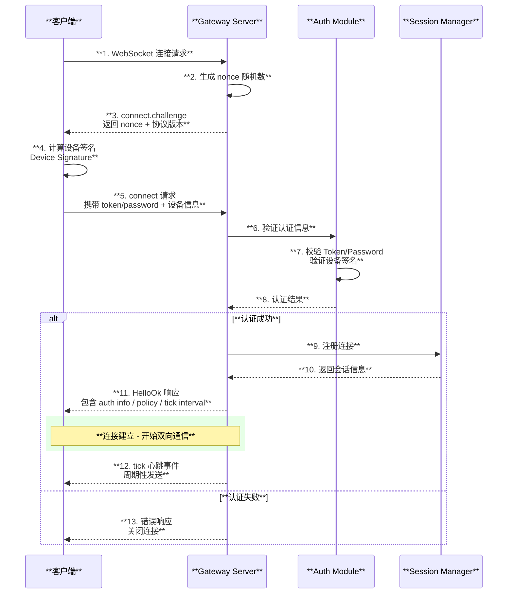
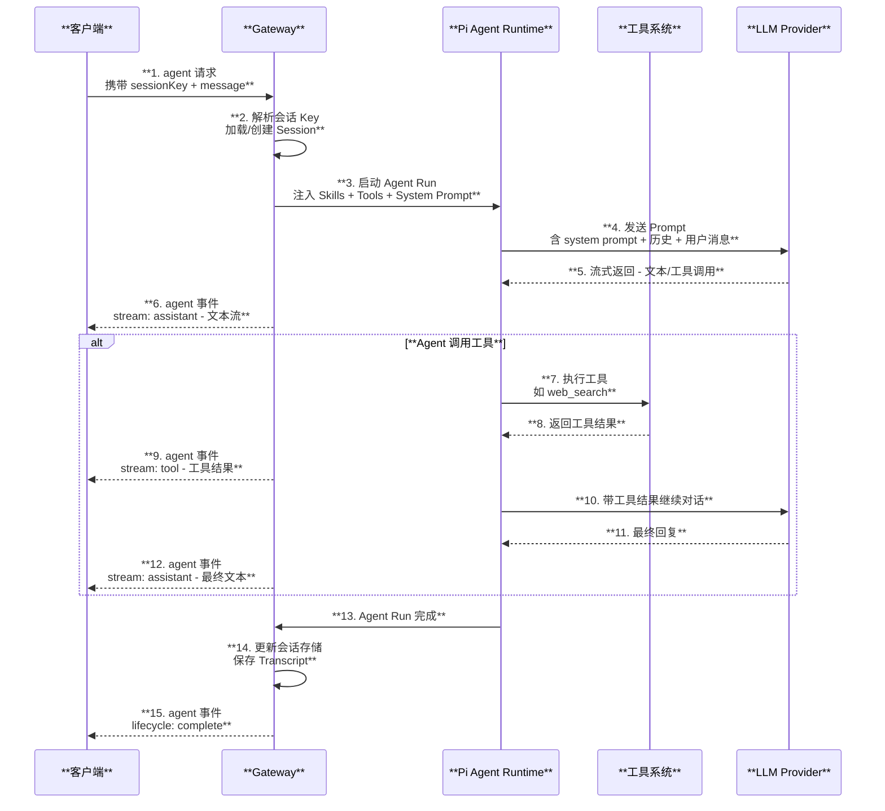

# Gateway 网关与通信协议

## 1. Gateway 概述

Gateway 是 OpenClaw 的**核心控制平面**，基于 WebSocket 实现双向实时通信，同时提供 HTTP 端点兼容 OpenAI API。所有客户端（CLI、Web UI、原生 App、远程节点）均通过 Gateway 与 Agent 系统交互。

| **属性** | **详情** |
|:---:|:---:|
| **协议** | WebSocket（JSON Frames） |
| **HTTP 框架** | Hono 4.11 + Express 5.2 |
| **默认端口** | 3000（Fly.io）/ 18789-18790（本地） |
| **认证方式** | Token / Password / Device Signature |
| **TLS** | 支持指纹验证 |
| **绑定模式** | Loopback / LAN / Tailnet |

## 2. Gateway 架构图



## 3. WebSocket 连接握手时序图



## 4. 协议帧结构

Gateway 使用 JSON 格式的帧进行通信，有三种帧类型：

### 4.1 请求帧 RequestFrame

```text
{
  "seq": 1,                    // 序列号，用于请求-响应匹配
  "method": "chat.send",       // 方法名
  "params": { ... }            // 方法参数
}
```

### 4.2 响应帧 ResponseFrame

```text
{
  "seq": 1,                    // 对应请求的序列号
  "result": { ... },           // 成功结果
  "error": { ... }             // 错误信息（与 result 互斥）
}
```

### 4.3 事件帧 EventFrame

```text
{
  "event": "agent",            // 事件类型
  "data": { ... }              // 事件数据
}
```

## 5. Agent 执行时序图



## 6. Gateway 核心方法列表

| **方法** | **说明** | **实现文件** |
|:---|:---|:---|
| `connect` | 认证握手 | `server/ws-connection.ts` |
| `agent` | 执行 Agent 运行 | `server-methods/agent.ts` |
| `chat.send` | 发送聊天消息 | `server-methods/chat.ts` |
| `chat.history` | 获取聊天历史 | `server-methods/chat.ts` |
| `chat.abort` | 中止聊天 | `server-methods/chat.ts` |
| `sessions.list` | 列出会话 | `server-methods/sessions.ts` |
| `sessions.preview` | 预览会话内容 | `server-methods/sessions.ts` |
| `sessions.resolve` | 解析会话 Key | `server-methods/sessions.ts` |
| `sessions.patch` | 更新会话元数据 | `server-methods/sessions.ts` |
| `sessions.reset` | 重置会话 | `server-methods/sessions.ts` |
| `sessions.delete` | 删除会话 | `server-methods/sessions.ts` |
| `sessions.compact` | 压缩 Transcript | `server-methods/sessions.ts` |
| `channels.*` | 渠道操作 | `server-methods/channels.ts` |
| `config.*` | 配置管理 | `server-methods/config.ts` |
| `skills.*` | Skills 管理 | `server-methods/skills.ts` |
| `nodes.*` | 节点管理 | `server-methods/nodes.ts` |

## 7. 关键文件索引

| **文件** | **职责** |
|:---|:---|
| `src/gateway/server.impl.ts` | Gateway 主服务器启动 |
| `src/gateway/server/ws-connection.ts` | WebSocket 连接管理 |
| `src/gateway/server/ws-connection/message-handler.ts` | 消息帧处理 |
| `src/gateway/protocol/index.ts` | 协议定义 |
| `src/gateway/client.ts` | Gateway 客户端实现 |
| `src/gateway/server-methods/*.ts` | 各方法处理器 |
| `src/gateway/server-chat.ts` | 聊天事件处理 |
