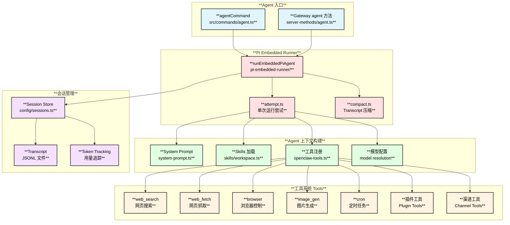
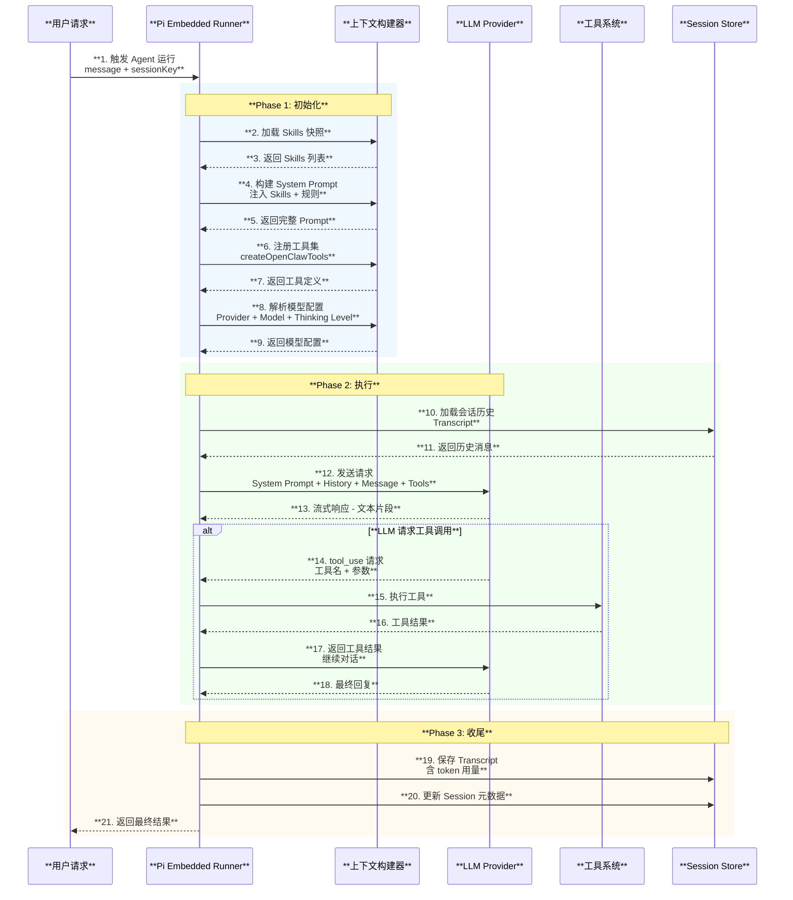
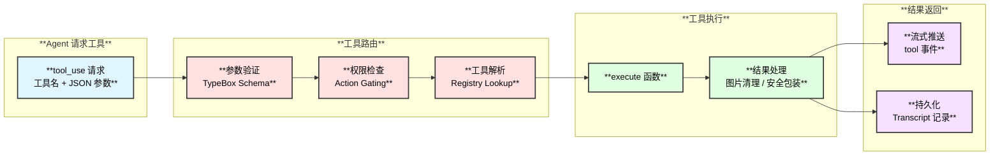
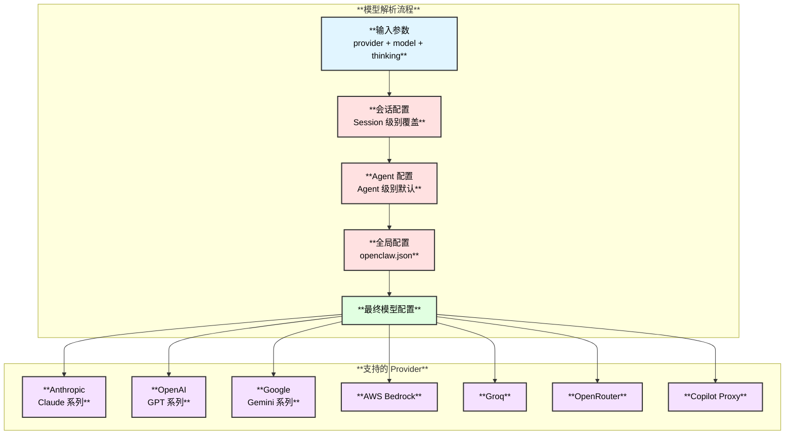

# Agent 与工具系统

## 1. Agent 运行时概述

OpenClaw 的 Agent 系统基于 **Pi Agent Core** 运行时，支持多种 LLM 提供商，提供会话管理、工具调用、Skills 注入等能力。Agent 运行时负责管理从用户请求到 LLM 交互的完整生命周期。

| **属性** | **详情** |
|:---:|:---:|
| **运行时** | Pi Agent Core（@mariozechner/pi-agent-core） |
| **嵌入模式** | Pi Embedded Runner |
| **会话存储** | JSONL Transcript 文件 |
| **模型支持** | 29+ 提供商（详见 [大模型支持](./10-大模型支持.md)） |
| **工具系统** | 声明式工具注册 + 动态执行 |

## 2. Agent 架构图



## 3. Agent 生命周期时序图



## 4. 工具系统架构

### 4.1 工具注册流程

工具在 `src/agents/openclaw-tools.ts` 中统一注册，分为以下几类：

| **工具类别** | **工具名** | **说明** | **实现文件** |
|:---:|:---|:---|:---|
| **Web 工具** | `web_search` | 网页搜索 | `tools/web-search.ts` |
| **Web 工具** | `web_fetch` | 网页内容抓取 | `tools/web-fetch.ts` |
| **浏览器** | `browser` | 浏览器自动化控制 | `tools/browser-tool.ts` |
| **媒体** | `image_gen` | 图片生成 | `tools/image-gen.ts` |
| **系统** | `cron` | 定时任务管理 | `tools/cron-tool.ts` |
| **会话** | `session_status` | 会话状态查询 | `tools/session-status.ts` |
| **渠道** | `discord_actions` | Discord 操作 | `tools/channel-actions.ts` |
| **渠道** | `telegram_actions` | Telegram 操作 | `tools/channel-actions.ts` |
| **渠道** | `slack_actions` | Slack 操作 | `tools/channel-actions.ts` |
| **插件** | 动态注册 | 插件注入的工具 | `plugins/tools.ts` |

### 4.2 工具执行流程



## 5. 会话管理

### 5.1 会话存储结构

```text
~/.openclaw/
├── sessions/
│   └── {agentId}/
│       ├── store.json           # 会话元数据索引
│       └── transcripts/
│           ├── {sessionId}.jsonl # 对话记录（JSONL 格式）
│           └── ...
```

### 5.2 会话 Key 解析规则

| **来源** | **Session Key 格式** | **示例** |
|:---|:---|:---|
| CLI 终端 | `global` | `global` |
| Telegram 私聊 | `telegram:{userId}` | `telegram:123456` |
| Telegram 群组 | `telegram:{groupId}:{threadId}` | `telegram:-1001:42` |
| WhatsApp | `whatsapp:{phoneNumber}` | `whatsapp:8613800138000` |
| Discord | `discord:{channelId}` | `discord:98765` |
| Slack | `slack:{channelId}` | `slack:C0123` |
| Gateway WebChat | `internal:{connectionId}` | `internal:uuid-xxx` |

### 5.3 会话操作

| **操作** | **说明** |
|:---|:---|
| `list` | 列出会话，支持按渠道/标签过滤 |
| `preview` | 预览会话 Transcript |
| `resolve` | 从各种标识符解析 Session Key |
| `patch` | 更新元数据（模型、思考级别等） |
| `reset` | 重置会话（新 SessionId、清除 Transcript） |
| `delete` | 删除会话和 Transcript 文件 |
| `compact` | 压缩 Transcript（用 LLM 摘要替换早期消息） |

## 6. 模型配置

OpenClaw 支持多种 LLM 提供商和模型，通过分层配置解析：



## 7. 关键文件索引

| **文件** | **职责** |
|:---|:---|
| `src/commands/agent.ts` | Agent 命令执行入口 |
| `src/gateway/server-methods/agent.ts` | Gateway Agent 方法处理器 |
| `src/agents/pi-embedded-runner/run/attempt.ts` | 单次 Agent 运行尝试 |
| `src/agents/pi-embedded-runner/compact.ts` | Transcript 压缩 |
| `src/agents/system-prompt.ts` | System Prompt 构建 |
| `src/agents/openclaw-tools.ts` | 工具注册中心 |
| `src/agents/tools/common.ts` | 工具公共工具函数 |
| `src/config/sessions.ts` | 会话存储管理 |
| `src/plugins/tools.ts` | 插件工具加载 |
| `src/plugins/registry.ts` | 插件注册中心 |
