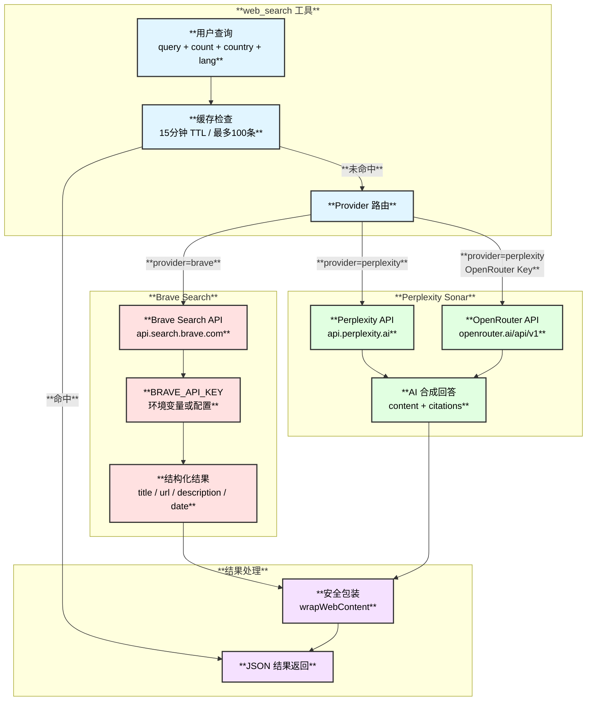
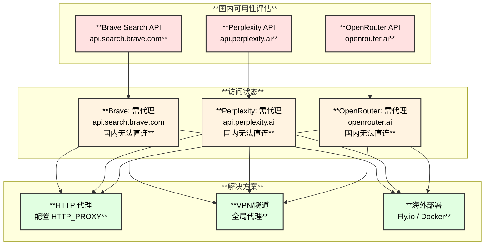
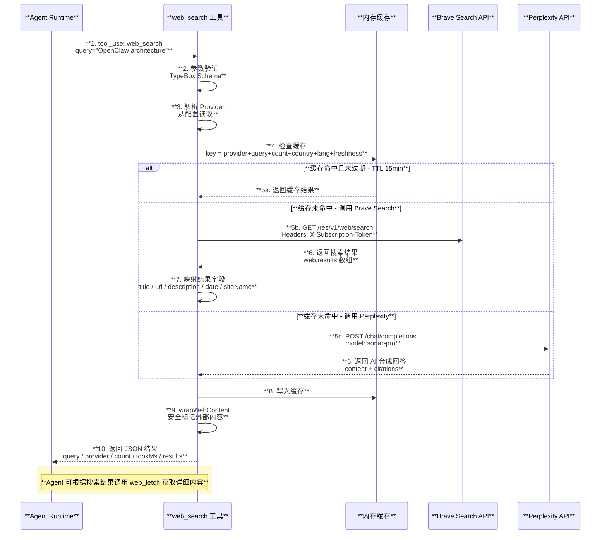
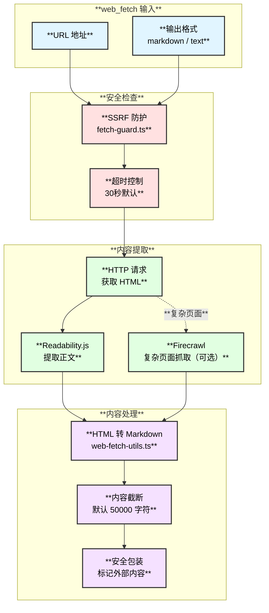
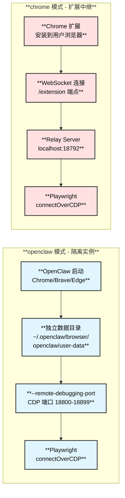
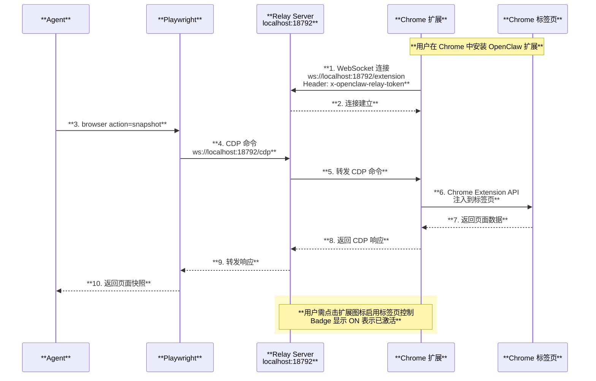
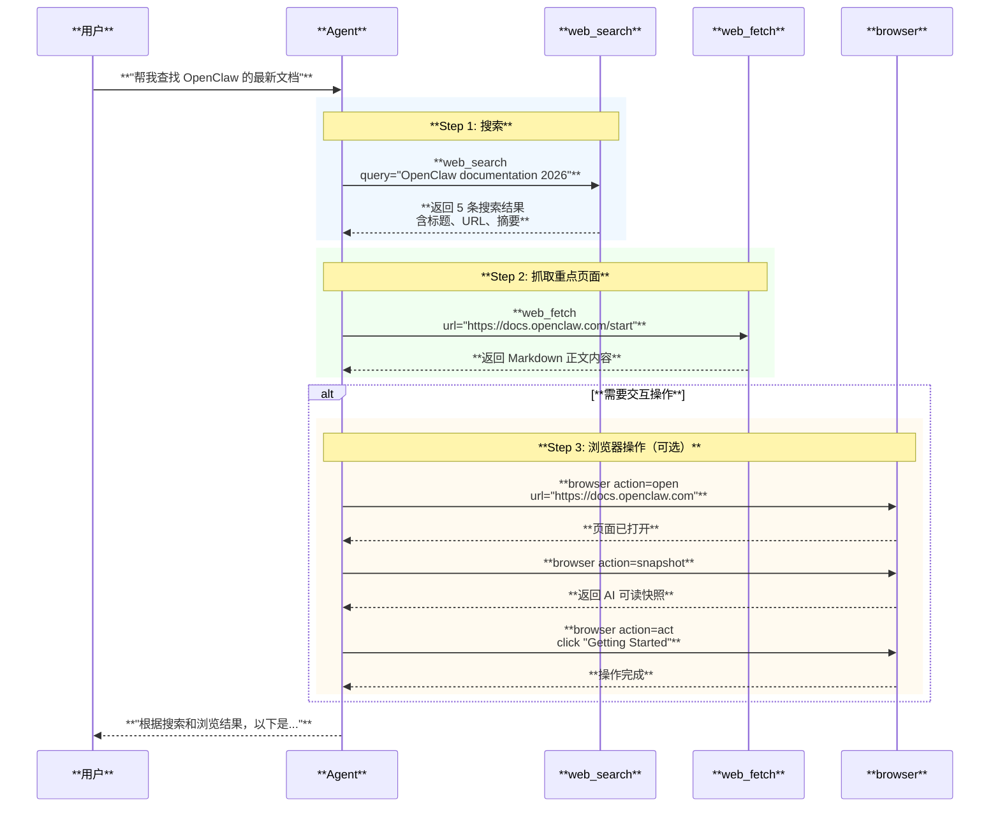

# 网页搜索与浏览器自动化

## 1. 概述

OpenClaw 提供三种网页资料获取能力：

| **工具** | **用途** | **实现文件** |
|:---:|:---|:---|
| **web_search** | 关键词搜索，返回搜索结果列表 | `src/agents/tools/web-search.ts` |
| **web_fetch** | 抓取指定 URL 的可读内容 | `src/agents/tools/web-fetch.ts` |
| **browser** | 完整浏览器自动化控制 | `src/agents/tools/browser-tool.ts` |

三者协同工作：**搜索 → 发现 URL → 抓取/浏览内容**，形成完整的网页信息获取链路。

## 2. Web Search 搜索引擎实现

### 2.1 搜索提供商

OpenClaw 支持两种搜索引擎后端：



### 2.2 Brave Search 详细参数

| **参数** | **类型** | **默认值** | **说明** |
|:---|:---:|:---:|:---|
| `query` | string | 必填 | 搜索关键词 |
| `count` | number | 5 | 返回结果数量（1-10） |
| `country` | string | US | 地区代码（2位） |
| `search_lang` | string | - | 搜索语言 ISO 代码 |
| `ui_lang` | string | - | 界面语言 ISO 代码 |
| `freshness` | string | - | 时效过滤：pd/pw/pm/py 或日期范围 |

### 2.3 Perplexity Sonar 详细参数

| **属性** | **详情** |
|:---|:---|
| **默认模型** | `perplexity/sonar-pro` |
| **接口格式** | Chat Completions API（OpenAI 兼容） |
| **直连端点** | `https://api.perplexity.ai` |
| **OpenRouter** | `https://openrouter.ai/api/v1` |
| **API Key** | `PERPLEXITY_API_KEY` 或 `OPENROUTER_API_KEY` |
| **返回格式** | AI 合成内容 + citations 引用数组 |

## 3. 搜索 API 定价与国内可用性

### 3.1 API 定价对比

| **提供商** | **免费额度** | **付费价格** | **认证方式** |
|:---:|:---|:---|:---:|
| **Brave Search** | **有** - 每月 2,000 次请求 | Base: $3/千次, Pro: $5/千次 | API Key + 信用卡注册 |
| **Perplexity Sonar** | **无** | Sonar: $1/百万 token, Sonar Pro: $3 入/$15 出/百万 token | API Key |
| **OpenRouter 转发** | **无** | 同 Perplexity 定价 + OpenRouter 加价 | API Key（支持加密货币） |

### 3.2 Brave Search 定价详情

| **套餐** | **价格** | **限制** | **功能** |
|:---|:---:|:---|:---|
| **Free** | **$0/月** | 1 QPS, 2,000 次/月 | Web搜索 + 新闻 + 视频 + 图片 + AI 数据权 |
| **Base** | **$3/千次** | 提高 QPS | 同 Free + 更高并发 |
| **Pro** | **$5/千次** | 最高 QPS | 全部功能 + 优先级 |

> **注意**：Free 套餐需通过 Stripe 绑定信用卡，但不收费。

### 3.3 Perplexity Sonar 定价详情

| **模型** | **输入价格** | **输出价格** | **上下文窗口** | **特点** |
|:---|:---:|:---:|:---:|:---|
| **Sonar** | $1/百万 token | $1/百万 token | 127K | 快速问答 + 网页搜索 |
| **Sonar Pro** | $3/百万 token | $15/百万 token | 200K | 多步推理 + 网页搜索（默认） |
| **Sonar Reasoning Pro** | $2/百万 token | $8/百万 token | 128K | 思维链分析 |
| **Search API** | $5/千次（固定） | - | - | 无 token 计费 |

### 3.4 国内可用性分析



| **API** | **国内直连** | **原因** | **解决方案** |
|:---|:---:|:---|:---|
| **Brave Search** | **不可** | `api.search.brave.com` 被墙 | 代理 / VPN / 海外服务器部署 |
| **Perplexity** | **不可** | `api.perplexity.ai` 被墙 | 代理 / VPN / 海外服务器部署 |
| **OpenRouter** | **不可** | `openrouter.ai` 被墙 | 代理 / VPN / 海外服务器部署 |

> **最佳实践**：国内用户建议将 OpenClaw Gateway 部署在海外服务器（如 Fly.io），通过 WebSocket 连接使用，搜索 API 调用在海外服务器上完成，无需本地代理。

### 3.5 免费替代方案与代理方案

OpenClaw 内置支持 Brave Search 和 Perplexity，但国内用户也可以考虑以下免费替代方案：

| **服务** | **免费额度** | **是否需注册** | **国内可用性** | **特点** |
|:---|:---|:---:|:---:|:---|
| **Brave Search** | 2,000 次/月 | 需要（绑信用卡） | 需代理 | 独立索引，结构化结果 |
| **Search1API** | 100 次免费额度 | 可选（无需信用卡） | 需代理 | 支持 Google/Bing/DuckDuckGo 等多引擎 |
| **Tavily** | 有免费套餐 | 需要 | 需代理 | AI 原生搜索，聚合 20+ 来源 |
| **Firecrawl Search** | 有免费套餐 | 需要 | 需代理 | 支持 Markdown/HTML/截图输出 |
| **SearXNG 自建** | **完全免费** | **不需要** | **可自建** | 开源元搜索引擎，聚合多搜索引擎 |

**国内推荐方案 — SearXNG 自建**：

SearXNG 是一个开源的元搜索引擎，可以自建在国内服务器上，无需 API Key，聚合 Google、Bing、DuckDuckGo 等搜索引擎的结果。虽然 OpenClaw 目前不原生支持 SearXNG，但可以通过自定义 Skill 或 Plugin 集成。

```text
# 国内用户推荐方案：

方案 1 - 海外部署 Gateway（推荐）:
  ┌─────────────────────────────────────────┐
  │ 国内设备 → WebSocket → 海外 Fly.io Gateway │
  │                          ↓               │
  │              Brave Search API / Perplexity │
  └─────────────────────────────────────────┘
  优点：零配置代理，Brave 免费 2000 次/月
  缺点：需要海外服务器

方案 2 - SearXNG 自建:
  ┌─────────────────────────────────────────┐
  │ OpenClaw → 自定义 Plugin → 自建 SearXNG   │
  │                             ↓            │
  │                   Google / Bing 聚合结果   │
  └─────────────────────────────────────────┘
  优点：完全免费，无 API Key，国内可用
  缺点：需自建维护，需编写 Plugin

方案 3 - HTTP 代理:
  ┌─────────────────────────────────────────┐
  │ OpenClaw → HTTP_PROXY → Brave/Perplexity │
  └─────────────────────────────────────────┘
  优点：不改架构，直接配环境变量
  缺点：需要稳定代理
```

### 3.6 API Key 路由逻辑

系统根据 API Key 前缀自动判断使用哪个端点：

| **Key 前缀** | **路由目标** | **端点** |
|:---|:---|:---|
| `pplx-` | Perplexity 直连 | `https://api.perplexity.ai` |
| `sk-or-` | OpenRouter 转发 | `https://openrouter.ai/api/v1` |
| 其他格式 | 默认 OpenRouter | `https://openrouter.ai/api/v1` |

### 3.6 错误处理与容错

| **场景** | **处理方式** |
|:---|:---|
| **API Key 缺失** | 返回 `missing_brave_api_key` / `missing_perplexity_api_key` 错误 + 配置说明 |
| **API 调用失败** | 抛出异常，返回 HTTP 状态码和错误详情 |
| **Provider 间无自动切换** | Brave 失败不会自动切换到 Perplexity，反之亦然 |
| **超时** | AbortSignal 30 秒超时 |
| **缓存命中** | 直接返回缓存，15 分钟 TTL |

## 4. Web Search 完整时序图（补充：含缓存与 API Key 路由）



## 4. Web Fetch 网页抓取

### 4.1 抓取流程

`web_fetch` 工具用于从指定 URL 获取可读内容：



### 4.2 安全机制

| **防护措施** | **说明** |
|:---|:---|
| **SSRF 防护** | `fetch-guard.ts` 阻止访问内网地址（localhost、私有 IP） |
| **超时保护** | 可配置超时时间，默认 30 秒 |
| **内容截断** | 默认限制 50,000 字符，防止内存溢出 |
| **安全标记** | 外部内容用安全标记包装，防止 Prompt 注入 |
| **缓存限制** | 最多 100 条缓存，防止内存泄漏 |

## 6. Browser 浏览器自动化

### 6.1 支持的浏览器 — 仅 Chromium 内核

OpenClaw 的浏览器自动化**仅支持 Chromium 内核浏览器**，不支持 Firefox 和 Safari/WebKit。

| **浏览器** | **支持** | **检测方式** |
|:---|:---:|:---|
| **Google Chrome** | **是**（Stable / Beta / Canary / Dev） | Bundle ID / 注册表 |
| **Microsoft Edge** | **是**（Stable / Beta / Dev / Canary） | Bundle ID / 注册表 |
| **Brave** | **是**（Stable / Beta / Nightly） | Bundle ID / 注册表 |
| **Chromium** | **是** | 路径检测 |
| **Vivaldi** | **是** | 检测为 Chromium |
| **Opera / Opera GX** | **是** | 检测为 Chromium |
| **Arc** | **是** | 检测为 Chromium |
| **Yandex** | **是** | 检测为 Chromium |
| **Firefox** | **否** | - |
| **Safari** | **否** | - |

> **底层原因**：Playwright 仅作为 CDP（Chrome DevTools Protocol）客户端使用，通过 `chromium.connectOverCDP()` 连接，而非通过 Playwright 启动浏览器。因此只支持 CDP 协议的 Chromium 内核浏览器。

### 6.2 两种运行模式对比



| **属性** | **openclaw 模式** | **chrome 模式** |
|:---|:---|:---|
| **驱动** | `driver: "openclaw"` | `driver: "extension"` |
| **浏览器实例** | OpenClaw 启动新实例 | 使用用户现有 Chrome |
| **数据目录** | `~/.openclaw/browser/openclaw/user-data` | 用户 Chrome 原有 Profile |
| **Cookies/登录** | 空白环境（隔离） | 用户已有的 Cookie 和登录态 |
| **扩展插件** | 无 | 用户已安装的扩展 |
| **启动参数** | `--remote-debugging-port --no-first-run` | 无需额外参数 |
| **生命周期** | OpenClaw 管理启停 | 用户自行管理 Chrome |
| **CDP 端口** | 18800-18899 范围分配 | Relay Server 端口（默认 18792） |
| **使用场景** | 干净的自动化环境 | 需要用户登录态/Cookie |

### 6.3 Chrome 扩展中继架构



### 6.4 浏览器启动参数

`openclaw` 模式启动浏览器时使用的关键参数：

```text
--remote-debugging-port={cdpPort}     # CDP 调试端口
--user-data-dir={userDataDir}         # 独立用户数据目录
--no-first-run                        # 跳过首次运行向导
--no-default-browser-check            # 跳过默认浏览器检查
--disable-sync                        # 禁用同步
--headless=new                        # 无头模式（可选）
--no-sandbox                          # 禁用沙箱（可选，Docker 中常用）
```

### 6.5 浏览器工具架构

```mermaid
graph TB
    subgraph "**browser 工具入口**"
        BTOOL[**browser-tool.ts<br/>Agent 工具接口**]
    end

    subgraph "**浏览器目标 Targets**"
        SANDBOX[**sandbox<br/>隔离浏览器实例**]
        HOST[**host<br/>本机浏览器**]
        NODE[**node<br/>远程浏览器代理**]
    end

    subgraph "**浏览器 Profiles**"
        CHROME[**chrome<br/>Chrome 扩展中继**]
        OPENCLAW_P[**openclaw<br/>隔离浏览器 Profile**]
    end

    subgraph "**浏览器操作 Actions**"
        A_STATUS[**status - 状态查询**]
        A_START[**start - 启动浏览器**]
        A_STOP[**stop - 停止浏览器**]
        A_TABS[**tabs - 标签页列表**]
        A_OPEN[**open - 打开 URL**]
        A_NAV[**navigate - 导航**]
        A_SNAP[**snapshot - 页面快照<br/>AI 可读格式**]
        A_SHOT[**screenshot - 截图**]
        A_ACT[**act - 执行操作<br/>点击/输入/滚动**]
        A_PDF[**pdf - 导出 PDF**]
    end

    subgraph "**底层实现**"
        PW[**Playwright<br/>浏览器自动化**]
        CDP[**Chrome DevTools Protocol<br/>CDP 连接**]
        EXT[**Chrome Extension<br/>扩展中继**]
    end

    BTOOL --> SANDBOX
    BTOOL --> HOST
    BTOOL --> NODE

    SANDBOX --> CHROME
    SANDBOX --> OPENCLAW_P

    BTOOL --> A_STATUS
    BTOOL --> A_START
    BTOOL --> A_STOP
    BTOOL --> A_TABS
    BTOOL --> A_OPEN
    BTOOL --> A_NAV
    BTOOL --> A_SNAP
    BTOOL --> A_SHOT
    BTOOL --> A_ACT
    BTOOL --> A_PDF

    A_SNAP --> PW
    A_SHOT --> PW
    A_ACT --> PW
    A_OPEN --> CDP
    A_NAV --> CDP
    HOST --> EXT

    style BTOOL fill:#e1f5ff,stroke:#333,stroke-width:2px,color:#000

    style SANDBOX fill:#ffe1e1,stroke:#333,stroke-width:2px,color:#000
    style HOST fill:#ffe1e1,stroke:#333,stroke-width:2px,color:#000
    style NODE fill:#ffe1e1,stroke:#333,stroke-width:2px,color:#000

    style CHROME fill:#fff3e1,stroke:#333,stroke-width:2px,color:#000
    style OPENCLAW_P fill:#fff3e1,stroke:#333,stroke-width:2px,color:#000

    style A_STATUS fill:#e1ffe1,stroke:#333,stroke-width:2px,color:#000
    style A_START fill:#e1ffe1,stroke:#333,stroke-width:2px,color:#000
    style A_STOP fill:#e1ffe1,stroke:#333,stroke-width:2px,color:#000
    style A_TABS fill:#e1ffe1,stroke:#333,stroke-width:2px,color:#000
    style A_OPEN fill:#e1ffe1,stroke:#333,stroke-width:2px,color:#000
    style A_NAV fill:#e1ffe1,stroke:#333,stroke-width:2px,color:#000
    style A_SNAP fill:#e1ffe1,stroke:#333,stroke-width:2px,color:#000
    style A_SHOT fill:#e1ffe1,stroke:#333,stroke-width:2px,color:#000
    style A_ACT fill:#e1ffe1,stroke:#333,stroke-width:2px,color:#000
    style A_PDF fill:#e1ffe1,stroke:#333,stroke-width:2px,color:#000

    style PW fill:#f5e1ff,stroke:#333,stroke-width:2px,color:#000
    style CDP fill:#f5e1ff,stroke:#333,stroke-width:2px,color:#000
    style EXT fill:#f5e1ff,stroke:#333,stroke-width:2px,color:#000
```



### 6.6 典型使用时序 - 搜索并浏览



## 7. 配置说明

### 7.1 Web Search 配置

```text
# ~/.openclaw/openclaw.json
{
  "tools": {
    "web": {
      "search": {
        "enabled": true,                    # 启用/禁用
        "provider": "brave",                # "brave" 或 "perplexity"
        "apiKey": "BSA_xxx",                # Brave API Key
        "timeoutSeconds": 30,               # 超时时间
        "cacheTtlMinutes": 15,              # 缓存 TTL
        "maxResults": 5,                    # 最大结果数
        "perplexity": {
          "apiKey": "pplx-xxx",             # Perplexity API Key
          "model": "perplexity/sonar-pro"   # 模型选择
        }
      }
    }
  }
}
```

### 7.2 环境变量

| **变量** | **说明** |
|:---|:---|
| `BRAVE_API_KEY` | Brave Search API 密钥 |
| `PERPLEXITY_API_KEY` | Perplexity API 密钥 |
| `OPENROUTER_API_KEY` | OpenRouter API 密钥（自动路由 Perplexity） |
| `FIRECRAWL_API_KEY` | Firecrawl API 密钥（高级网页抓取） |

## 8. 关键文件索引

| **文件** | **职责** |
|:---|:---|
| `src/agents/tools/web-search.ts` | Web 搜索工具核心实现 |
| `src/agents/tools/web-fetch.ts` | 网页内容抓取工具 |
| `src/agents/tools/web-fetch-utils.ts` | HTML 提取工具（Readability + Markdown） |
| `src/agents/tools/web-shared.ts` | 共享工具（缓存、超时） |
| `src/agents/tools/web-tools.ts` | Web 工具统一导出 |
| `src/agents/tools/browser-tool.ts` | 浏览器自动化工具 |
| `src/browser/` | 浏览器自动化基础设施 |
| `src/browser/chrome.ts` | Chrome 浏览器启动与管理 |
| `src/browser/pw-session.ts` | Playwright CDP 连接管理 |
| `src/browser/extension-relay.ts` | Chrome 扩展中继服务器 |
| `src/browser/profiles.ts` | 浏览器 Profile 管理 |
| `src/browser/detect.ts` | 浏览器可执行文件检测 |
| `src/infra/net/fetch-guard.ts` | SSRF 防护 |
| `src/agents/openclaw-tools.ts` | 工具注册入口 |
