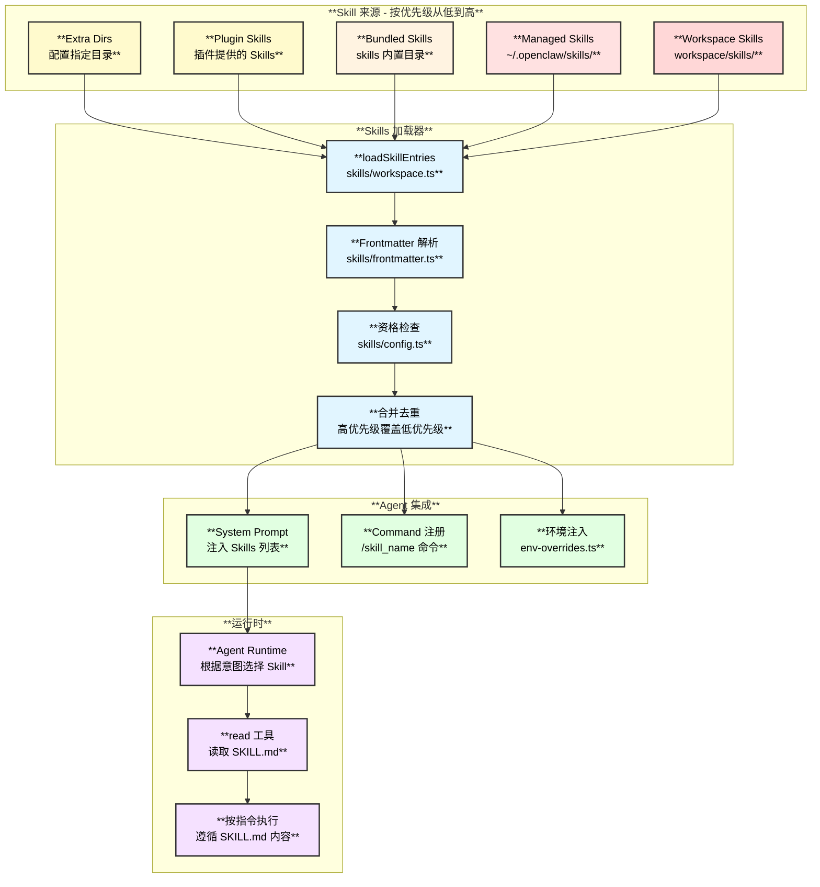
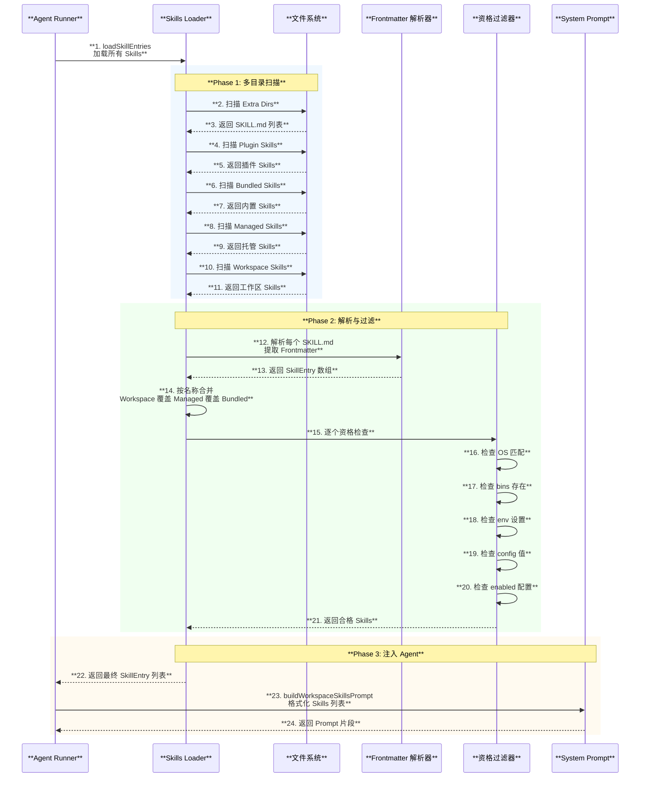
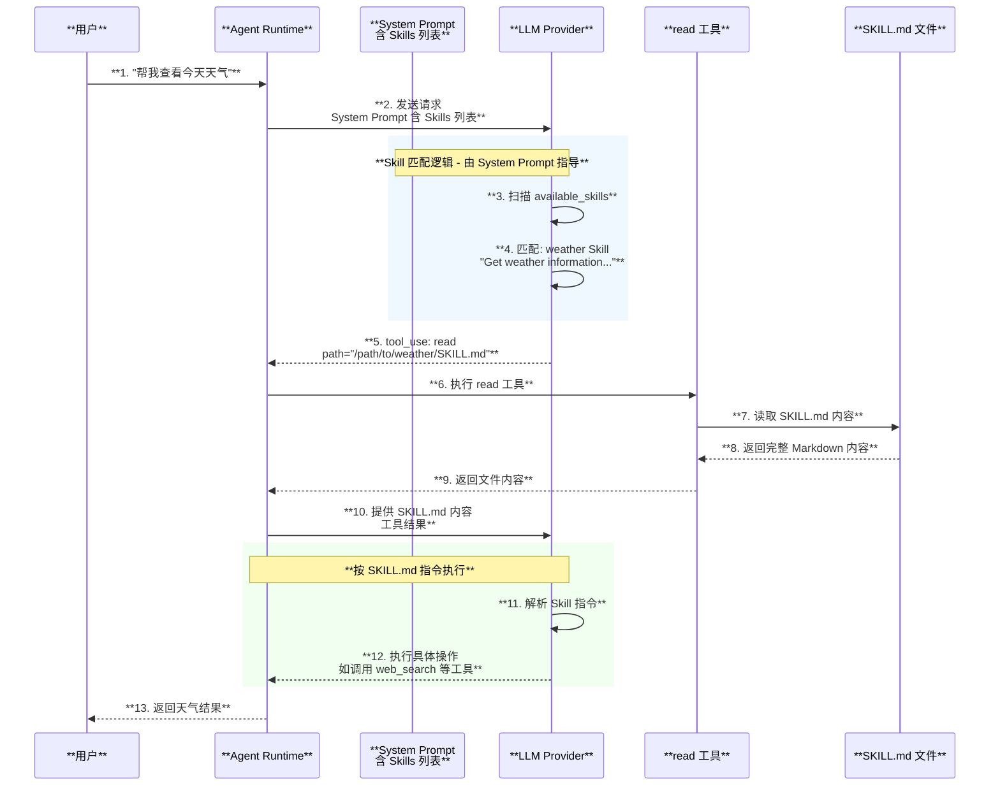

# Skills 系统

## 1. 概述

Skills 是 OpenClaw 的**可扩展自动化能力系统**。每个 Skill 以 `SKILL.md` 文件定义，Agent 在运行时自动发现并根据用户意图选择合适的 Skill 执行。Skills 支持从多个目录加载，具备热重载能力，并可通过 `/command` 方式由用户直接调用。

| **属性** | **详情** |
|:---:|:---:|
| **定义格式** | SKILL.md（YAML Frontmatter + Markdown） |
| **加载方式** | 多目录自动发现 + 优先级覆盖 |
| **执行方式** | Agent 读取 SKILL.md → 按指令执行 |
| **热重载** | 文件变更自动刷新（250ms 防抖） |
| **内置数量** | 50+ 内置 Skills |

## 2. Skills 系统架构图



## 3. SKILL.md 文件格式

### 3.1 完整格式示例

```markdown
---
name: weather
description: Get weather information for any location
homepage: https://openweathermap.org
metadata:
  {
    "openclaw": {
      "emoji": "🌤️",
      "skillKey": "weather",
      "primaryEnv": "OPENWEATHER_API_KEY",
      "os": ["darwin", "linux"],
      "always": false,
      "requires": {
        "bins": ["curl"],
        "anyBins": ["python3", "python"],
        "env": ["OPENWEATHER_API_KEY"],
        "config": ["tools.web.search.enabled"]
      },
      "install": [
        {
          "id": "brew-curl",
          "kind": "brew",
          "formula": "curl",
          "bins": ["curl"],
          "label": "Install curl via Homebrew"
        }
      ]
    }
  }
---

# Weather Skill

Instructions for the agent to follow when this skill is activated...
```

### 3.2 Frontmatter 字段说明

| **字段** | **类型** | **默认值** | **说明** |
|:---|:---:|:---:|:---|
| `name` | string | 必填 | Skill 名称 |
| `description` | string | 必填 | Skill 描述（Agent 用来匹配意图） |
| `homepage` | string | 可选 | 官网链接 |
| `user-invocable` | boolean | true | 是否可通过 `/command` 调用 |
| `disable-model-invocation` | boolean | false | 是否从模型 Prompt 中隐藏 |
| `command-dispatch` | string | - | "tool" 表示路由到工具 |
| `command-tool` | string | - | 调度目标工具名 |
| `command-arg-mode` | string | - | "raw" 表示原始参数传递 |

### 3.3 OpenClaw Metadata 字段

| **字段** | **说明** |
|:---|:---|
| `emoji` | Skill 显示图标 |
| `skillKey` | 配置键名（默认为 name） |
| `primaryEnv` | 主要环境变量名 |
| `os` | 支持的操作系统列表 |
| `always` | 是否强制包含（跳过条件检查） |
| `requires.bins` | 必须存在的二进制程序 |
| `requires.anyBins` | 至少一个存在的二进制程序 |
| `requires.env` | 必须设置的环境变量 |
| `requires.config` | 必须为 truthy 的配置项 |
| `install` | 安装指令列表 |

## 4. Skills 加载与发现时序图



## 5. Skill 执行流程时序图



## 6. System Prompt 中的 Skills 注入格式

Agent 的 System Prompt 中包含如下 Skills 指引段落：

```text
## Skills (mandatory)
Before replying: scan <available_skills> <description> entries.
- If exactly one skill clearly applies: read its SKILL.md at <location> 
  with `read`, then follow it.
- If multiple could apply: choose the most specific one, then read/follow it.
- If none clearly apply: do not read any SKILL.md.
Constraints: never read more than one skill up front; only read after selecting.

<available_skills>
🌤️ weather: Get weather information for any location
  Location: /path/to/skills/weather/SKILL.md
🐙 github: GitHub CLI integration for repos, issues, PRs
  Location: /path/to/skills/github/SKILL.md
📝 notion: Notion workspace integration
  Location: /path/to/skills/notion/SKILL.md
...
</available_skills>
```

**关键设计**：Agent **先匹配描述，再读取 SKILL.md**，避免一次性加载所有 Skill 内容导致 Token 浪费。

## 7. Skills 资格检查流程

```mermaid
graph TB
    subgraph "**资格检查 shouldIncludeSkill**"
        START[**输入: SkillEntry**]
        CHK_CFG[**配置检查<br/>entries.skillKey.enabled != false?**]
        CHK_BUNDLED[**内置许可检查<br/>skills.allowBundled?**]
        CHK_OS[**OS 检查<br/>metadata.os 含当前平台?**]
        CHK_BINS[**Bins 检查<br/>requires.bins 全部存在?**]
        CHK_ANY[**AnyBins 检查<br/>requires.anyBins 至少一个?**]
        CHK_ENV[**Env 检查<br/>requires.env 全部设置?**]
        CHK_CFGVAL[**Config 检查<br/>requires.config 值为 truthy?**]
        CHK_ALWAYS[**Always 旗标<br/>metadata.always == true?**]
        INCLUDE[**包含此 Skill**]
        EXCLUDE[**排除此 Skill**]
    end

    START --> CHK_CFG
    CHK_CFG -->|**disabled**| EXCLUDE
    CHK_CFG -->|**enabled**| CHK_BUNDLED
    CHK_BUNDLED -->|**不允许**| EXCLUDE
    CHK_BUNDLED -->|**允许**| CHK_ALWAYS
    CHK_ALWAYS -->|**always=true**| INCLUDE
    CHK_ALWAYS -->|**always=false**| CHK_OS
    CHK_OS -->|**不匹配**| EXCLUDE
    CHK_OS -->|**匹配**| CHK_BINS
    CHK_BINS -->|**缺失**| EXCLUDE
    CHK_BINS -->|**全部存在**| CHK_ANY
    CHK_ANY -->|**全部缺失**| EXCLUDE
    CHK_ANY -->|**至少一个**| CHK_ENV
    CHK_ENV -->|**未设置**| EXCLUDE
    CHK_ENV -->|**已设置**| CHK_CFGVAL
    CHK_CFGVAL -->|**falsy**| EXCLUDE
    CHK_CFGVAL -->|**truthy**| INCLUDE

    style START fill:#e1f5ff,stroke:#333,stroke-width:2px,color:#000
    style CHK_CFG fill:#ffe1e1,stroke:#333,stroke-width:2px,color:#000
    style CHK_BUNDLED fill:#ffe1e1,stroke:#333,stroke-width:2px,color:#000
    style CHK_OS fill:#ffe1e1,stroke:#333,stroke-width:2px,color:#000
    style CHK_BINS fill:#ffe1e1,stroke:#333,stroke-width:2px,color:#000
    style CHK_ANY fill:#ffe1e1,stroke:#333,stroke-width:2px,color:#000
    style CHK_ENV fill:#ffe1e1,stroke:#333,stroke-width:2px,color:#000
    style CHK_CFGVAL fill:#ffe1e1,stroke:#333,stroke-width:2px,color:#000
    style CHK_ALWAYS fill:#fff3e1,stroke:#333,stroke-width:2px,color:#000
    style INCLUDE fill:#e1ffe1,stroke:#333,stroke-width:2px,color:#000
    style EXCLUDE fill:#f0f0f0,stroke:#333,stroke-width:2px,color:#000
```



## 8. 内置 Skills 列表

| **类别** | **Skill 名称** | **说明** |
|:---:|:---|:---|
| **生产力** | `notion` | Notion 工作区集成 |
| **生产力** | `obsidian` | Obsidian 笔记集成 |
| **生产力** | `trello` | Trello 看板集成 |
| **生产力** | `apple-notes` | Apple 备忘录 |
| **生产力** | `apple-reminders` | Apple 提醒事项 |
| **生产力** | `bear-notes` | Bear 笔记 |
| **生产力** | `things-mac` | Things.app 任务管理 |
| **开发** | `github` | GitHub CLI 集成 |
| **开发** | `coding-agent` | 编码代理 |
| **开发** | `tmux` | tmux 会话管理 |
| **通信** | `slack` | Slack 集成 |
| **通信** | `discord` | Discord 集成 |
| **通信** | `himalaya` | Email 客户端 |
| **通信** | `imsg` | iMessage 集成 |
| **媒体** | `spotify-player` | Spotify 播放控制 |
| **媒体** | `openai-image-gen` | OpenAI 图片生成 |
| **媒体** | `nano-banana-pro` | Gemini 3 Pro 图片生成 |
| **媒体** | `openai-whisper` | Whisper 语音转文字 |
| **媒体** | `video-frames` | 视频帧提取 |
| **媒体** | `songsee` | 歌曲搜索 |
| **工具** | `weather` | 天气查询 |
| **工具** | `summarize` | URL/文件摘要 |
| **工具** | `nano-pdf` | PDF 处理 |
| **工具** | `gifgrep` | GIF 搜索 |
| **工具** | `camsnap` | 摄像头快照 |
| **智能家居** | `openhue` | Philips Hue 灯控 |
| **智能家居** | `sonoscli` | Sonos 音响控制 |
| **安全** | `1password` | 1Password CLI 集成 |
| **系统** | `healthcheck` | 健康检查 |
| **系统** | `model-usage` | 模型用量追踪 |
| **系统** | `session-logs` | 会话日志 |
| **系统** | `skill-creator` | Skill 创建助手 |

## 9. 关键文件索引

| **文件** | **职责** |
|:---|:---|
| `src/agents/skills.ts` | Skills 主导出 |
| `src/agents/skills/workspace.ts` | 加载、过滤、Prompt 构建 |
| `src/agents/skills/types.ts` | 类型定义 |
| `src/agents/skills/frontmatter.ts` | Frontmatter 解析 |
| `src/agents/skills/config.ts` | 资格检查与配置解析 |
| `src/agents/skills/env-overrides.ts` | 环境变量注入 |
| `src/agents/skills/bundled-dir.ts` | 内置 Skills 目录解析 |
| `src/agents/skills/plugin-skills.ts` | 插件 Skill 发现 |
| `src/agents/skills/refresh.ts` | 文件监听与热重载 |
| `src/agents/skills/serialize.ts` | 序列化工具 |
| `src/agents/system-prompt.ts` | System Prompt 构建 |
| `src/cli/skills-cli.ts` | CLI 命令 |
| `src/agents/skills-install.ts` | Skill 安装逻辑 |
| `src/gateway/server-methods/skills.ts` | Gateway Skills API |
