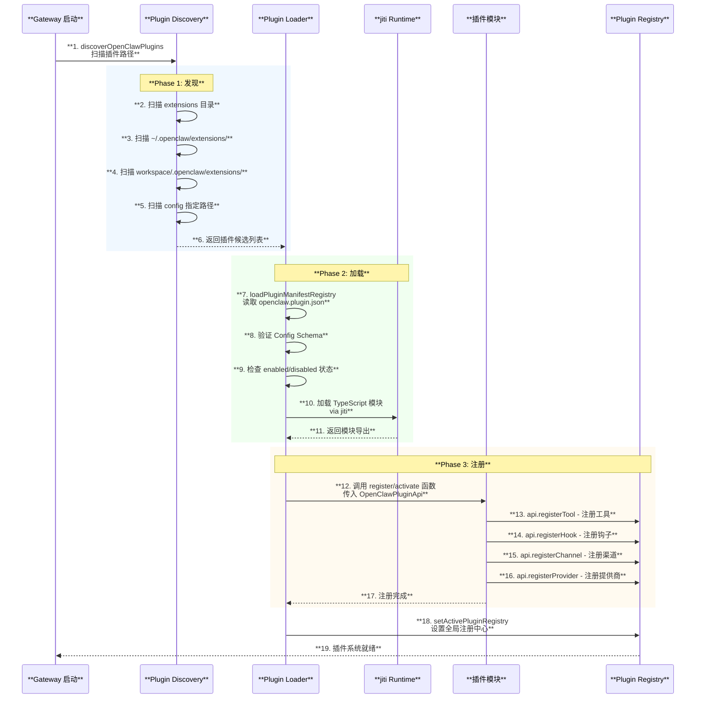
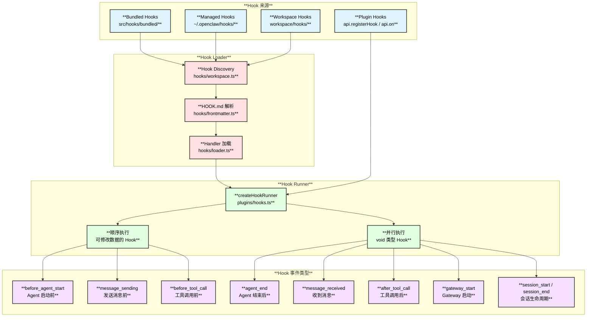

# 插件与扩展系统

## 1. 概述

OpenClaw 的插件系统是其**核心可扩展性基础设施**，通过统一的 Plugin SDK 支持注册工具（Tools）、钩子（Hooks）、渠道（Channels）、模型提供商（Providers）等各类扩展。系统包含三个层次：**Extensions（插件包）**、**Hooks（生命周期钩子）**、**Plugin SDK（开发接口）**。

| **属性** | **详情** |
|:---:|:---:|
| **插件发现** | 多路径自动扫描 |
| **加载方式** | jiti（运行时 TypeScript 加载） |
| **注册能力** | Tools / Hooks / Channels / Providers / HTTP / CLI / Services |
| **配置验证** | JSON Schema |
| **热重载** | 支持 |

## 2. 插件系统整体架构图

```mermaid
graph TB
    subgraph "**插件发现层**"
        DISC[**Plugin Discovery<br/>discovery.ts**]
        BUNDLED[**Bundled Plugins<br/>extensions 目录**]
        GLOBAL[**Global Plugins<br/>~/.openclaw/extensions/**]
        WK_PLUG[**Workspace Plugins<br/>workspace/.openclaw/extensions/**]
        CFG_PATH[**Config Paths<br/>plugins.load.paths**]
    end

    subgraph "**插件加载层**"
        LOAD[**Plugin Loader<br/>loader.ts**]
        MANIFEST[**Manifest Parser<br/>openclaw.plugin.json**]
        JITI[**jiti Runtime<br/>TypeScript 动态加载**]
        VALIDATE[**Config Validator<br/>JSON Schema 验证**]
    end

    subgraph "**Plugin Registry 注册中心**"
        REG[**PluginRegistry<br/>registry.ts**]
        R_TOOLS[**tools 数组**]
        R_HOOKS[**hooks 数组**]
        R_CHANNELS[**channels 数组**]
        R_PROVIDERS[**providers 数组**]
        R_HTTP[**httpHandlers 数组**]
        R_CLI[**cliRegistrars 数组**]
        R_SERVICES[**services 数组**]
        R_COMMANDS[**commands 数组**]
    end

    subgraph "**Plugin SDK API**"
        API[**OpenClawPluginApi<br/>plugin-sdk/index.ts**]
        API_TOOL[**registerTool**]
        API_HOOK[**registerHook**]
        API_CHAN[**registerChannel**]
        API_PROV[**registerProvider**]
        API_HTTP[**registerHttpHandler**]
        API_CLI[**registerCli**]
        API_SVC[**registerService**]
    end

    DISC --> BUNDLED
    DISC --> GLOBAL
    DISC --> WK_PLUG
    DISC --> CFG_PATH

    DISC --> LOAD
    LOAD --> MANIFEST
    LOAD --> JITI
    LOAD --> VALIDATE

    LOAD --> REG
    REG --> R_TOOLS
    REG --> R_HOOKS
    REG --> R_CHANNELS
    REG --> R_PROVIDERS
    REG --> R_HTTP
    REG --> R_CLI
    REG --> R_SERVICES
    REG --> R_COMMANDS

    API --> API_TOOL
    API --> API_HOOK
    API --> API_CHAN
    API --> API_PROV
    API --> API_HTTP
    API --> API_CLI
    API --> API_SVC

    API_TOOL --> R_TOOLS
    API_HOOK --> R_HOOKS
    API_CHAN --> R_CHANNELS
    API_PROV --> R_PROVIDERS
    API_HTTP --> R_HTTP
    API_CLI --> R_CLI
    API_SVC --> R_SERVICES

    style DISC fill:#e1f5ff,stroke:#333,stroke-width:2px,color:#000
    style BUNDLED fill:#e1f5ff,stroke:#333,stroke-width:2px,color:#000
    style GLOBAL fill:#e1f5ff,stroke:#333,stroke-width:2px,color:#000
    style WK_PLUG fill:#e1f5ff,stroke:#333,stroke-width:2px,color:#000
    style CFG_PATH fill:#e1f5ff,stroke:#333,stroke-width:2px,color:#000

    style LOAD fill:#ffe1e1,stroke:#333,stroke-width:2px,color:#000
    style MANIFEST fill:#ffe1e1,stroke:#333,stroke-width:2px,color:#000
    style JITI fill:#ffe1e1,stroke:#333,stroke-width:2px,color:#000
    style VALIDATE fill:#ffe1e1,stroke:#333,stroke-width:2px,color:#000

    style REG fill:#e1ffe1,stroke:#333,stroke-width:2px,color:#000
    style R_TOOLS fill:#e1ffe1,stroke:#333,stroke-width:2px,color:#000
    style R_HOOKS fill:#e1ffe1,stroke:#333,stroke-width:2px,color:#000
    style R_CHANNELS fill:#e1ffe1,stroke:#333,stroke-width:2px,color:#000
    style R_PROVIDERS fill:#e1ffe1,stroke:#333,stroke-width:2px,color:#000
    style R_HTTP fill:#e1ffe1,stroke:#333,stroke-width:2px,color:#000
    style R_CLI fill:#e1ffe1,stroke:#333,stroke-width:2px,color:#000
    style R_SERVICES fill:#e1ffe1,stroke:#333,stroke-width:2px,color:#000
    style R_COMMANDS fill:#e1ffe1,stroke:#333,stroke-width:2px,color:#000

    style API fill:#f5e1ff,stroke:#333,stroke-width:2px,color:#000
    style API_TOOL fill:#f5e1ff,stroke:#333,stroke-width:2px,color:#000
    style API_HOOK fill:#f5e1ff,stroke:#333,stroke-width:2px,color:#000
    style API_CHAN fill:#f5e1ff,stroke:#333,stroke-width:2px,color:#000
    style API_PROV fill:#f5e1ff,stroke:#333,stroke-width:2px,color:#000
    style API_HTTP fill:#f5e1ff,stroke:#333,stroke-width:2px,color:#000
    style API_CLI fill:#f5e1ff,stroke:#333,stroke-width:2px,color:#000
    style API_SVC fill:#f5e1ff,stroke:#333,stroke-width:2px,color:#000
```



## 3. 插件生命周期时序图



## 4. Extension 插件结构

### 4.1 目录结构

```text
extensions/
├── feishu/                        # 飞书渠道插件
│   ├── openclaw.plugin.json       # 插件清单
│   ├── index.ts                   # 入口文件
│   └── package.json               # 包信息
├── copilot-proxy/                 # Copilot 代理提供商插件
│   ├── openclaw.plugin.json
│   └── index.ts
├── memory-lancedb/                # LanceDB 记忆插件
│   ├── openclaw.plugin.json
│   └── index.ts
└── ...
```

### 4.2 插件清单格式 `openclaw.plugin.json`

```text
{
  "id": "feishu",                           // 插件 ID
  "channels": ["feishu"],                   // 渠道 ID 列表（可选）
  "providers": ["copilot-proxy"],           // 提供商 ID 列表（可选）
  "skills": ["./skills"],                   // Skills 目录（可选）
  "configSchema": {                         // 配置 Schema（可选）
    "type": "object",
    "properties": {
      "appId": { "type": "string" },
      "appSecret": { "type": "string" }
    }
  }
}
```

### 4.3 内置 Extensions 列表

| **Extension** | **类型** | **说明** |
|:---|:---:|:---|
| `bluebubbles` | Channel | iMessage via BlueBubbles |
| `matrix` | Channel | Matrix 协议 |
| `msteams` | Channel | Microsoft Teams |
| `feishu` | Channel | 飞书 |
| `zalo` / `zalouser` | Channel | Zalo 消息 |
| `voice-call` | Channel | 语音通话 |
| `nostr` | Channel | Nostr 协议 |
| `twitch` | Channel | Twitch 聊天 |
| `nextcloud-talk` | Channel | Nextcloud Talk |
| `tlon` | Channel | Tlon/Urbit |
| `copilot-proxy` | Provider | GitHub Copilot 代理 |
| `google-antigravity-auth` | Auth | Google 认证 |
| `google-gemini-cli-auth` | Auth | Gemini CLI 认证 |
| `minimax-portal-auth` | Auth | MiniMax 认证 |
| `qwen-portal-auth` | Auth | 通义千问认证 |
| `diagnostics-otel` | Diagnostics | OpenTelemetry |
| `llm-task` | Tool | LLM 任务工具 |
| `lobster` | Integration | Lobster 集成 |
| `memory-core` | Memory | 核心记忆系统 |
| `memory-lancedb` | Memory | LanceDB 记忆存储 |
| `open-prose` | Document | Prose 文档系统 |

## 5. Plugin SDK API

插件通过 `OpenClawPluginApi` 接口与核心系统交互：

| **API 方法** | **说明** | **注册目标** |
|:---|:---|:---|
| `registerTool` | 注册 Agent 可调用的工具 | `registry.tools` |
| `registerHook` | 注册生命周期钩子 | `registry.hooks` |
| `registerChannel` | 注册消息渠道 | `registry.channels` |
| `registerProvider` | 注册 LLM 提供商 | `registry.providers` |
| `registerHttpHandler` | 注册 HTTP 处理器 | `registry.httpHandlers` |
| `registerHttpRoute` | 注册 HTTP 路由 | `registry.httpHandlers` |
| `registerGatewayMethod` | 注册 Gateway 方法 | Gateway 方法表 |
| `registerCli` | 注册 CLI 命令 | `registry.cliRegistrars` |
| `registerService` | 注册后台服务 | `registry.services` |
| `registerCommand` | 注册自定义命令 | `registry.commands` |
| `on` | 注册类型化生命周期钩子 | Hook Runner |
| `resolvePath` | 解析用户路径 | - |

### 5.1 API 上下文属性

| **属性** | **说明** |
|:---|:---|
| `id` | 插件 ID |
| `name` | 插件名称 |
| `version` | 插件版本 |
| `description` | 插件描述 |
| `source` | 插件来源路径 |
| `config` | 全局配置访问 |
| `pluginConfig` | 插件私有配置 |
| `runtime` | 运行时 API（Config / Media / Channel / Logger / State） |
| `logger` | 日志记录器 |

## 6. Hook 系统

### 6.1 Hook 架构图



### 6.2 HOOK.md 格式

```text
hook-name/
├── HOOK.md          # 元数据文档
└── handler.ts       # 处理器实现
```

**HOOK.md 示例：**
```markdown
---
name: session-memory
description: "Saves session context to memory on /new"
metadata:
  {
    "openclaw": {
      "emoji": "💾",
      "events": ["command:new"],
      "requires": { "bins": ["node"] }
    }
  }
---
```

### 6.3 内置 Hooks

| **Hook 名称** | **触发事件** | **功能** |
|:---|:---|:---|
| `session-memory` | `command:new` | 会话切换时保存上下文到记忆 |
| `command-logger` | `command:*` | 记录所有命令到审计日志 |
| `soul-evil` | `agent:bootstrap` | 替换 SOUL.md 为 SOUL_EVIL.md |
| `boot-md` | `gateway:startup` | Gateway 启动时执行 BOOT.md |

### 6.4 Hook 生命周期事件

| **事件** | **执行方式** | **说明** |
|:---|:---:|:---|
| `before_agent_start` | 顺序 | Agent 启动前，可注入上下文 |
| `agent_end` | 并行 | Agent 运行结束后 |
| `before_compaction` | 顺序 | Transcript 压缩前 |
| `after_compaction` | 并行 | Transcript 压缩后 |
| `message_received` | 并行 | 收到渠道消息 |
| `message_sending` | 顺序 | 发送消息前，可修改内容 |
| `message_sent` | 并行 | 消息发送后 |
| `before_tool_call` | 顺序 | 工具调用前，可拦截 |
| `after_tool_call` | 并行 | 工具调用后 |
| `tool_result_persist` | 顺序 | 持久化前修改工具结果 |
| `session_start` | 并行 | 会话开始 |
| `session_end` | 并行 | 会话结束 |
| `gateway_start` | 并行 | Gateway 启动 |
| `gateway_stop` | 并行 | Gateway 停止 |

## 7. 插件配置

```text
# ~/.openclaw/openclaw.json
{
  "plugins": {
    "load": {
      "paths": ["/custom/plugin/path"],        // 额外扫描路径
      "extraDirs": ["/more/paths"]             // 更多额外目录
    },
    "entries": {
      "feishu": {
        "enabled": true,                        // 启用插件
        "config": {                             // 插件私有配置
          "appId": "cli_xxx",
          "appSecret": "secret_xxx"
        }
      },
      "memory-lancedb": {
        "enabled": true
      }
    }
  },
  "hooks": {
    "internal": {
      "enabled": true,
      "entries": {
        "session-memory": { "enabled": true },
        "command-logger": { "enabled": false }
      }
    }
  }
}
```

## 8. 关键文件索引

| **文件** | **职责** |
|:---|:---|
| `src/plugins/discovery.ts` | 插件发现逻辑 |
| `src/plugins/loader.ts` | 插件加载与注册 |
| `src/plugins/registry.ts` | Plugin Registry 实现 |
| `src/plugins/runtime.ts` | 运行时状态管理 |
| `src/plugins/manifest.ts` | 清单解析 |
| `src/plugins/types.ts` | 类型定义 |
| `src/plugins/hooks.ts` | Hook Runner |
| `src/plugins/hook-runner-global.ts` | 全局 Hook Runner 单例 |
| `src/plugin-sdk/index.ts` | Plugin SDK API |
| `src/hooks/types.ts` | Hook 类型定义 |
| `src/hooks/workspace.ts` | Hook 目录发现 |
| `src/hooks/loader.ts` | Hook 加载与注册 |
| `src/hooks/internal-hooks.ts` | 内部 Hook 系统 |
| `src/hooks/frontmatter.ts` | HOOK.md 解析 |
| `src/hooks/bundled/` | 内置 Hooks 目录 |
| `extensions/*/openclaw.plugin.json` | 各插件清单 |
