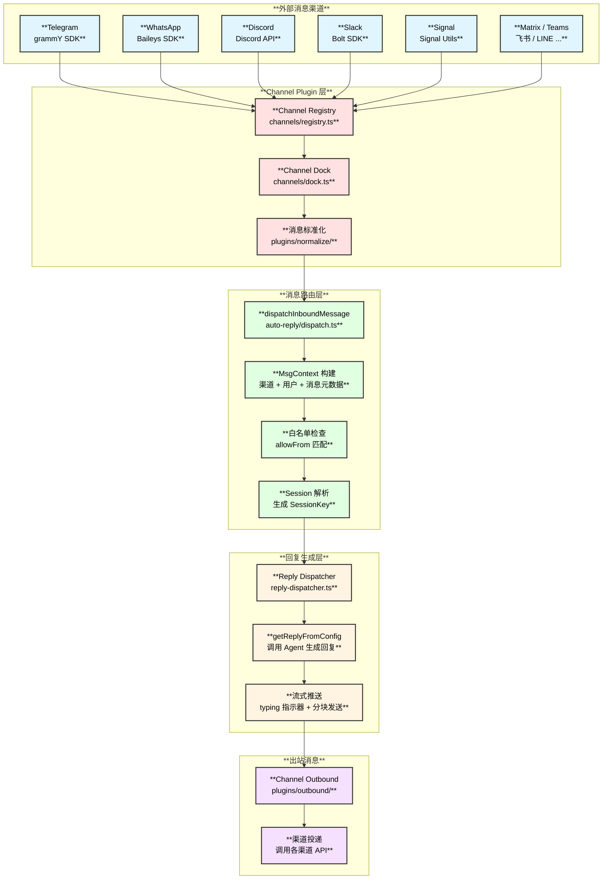
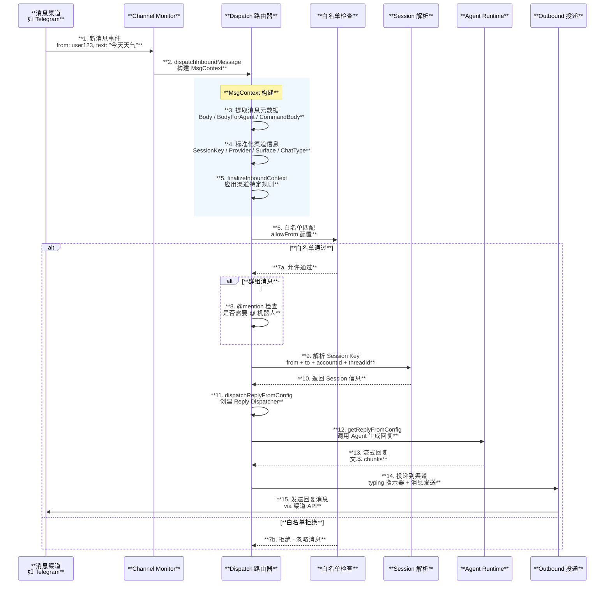
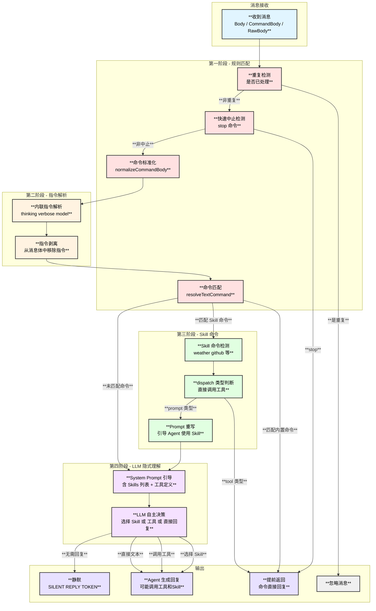
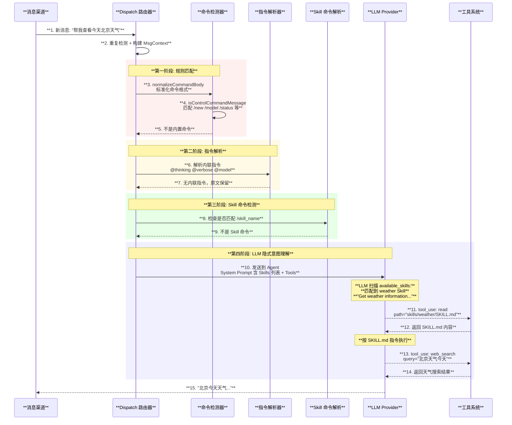

# 消息路由与频道系统

## 1. 概述

OpenClaw 的频道系统负责将**外部消息渠道**（Telegram、WhatsApp、Discord 等）与**Agent 核心**连接起来。系统采用插件化架构，每个频道实现统一的 `ChannelPlugin` 接口，支持白名单过滤、@mention 门控、线程上下文、媒体处理等功能。

| **属性** | **详情** |
|:---:|:---:|
| **核心频道** | Telegram / WhatsApp / Discord / Slack / Signal / iMessage / Google Chat |
| **扩展频道** | Matrix / Teams / 飞书 / LINE / BlueBubbles / Nostr / Twitch 等 |
| **总数** | 15+ 频道 |
| **白名单** | 支持按用户/群组过滤 |
| **线程支持** | 支持回复模式和线程上下文 |

## 2. 消息流转架构图



## 3. 入站消息处理时序图



## 4. Channel Plugin 接口

每个频道插件实现 `ChannelPlugin` 接口，包含多个可选适配器：

```mermaid
graph TB
    subgraph SG1["ChannelPlugin 接口"]
        META[**id + meta<br/>频道标识和元数据**]
        CAP[**capabilities<br/>频道能力声明**]
    end

    subgraph SG2["核心适配器"]
        CFGA[**config<br/>配置适配器**]
        OUTB[**outbound<br/>出站消息适配器**]
        STAT[**status<br/>状态查询适配器**]
        GWA[**gateway<br/>Gateway 集成适配器**]
    end

    subgraph SG3["消息适配器"]
        MSG[**messaging<br/>消息处理适配器**]
        THR[**threading<br/>线程管理适配器**]
        STR[**streaming<br/>流式消息适配器**]
        MEN[**mentions<br/>提及适配器**]
        ACT[**actions<br/>消息动作适配器**]
    end

    subgraph SG4["管理适配器"]
        ONB[**onboarding<br/>引导流程适配器**]
        SET[**setup<br/>设置适配器**]
        PAI[**pairing<br/>设备配对适配器**]
        SEC[**security<br/>安全适配器**]
        AUT[**auth<br/>认证适配器**]
    end

    subgraph SG5["扩展适配器"]
        DIR[**directory<br/>联系人目录适配器**]
        RES[**resolver<br/>标识解析适配器**]
        HBT[**heartbeat<br/>心跳适配器**]
        ATL[**agentTools<br/>渠道专属工具**]
        APR[**agentPrompt<br/>渠道 Prompt 注入**]
    end

    META --> CFGA
    META --> OUTB
    META --> STAT
    META --> GWA

    CAP --> MSG
    CAP --> THR
    CAP --> STR
    CAP --> MEN
    CAP --> ACT

    META --> ONB
    META --> SET
    META --> PAI
    META --> SEC
    META --> AUT

    META --> DIR
    META --> RES
    META --> HBT
    META --> ATL
    META --> APR

    style META fill:#e1f5ff,stroke:#333,stroke-width:2px,color:#000
    style CAP fill:#e1f5ff,stroke:#333,stroke-width:2px,color:#000

    style CFGA fill:#ffe1e1,stroke:#333,stroke-width:2px,color:#000
    style OUTB fill:#ffe1e1,stroke:#333,stroke-width:2px,color:#000
    style STAT fill:#ffe1e1,stroke:#333,stroke-width:2px,color:#000
    style GWA fill:#ffe1e1,stroke:#333,stroke-width:2px,color:#000

    style MSG fill:#e1ffe1,stroke:#333,stroke-width:2px,color:#000
    style THR fill:#e1ffe1,stroke:#333,stroke-width:2px,color:#000
    style STR fill:#e1ffe1,stroke:#333,stroke-width:2px,color:#000
    style MEN fill:#e1ffe1,stroke:#333,stroke-width:2px,color:#000
    style ACT fill:#e1ffe1,stroke:#333,stroke-width:2px,color:#000

    style ONB fill:#fff3e1,stroke:#333,stroke-width:2px,color:#000
    style SET fill:#fff3e1,stroke:#333,stroke-width:2px,color:#000
    style PAI fill:#fff3e1,stroke:#333,stroke-width:2px,color:#000
    style SEC fill:#fff3e1,stroke:#333,stroke-width:2px,color:#000
    style AUT fill:#fff3e1,stroke:#333,stroke-width:2px,color:#000

    style DIR fill:#f5e1ff,stroke:#333,stroke-width:2px,color:#000
    style RES fill:#f5e1ff,stroke:#333,stroke-width:2px,color:#000
    style HBT fill:#f5e1ff,stroke:#333,stroke-width:2px,color:#000
    style ATL fill:#f5e1ff,stroke:#333,stroke-width:2px,color:#000
    style APR fill:#f5e1ff,stroke:#333,stroke-width:2px,color:#000
```



## 5. 频道能力矩阵

| **渠道** | **私聊** | **群组** | **线程** | **流式** | **媒体** | **反应** | **@mention** |
|:---|:---:|:---:|:---:|:---:|:---:|:---:|:---:|
| **Telegram** | **是** | **是** | **是** | **是** | **是** | **是** | **是** |
| **WhatsApp** | **是** | **是** | 否 | 块发送 | **是** | **是** | **是** |
| **Discord** | **是** | **是** | **是** | **是** | **是** | **是** | **是** |
| **Slack** | **是** | **是** | **是** | **是** | **是** | **是** | **是** |
| **Signal** | **是** | **是** | 否 | 否 | **是** | **是** | 否 |
| **iMessage** | **是** | **是** | 否 | 否 | **是** | 否 | 否 |
| **Google Chat** | **是** | **是** | **是** | 否 | **是** | 否 | **是** |
| **Matrix** | **是** | **是** | **是** | **是** | **是** | **是** | **是** |
| **Teams** | **是** | **是** | **是** | 否 | **是** | 否 | **是** |
| **飞书** | **是** | **是** | 否 | 否 | **是** | 否 | **是** |
| **LINE** | **是** | **是** | 否 | 否 | **是** | 否 | 否 |

## 6. 白名单与安全机制

### 6.1 白名单配置

```text
# ~/.openclaw/openclaw.json
{
  "channels": {
    "telegram": {
      "allowFrom": [
        "123456789",              // 用户 ID
        "@username",              // 用户名
        "-1001234567890"          // 群组 ID
      ],
      "mentionRequired": true,    // 群组中需要 @ 机器人
      "commandGating": "owner"    // 命令权限级别
    }
  }
}
```

### 6.2 安全层次

| **层次** | **机制** | **说明** |
|:---|:---|:---|
| **渠道认证** | Bot Token / API Key | 各渠道自有认证 |
| **白名单** | allowFrom | 限制可交互的用户/群组 |
| **@mention 门控** | mentionRequired | 群组中需 @ 才回复 |
| **命令门控** | commandGating | 限制谁能执行管理命令 |
| **Send Policy** | sendPolicy | 会话级别的发送策略 |
| **SSRF 防护** | fetch-guard | 防止内网访问 |

## 7. 渠道专属工具

部分渠道提供专属的 Agent 工具，让 Agent 可以执行渠道特定操作：

| **渠道** | **工具名** | **功能** |
|:---|:---|:---|
| **Discord** | `discord_actions` | 发送/编辑/删除消息、反应、pin |
| **Telegram** | `telegram_actions` | 发送/编辑/删除消息、反应、pin |
| **Slack** | `slack_actions` | 发送/更新消息、反应、线程操作 |
| **WhatsApp** | `whatsapp_actions` | 发送消息、反应 |

## 8. 意图识别机制详解

### 8.1 核心设计：无独立 NLU，混合路由

OpenClaw **没有独立的 NLU（自然语言理解）层**，而是采用**规则匹配 + LLM 隐式理解**的混合方式处理意图识别：

| **阶段** | **机制** | **处理内容** |
|:---:|:---:|:---|
| **第一阶段** | 规则匹配 | 斜杠命令 `/new`、`/model` 等 |
| **第二阶段** | 指令解析 | 内联指令 `@thinking`、`@model` 等 |
| **第三阶段** | Skill 命令 | `/skill_name` 格式的 Skill 调用 |
| **第四阶段** | LLM 隐式理解 | 普通文本 → LLM 自主判断意图 |

### 8.2 意图识别决策树



### 8.3 完整意图识别时序图



### 8.4 LLM 意图理解的关键 — System Prompt

Agent 的 System Prompt 通过以下结构化指令引导 LLM 进行隐式意图识别：

```text
## Skills (mandatory)
Before replying: scan <available_skills> <description> entries.
- If exactly one skill clearly applies: read its SKILL.md at <location>
  with `read`, then follow it.
- If multiple could apply: choose the most specific one, then read/follow it.
- If none clearly apply: do not read any SKILL.md.
Constraints: never read more than one skill up front; only read after selecting.

<available_skills>
🌤️ weather: Get weather information for any location
  Location: /path/to/skills/weather/SKILL.md
🐙 github: GitHub CLI integration for repos, issues, PRs
  Location: /path/to/skills/github/SKILL.md
📝 notion: Notion workspace integration
  Location: /path/to/skills/notion/SKILL.md
...
</available_skills>
```

**关键设计原则**：

| **设计** | **说明** |
|:---|:---|
| **无分类器** | 不使用独立的 Intent Classification 模型，完全依赖 LLM |
| **描述匹配** | LLM 通过 Skill 的描述文本匹配用户意图 |
| **延迟加载** | 匹配后才读取 SKILL.md，不预加载所有 Skill 内容 |
| **工具自主决策** | LLM 自主决定是否调用工具，无硬编码规则 |
| **回退到文本** | 如果没有匹配的 Skill 和工具，LLM 直接生成文本回复 |

### 8.5 命令 vs 普通消息的区分

| **消息类型** | **识别方式** | **处理路径** | **示例** |
|:---|:---|:---|:---|
| **斜杠命令** | 以 `/` 开头 + 匹配注册命令 | 命令处理器直接执行 | `/new`、`/model gpt-4` |
| **原生命令** | 渠道原生斜杠命令 | CommandSource="native" | Telegram `/start` |
| **Skill 命令** | `/skill_name` 匹配已注册 Skill | 工具调度或 Prompt 重写 | `/weather 北京` |
| **内联指令** | `@keyword` 格式 | 解析并剥离后继续处理 | `@thinking 分析这个问题` |
| **普通消息** | 以上均不匹配 | 发送给 LLM 处理 | "今天天气怎么样" |

## 9. 关键文件索引

| **文件** | **职责** |
|:---|:---|
| `src/channels/registry.ts` | 频道 ID 规范化和元数据 |
| `src/channels/dock.ts` | 频道轻量级元数据（无重依赖） |
| `src/channels/plugins/index.ts` | 频道插件注册中心 |
| `src/channels/plugins/load.ts` | 频道插件加载 |
| `src/channels/plugins/types.plugin.ts` | ChannelPlugin 接口定义 |
| `src/channels/plugins/types.core.ts` | 核心频道类型 |
| `src/channels/plugins/types.adapters.ts` | 适配器接口定义 |
| `src/channels/session.ts` | 频道会话记录 |
| `src/auto-reply/dispatch.ts` | 入站消息路由 |
| `src/auto-reply/reply.ts` | 回复生成 |
| `src/auto-reply/reply/reply-dispatcher.ts` | 回复投递 |
| `src/telegram/` | Telegram 渠道实现 |
| `src/discord/` | Discord 渠道实现 |
| `src/slack/` | Slack 渠道实现 |
| `src/signal/` | Signal 渠道实现 |
| `src/web/` | WhatsApp Web 渠道实现 |
| `src/line/` | LINE 渠道实现 |
