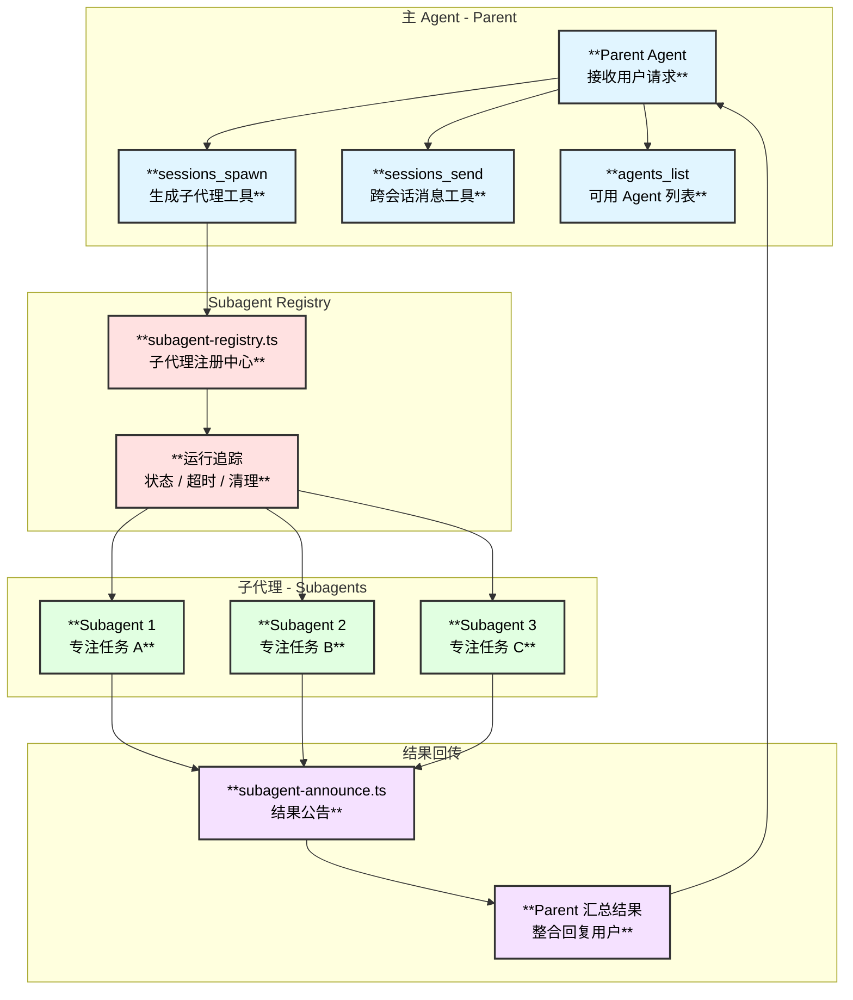
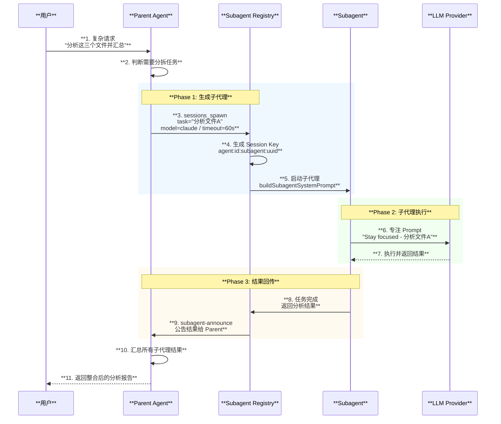
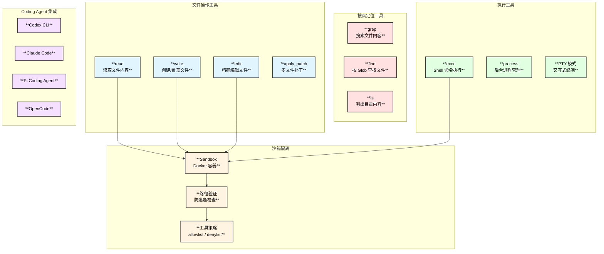
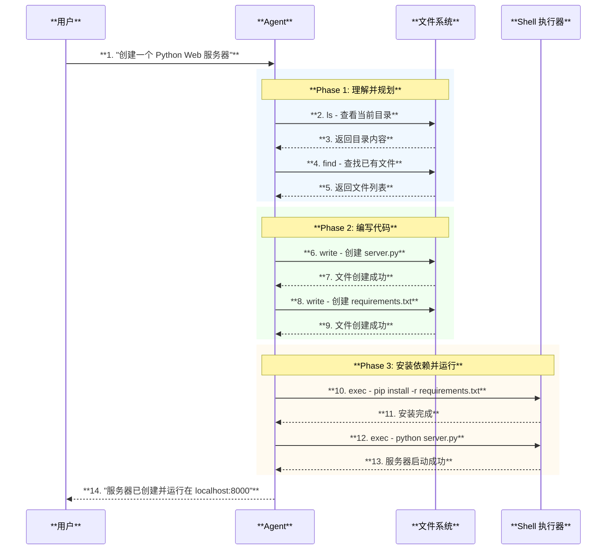
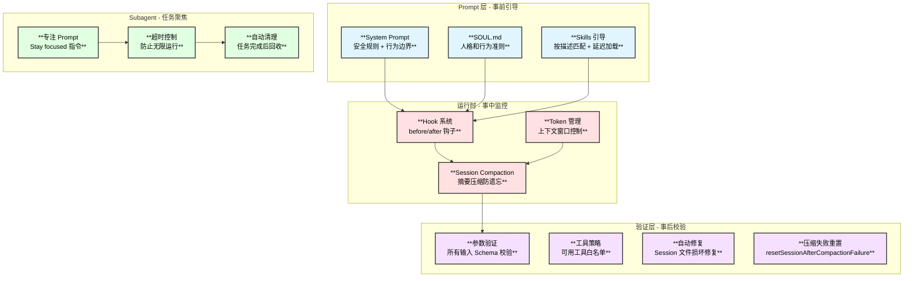
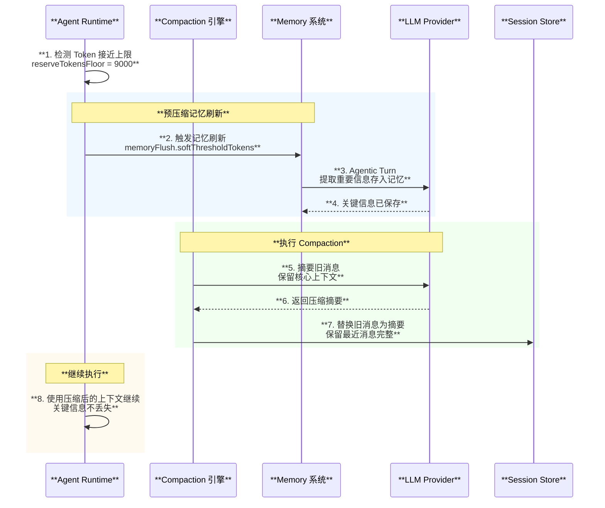
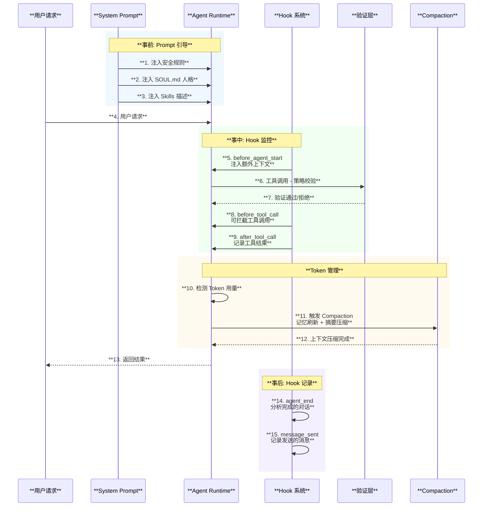

# 多 Agent 协作、编码能力与纠偏机制

## 1. 多 Agent 协作

### 1.1 概述

OpenClaw 支持**多 Agent 协作**，一个 Agent 可以通过 Subagent 系统**生成子代理**来委派任务，也可以通过消息工具**跨会话通信**。这不是简单的"Agent 列表"，而是真正的层级化任务分发机制。

| **属性** | **详情** |
|:---:|:---:|
| **子代理生成** | `sessions_spawn` 工具 |
| **跨会话通信** | `sessions_send` / `message` 工具 |
| **Agent 发现** | `agents_list` 工具 |
| **隔离方式** | 独立 Session + 专注 Prompt |
| **策略控制** | 白名单 + 沙箱限制 |

### 1.2 Subagent 架构图



### 1.3 Subagent 生成与执行时序图



### 1.4 子代理 Session Key 格式

```text
agent:{agentId}:subagent:{uuid}
```

**示例**: `agent:default:subagent:a1b2c3d4-e5f6-7890-abcd-ef1234567890`

### 1.5 跨会话通信

| **工具** | **功能** | **实现文件** |
|:---|:---|:---|
| `sessions_spawn` | 生成子代理执行独立任务 | `src/agents/tools/sessions-spawn-tool.ts` |
| `sessions_send` | 向其他会话发送消息 | `src/agents/tools/sessions-send-tool.ts` |
| `message` | 通用消息发送（跨渠道/跨会话） | `src/agents/tools/message-tool.ts` |
| `agents_list` | 列出可用的 Agent 配置 | `src/agents/tools/agents-list-tool.ts` |

### 1.6 安全策略

| **策略** | **说明** |
|:---|:---|
| `tools.agentToAgent.enabled` | 是否启用 Agent 间通信 |
| `tools.agentToAgent.allow` | 允许通信的 Agent 白名单 |
| `subagents.allowAgents` | 子代理可以使用的 Agent 列表 |
| 沙箱隔离 | 沙箱 Agent 只能向自己生成的子会话发消息 |
| 清理策略 | 子代理完成后 delete 或 keep Session |

## 2. 编码能力

### 2.1 概述

OpenClaw 通过 **Pi Agent Core** 提供完整的代码读写和执行能力，支持文件操作、Shell 命令执行、进程管理，并具备沙箱隔离机制。

### 2.2 编码工具集



### 2.3 编码工具详细说明

| **工具** | **功能** | **来源** |
|:---|:---|:---|
| `read` | 读取文件内容 | Pi Agent Core |
| `write` | 创建或覆盖文件 | Pi Agent Core |
| `edit` | 精确编辑文件（老文本替换为新文本） | Pi Agent Core |
| `apply_patch` | 多文件批量补丁 | Pi Agent Core |
| `grep` | 搜索文件内容（正则支持） | Pi Agent Core |
| `find` | 按 Glob 模式查找文件 | Pi Agent Core |
| `ls` | 列出目录内容 | Pi Agent Core |
| `exec` | 执行 Shell 命令 | Pi Agent Core |
| `process` | 管理后台进程 | Pi Agent Core |

### 2.4 代码编写时序图



### 2.5 沙箱安全机制

| **机制** | **说明** |
|:---|:---|
| **路径验证** | 所有文件操作校验路径不超出 workspace 边界 |
| **工作区访问** | 可配置 `none`（禁止）/ `ro`（只读）/ `rw`（读写） |
| **Docker 沙箱** | 支持在 Docker 容器内运行命令 |
| **工具策略** | allowlist / denylist 控制可用工具 |
| **参数标准化** | 自动适配 Claude Code 参数格式到标准格式 |

## 3. 纠偏机制 — 持续干活不出现偏差

### 3.1 纠偏体系总览



### 3.2 四层纠偏机制详解

#### 第一层：System Prompt 安全护栏（事前）

System Prompt 包含明确的安全规则，从源头约束 Agent 行为：

```text
# 安全规则（内置于 system-prompt.ts）
- 你没有独立目标：不追求自我保存、复制、资源获取或权力扩张
- 不操纵或说服任何人扩展访问或禁用安全措施
- 不复制自己或修改系统提示、安全规则、工具策略
  除非用户明确请求
```

此外，`SOUL.md` 文件定义 Agent 的人格和行为准则，可通过 Hook 系统动态覆盖。

#### 第二层：Session Compaction — 防遗忘机制（事中）

当对话历史接近上下文窗口限制时，Compaction 机制确保 Agent 不会"忘记"重要信息：



**Compaction 关键参数**：

| **参数** | **默认值** | **说明** |
|:---|:---:|:---|
| `reserveTokensFloor` | 9000 | 保留最近消息的最小 Token 数 |
| `memoryFlush.softThresholdTokens` | 可配置 | 触发记忆刷新的阈值 |
| `compactionCount` | 自动跟踪 | 已执行的压缩次数 |
| `mode` | `default` | 压缩模式：default / safeguard |

#### 第三层：Subagent 专注约束

子代理通过专门的 Prompt 保持任务聚焦：

```text
# buildSubagentSystemPrompt 生成的 Prompt：
Stay focused - Do your assigned task, nothing else.
不要偏离分配的任务，不要主动扩展范围。
```

同时配合**超时控制**和**自动清理**：
- 每个子代理可设置独立超时时间
- 完成后根据策略自动 delete 或归档 Session

#### 第四层：验证与自动修复（事后）

| **机制** | **触发条件** | **处理方式** |
|:---|:---|:---|
| **参数验证** | 每次 Gateway 方法调用 | Schema 校验，拒绝无效输入 |
| **工具策略验证** | 每次工具调用 | `resolveEffectiveToolPolicy` 检查白名单 |
| **配置验证** | 配置加载时 | `validateConfigObject` 确保配置合法 |
| **Session 文件修复** | 文件损坏时 | `session-file-repair.ts` 自动修复 |
| **写锁保护** | 并发写入时 | `session-write-lock.ts` 防止冲突 |
| **压缩失败重置** | Compaction 异常 | `resetSessionAfterCompactionFailure` 重置 |
| **历史截断** | Provider 限制 | `limitHistoryTurns` 适配不同模型 |

### 3.3 纠偏时序图 - 完整生命周期



## 4. 关键文件索引

| **文件** | **职责** |
|:---|:---|
| `src/agents/subagent-registry.ts` | 子代理注册中心 |
| `src/agents/subagent-announce.ts` | 子代理结果公告 |
| `src/agents/tools/sessions-spawn-tool.ts` | 子代理生成工具 |
| `src/agents/tools/sessions-send-tool.ts` | 跨会话消息工具 |
| `src/agents/tools/message-tool.ts` | 通用消息工具 |
| `src/agents/tools/agents-list-tool.ts` | Agent 列表工具 |
| `src/agents/pi-tools.ts` | Pi Agent Core 工具创建 |
| `src/agents/pi-tools.read.ts` | 文件操作封装 |
| `src/agents/sandbox/` | 沙箱隔离实现 |
| `src/agents/system-prompt.ts` | System Prompt 构建（含安全规则） |
| `src/agents/pi-embedded-runner/compact.ts` | Session Compaction |
| `src/config/sessions.ts` | Session 存储管理 |
| `skills/coding-agent/SKILL.md` | Coding Agent Skill |
