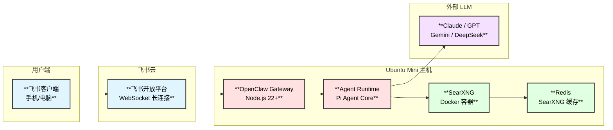
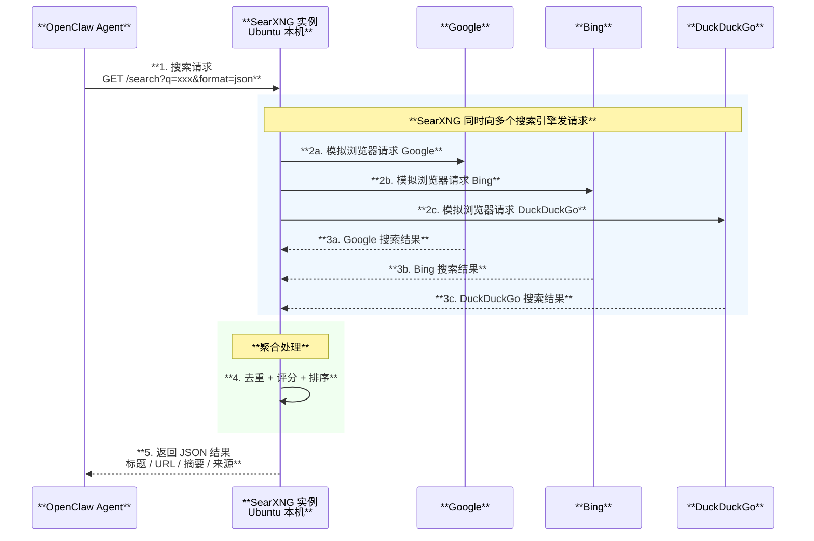
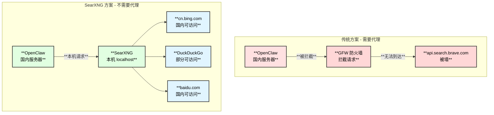
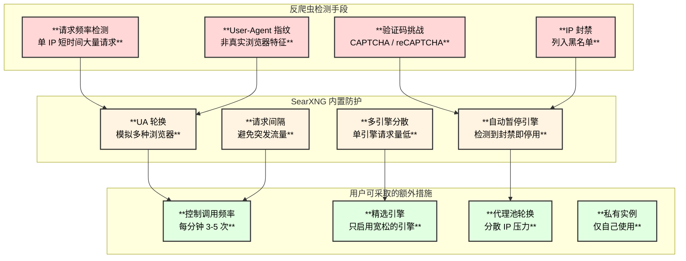
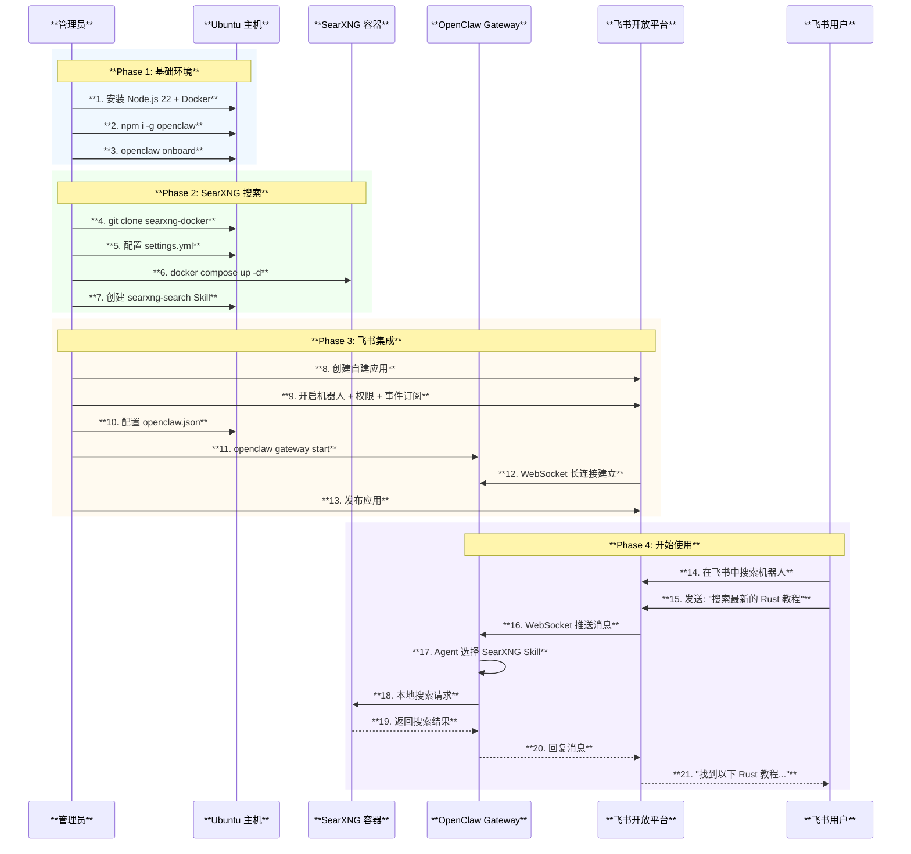

# 部署方案：Ubuntu Mini 主机 + 飞书控制 + SearXNG 免费搜索

## 1. 方案总览

在 Ubuntu Mini 主机上部署 OpenClaw Gateway，通过飞书机器人作为交互入口，并自建 SearXNG 提供免费搜索能力，无需付费 API、无需代理。

### 1.1 架构总览



### 1.2 为什么飞书用 WebSocket 不需要公网 IP

飞书支持**长连接（WebSocket）模式**，这意味着：
- OpenClaw 主动**向飞书服务器发起连接**（出站请求）
- 飞书通过这个已建立的连接推送消息事件
- **无需 Webhook、无需公网 IP、无需域名、无需 HTTPS 证书**
- 只要 Ubuntu 主机能访问 `open.feishu.cn` 即可

### 1.3 最低硬件要求

| **资源** | **最低要求** | **推荐** |
|:---:|:---:|:---:|
| **CPU** | 2 核 | 4 核 |
| **内存** | 2 GB | 4 GB |
| **磁盘** | 10 GB | 20 GB |
| **网络** | 能访问外网 | 稳定连接 |
| **系统** | Ubuntu 22.04+ | Ubuntu 24.04 LTS |

## 2. SearXNG 原理 — 为什么不需要代理

### 2.1 核心原理

SearXNG 是一个**元搜索引擎**（Meta Search Engine），它本身不爬取网页，而是：



### 2.2 为什么不需要 API Key

| **传统搜索 API** | **SearXNG** |
|:---|:---|
| 需要注册账号、申请 API Key | **无需注册、无需 Key** |
| 搜索引擎识别你为 API 调用者 | SearXNG 模拟**普通浏览器**访问 |
| 按调用次数收费 | **完全免费** |
| 搜索引擎知道你的 IP | 搜索引擎只看到 **SearXNG 服务器 IP** |

### 2.3 为什么国内不需要代理

这是关键问题。SearXNG **本身不需要代理**的原因：



**核心逻辑**：

1. **Brave/Perplexity API 被墙**：它们的 API 域名在国内无法直连
2. **SearXNG 运行在本机**：OpenClaw 调用的是 `localhost:8080`，不经过防火墙
3. **SearXNG 的后端引擎可选**：你可以只启用国内能访问的搜索引擎：
   - **Bing 国际版**（`cn.bing.com`）— 国内可直连
   - **百度**（`baidu.com`）— 国内可直连
   - **搜狗**（`sogou.com`）— 国内可直连
   - **Wikipedia**（`zh.wikipedia.org`）— 国内可直连
4. **禁用被墙的引擎**：在配置中禁用 Google、DuckDuckGo 等国内无法访问的引擎

> **总结**：SearXNG 把"请求哪个搜索引擎"的选择权交给了你，你只需启用国内可达的引擎即可。

### 2.4 反爬虫风险与应对 — 诚实的真相

**SearXNG 确实面临反爬虫风险**，这是必须正视的问题。搜索引擎有能力检测并封禁高频请求的 IP。

#### 风险全景图



#### 为什么个人自建受影响较小

| **场景** | **被封风险** | **原因** |
|:---|:---:|:---|
| **公共 SearXNG 实例** | **高** | 大量用户共享一个 IP，请求频率极高 |
| **个人私有实例** | **低** | 只有你一个人用，请求频率很低（一天几十次） |
| **AI Agent 集成** | **中等** | Agent 可能短时间连续搜索，需控制频率 |

个人自建之所以风险较低，核心原因是**请求量极小**。一个人一天的搜索量可能就几十次，而搜索引擎的反爬阈值通常是每 IP 每分钟数十到数百次。

#### SearXNG 的内置自我保护机制

SearXNG 检测到搜索引擎返回异常时，会**自动暂停该引擎**：

| **触发条件** | **自动暂停时长** | **含义** |
|:---|:---:|:---|
| 检测到 CDN 验证码 | **15 天** | 该引擎彻底被封，长期暂停 |
| 检测到 reCAPTCHA | **7 天** | 需要人机验证，中期暂停 |
| HTTP 403（禁止访问） | **24 小时** | 临时拒绝，短期暂停 |
| HTTP 429（请求过多） | **1 小时** | 频率过高，快速暂停 |

> 引擎被暂停后，SearXNG 会自动切换到其他可用引擎继续工作，不会中断服务。

#### 推荐的反爬虫配置策略

```yaml
# searxng/settings.yml - 个人实例推荐配置

server:
  limiter: false          # 私有实例可关闭入站限流
  image_proxy: true

search:
  formats:
    - html
    - json
  default_lang: "zh-CN"

# 选择对爬虫最宽松的引擎
engines:
  # Bing 对自动化请求最宽容（推荐首选）
  - name: bing
    disabled: false
    weight: 3              # 最高权重

  # 百度对国内 IP 友好
  - name: baidu
    disabled: false
    weight: 2

  # Wikipedia 无反爬限制
  - name: wikipedia
    disabled: false
    weight: 2

  # Google 反爬最严格（建议禁用）
  - name: google
    disabled: true

  # DuckDuckGo 国内不可达（建议禁用）
  - name: duckduckgo
    disabled: true
```

#### 各引擎的反爬严格程度

| **搜索引擎** | **反爬严格度** | **国内可用** | **推荐** |
|:---|:---:|:---:|:---:|
| **Bing** | 宽松 | 是 | 强烈推荐 |
| **百度** | 宽松 | 是 | 推荐 |
| **搜狗** | 中等 | 是 | 可选 |
| **Wikipedia** | 无限制 | 是 | 推荐 |
| **DuckDuckGo** | 中等 | 需代理 | 不推荐 |
| **Google** | **非常严格** | 需代理 | 不推荐 |
| **Yahoo** | 严格 | 需代理 | 不推荐 |

#### 总结：实际可靠性评估

```text
个人 AI 助手场景（每天 20-50 次搜索）：
┌──────────────────────────────────────────────┐
│  引擎选择: Bing + 百度 + Wikipedia            │
│  被封概率: 极低（< 1%）                        │
│  原因: 请求量远低于反爬阈值                     │
│  即使被封: 自动暂停该引擎,切换到其他引擎继续工作  │
│  最差情况: 暂时无搜索结果,等待自动恢复           │
└──────────────────────────────────────────────┘

高频 Agent 场景（每天 200+ 次搜索）：
┌──────────────────────────────────────────────┐
│  额外措施: 控制频率 ≤ 3次/分钟                  │
│  备选方案: 配置代理池轮换 IP                    │
│  或混合方案: SearXNG + Brave Free 2000次/月    │
└──────────────────────────────────────────────┘
```

### 2.5 支持的搜索引擎（70+）

| **类别** | **国内可用引擎** | **需代理引擎** |
|:---|:---|:---|
| **通用搜索** | Bing、百度、搜狗 | Google、DuckDuckGo、Yahoo |
| **学术** | Google Scholar（部分可）、Semantic Scholar | - |
| **代码** | GitHub | - |
| **百科** | Wikipedia 中文 | - |
| **新闻** | Bing News | Google News |
| **图片** | Bing Images | Google Images |
| **视频** | Bing Videos、Bilibili（需插件） | YouTube |

## 3. 部署步骤 — 第一阶段：基础环境

### 3.1 安装 Node.js 22+

```bash
# 方法 1: NodeSource 官方源（推荐）
curl -fsSL https://deb.nodesource.com/setup_22.x | sudo -E bash -
sudo apt-get install -y nodejs

# 验证
node --version   # 应显示 v22.x.x
npm --version
```

### 3.2 安装 Docker 和 Docker Compose

```bash
# 安装 Docker
sudo apt-get update
sudo apt-get install -y docker.io docker-compose-v2

# 将当前用户加入 docker 组（免 sudo）
sudo usermod -aG docker $USER
newgrp docker

# 验证
docker --version
docker compose version
```

### 3.3 安装 OpenClaw

```bash
# 全局安装
npm i -g openclaw@latest

# 验证
openclaw --version

# 运行引导向导
openclaw onboard
```

引导向导会引导你配置：
- LLM 提供商和 API Key（Claude / GPT / Gemini / DeepSeek）
- Gateway 密码或 Token

## 4. 部署步骤 — 第二阶段：SearXNG 搜索

### 4.1 安装 SearXNG

```bash
# 克隆官方 Docker 项目
cd ~
git clone https://github.com/searxng/searxng-docker.git
cd searxng-docker

# 生成安全密钥
sed -i "s|ultrasecretkey|$(openssl rand -hex 32)|g" searxng/settings.yml
```

### 4.2 配置 SearXNG

编辑 `searxng/settings.yml`：

```yaml
use_default_settings: true

server:
  secret_key: "自动生成的密钥"
  bind_address: "0.0.0.0"
  port: 8080

search:
  formats:
    - html
    - json          # 必须启用 JSON 格式供 API 调用
  default_lang: "zh-CN"

# 国内优化：只启用可达的引擎
engines:
  # 禁用国内无法访问的引擎
  - name: google
    disabled: true
  - name: duckduckgo
    disabled: true
  - name: yahoo
    disabled: true

  # 启用国内可访问的引擎
  - name: bing
    disabled: false
    weight: 2        # 提高权重
  - name: wikipedia
    disabled: false
```

### 4.3 配置 Docker Compose

编辑 `docker-compose.yaml`，如果不需要 Caddy 反向代理可以简化：

```yaml
version: '3.8'
services:
  searxng:
    image: searxng/searxng:latest
    container_name: searxng
    restart: unless-stopped
    ports:
      - "8080:8080"
    volumes:
      - ./searxng:/etc/searxng:rw
    environment:
      - SEARXNG_BASE_URL=http://localhost:8080/

  redis:
    image: redis:alpine
    container_name: searxng-redis
    restart: unless-stopped
    command: redis-server --save "" --appendonly "no"
```

### 4.4 启动 SearXNG

```bash
docker compose up -d

# 验证
curl "http://localhost:8080/search?q=test&format=json" | head -c 200
```

### 4.5 集成到 OpenClaw（自定义 Skill）

创建搜索 Skill 文件 `~/.openclaw/skills/searxng-search/SKILL.md`：

```markdown
---
name: searxng-search
description: Search the web using local SearXNG instance for any query
metadata:
  {
    "openclaw": {
      "emoji": "🔍",
      "always": true
    }
  }
---

# SearXNG Web Search

When the user asks to search the web or needs current information:

1. Use the `exec` tool to call the local SearXNG API:

   curl -s "http://localhost:8080/search?q=QUERY&format=json&language=zh-CN" | head -c 5000

   Replace QUERY with the URL-encoded search query.

2. Parse the JSON response. Results are in the `results` array with fields:
   - `title`: Result title
   - `url`: Result URL
   - `content`: Result snippet/description
   - `engine`: Source search engine

3. If needed, use `web_fetch` to get detailed content from specific URLs.

4. Summarize the findings and respond to the user.
```

## 5. 部署步骤 — 第三阶段：飞书集成

### 5.1 创建飞书机器人应用

```text
步骤 1: 登录飞书开放平台
  → https://open.feishu.cn/app
  → 创建企业自建应用

步骤 2: 记录 App ID 和 App Secret
  → 凭证与基础信息页面
  → App ID: cli_xxxxxxxxxxxx
  → App Secret: xxxxxxxxxxxxxxx

步骤 3: 开启机器人能力
  → 应用能力 → 机器人
  → 开启机器人功能

步骤 4: 配置权限（批量导入）
  → 权限管理 → 批量开通
  → 至少需要：
     im:message（收发消息）
     im:message:send_as_bot（以机器人发消息）
     im:chat（聊天管理）

步骤 5: 配置事件订阅
  → 事件与回调 → 事件配置
  → 订阅方式：使用长连接（WebSocket）★重要
  → 添加事件：im.message.receive_v1
  → 注意：Gateway 必须先运行，再保存事件配置

步骤 6: 发布应用
  → 版本管理与发布
  → 创建版本并提交审核
```

### 5.2 配置 OpenClaw 飞书渠道

编辑 `~/.openclaw/openclaw.json`：

```json
{
  "gateway": {
    "mode": "local",
    "port": 18789,
    "bind": "loopback",
    "auth": {
      "mode": "password",
      "password": "你的网关密码"
    }
  },
  "channels": {
    "feishu": {
      "enabled": true,
      "domain": "feishu",
      "connectionMode": "websocket",
      "dmPolicy": "open",
      "accounts": {
        "main": {
          "appId": "cli_xxxxxxxxxxxx",
          "appSecret": "你的 App Secret",
          "botName": "我的AI助手"
        }
      },
      "allowFrom": ["*"]
    }
  }
}
```

### 5.3 启动 Gateway

```bash
# 前台启动（调试用）
openclaw gateway start

# 安装为 systemd 服务（生产用）
openclaw gateway install
systemctl --user enable openclaw-gateway
systemctl --user start openclaw-gateway

# 查看状态
openclaw gateway status
```

### 5.4 验证飞书连接

```bash
# 查看日志
openclaw logs --follow

# 应该看到类似输出：
# [feishu] Connected to Feishu WebSocket
# [feishu] Bot ready: 我的AI助手
```

在飞书中搜索你的机器人名字，发送消息即可开始对话。

## 6. 完整部署时序图



## 7. 飞书使用技巧

### 7.1 支持的交互方式

| **方式** | **说明** |
|:---|:---|
| **私聊** | 直接发消息给机器人 |
| **群聊** | 在群中 @机器人 发消息 |
| **图片** | 发送图片，Agent 可识别 |
| **文件** | 发送文件，Agent 可处理 |
| **命令** | `/new` 新会话、`/model` 切换模型 |

### 7.2 访问策略

| **策略** | **值** | **说明** |
|:---|:---|:---|
| `dmPolicy` | `"pairing"` | 未知用户需配对码（默认，最安全） |
| `dmPolicy` | `"allowlist"` | 仅白名单用户可用 |
| `dmPolicy` | `"open"` | 所有人可用（需配合 `allowFrom: ["*"]`） |
| `groupPolicy` | `"open"` | 所有群可用（需 @mention） |
| `groupPolicy` | `"allowlist"` | 仅指定群可用 |

### 7.3 常用运维命令

```bash
# 查看 Gateway 状态
openclaw gateway status

# 查看实时日志
openclaw logs --follow

# 重启 Gateway
systemctl --user restart openclaw-gateway

# 查看 SearXNG 状态
docker compose -f ~/searxng-docker/docker-compose.yaml ps

# 查看 SearXNG 日志
docker compose -f ~/searxng-docker/docker-compose.yaml logs -f searxng

# 更新 OpenClaw
npm update -g openclaw

# 更新 SearXNG
cd ~/searxng-docker && docker compose pull && docker compose up -d
```

## 8. 故障排查

| **问题** | **排查方法** |
|:---|:---|
| **飞书机器人无响应** | 1. `openclaw gateway status` 检查 Gateway<br/>2. 确认事件订阅用的是长连接<br/>3. `openclaw logs --follow` 查看日志 |
| **SearXNG 无结果** | 1. `curl "http://localhost:8080/search?q=test&format=json"`<br/>2. 检查 settings.yml 是否启用了 json 格式<br/>3. 检查引擎是否在国内可达 |
| **LLM 无响应** | 1. 检查 API Key 是否正确<br/>2. 检查 LLM API 在国内是否可达<br/>3. 考虑使用 DeepSeek（国内可直连） |
| **Gateway 启动失败** | 1. 检查 18789 端口是否被占用<br/>2. 检查 Node.js 版本是否 22+<br/>3. 检查 `~/.openclaw/` 目录权限 |

## 9. 推荐的国内 LLM 配合方案

由于 Claude/GPT 的 API 在国内也需要代理，推荐以下国内可直连的 LLM：

| **LLM** | **API 端点** | **国内直连** | **推荐度** |
|:---|:---|:---:|:---:|
| **DeepSeek** | `api.deepseek.com` | **是** | 强烈推荐 |
| **通义千问** | `dashscope.aliyuncs.com` | **是** | 推荐 |
| **Moonshot** | `api.moonshot.cn` | **是** | 推荐 |
| **智谱 GLM** | `open.bigmodel.cn` | **是** | 推荐 |
| **文心一言** | `aip.baidubce.com` | **是** | 可选 |

> **完全国内方案**：DeepSeek + SearXNG + 飞书 = 零代理、零付费搜索、国内可直连
