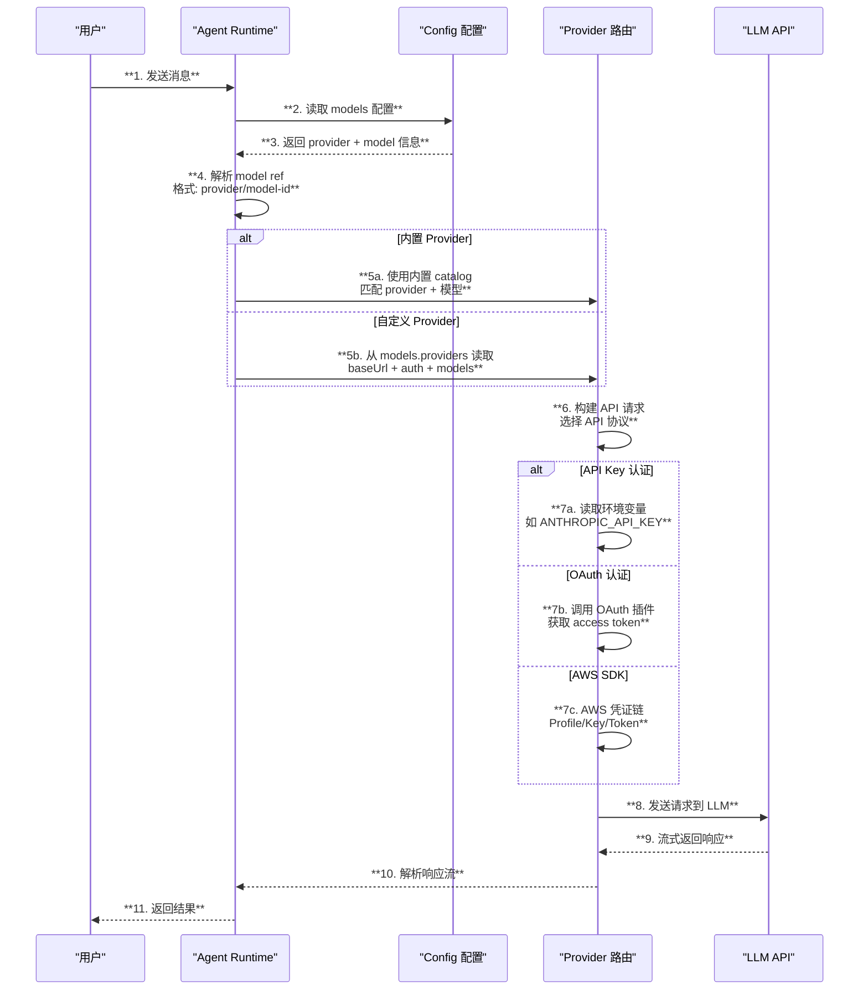
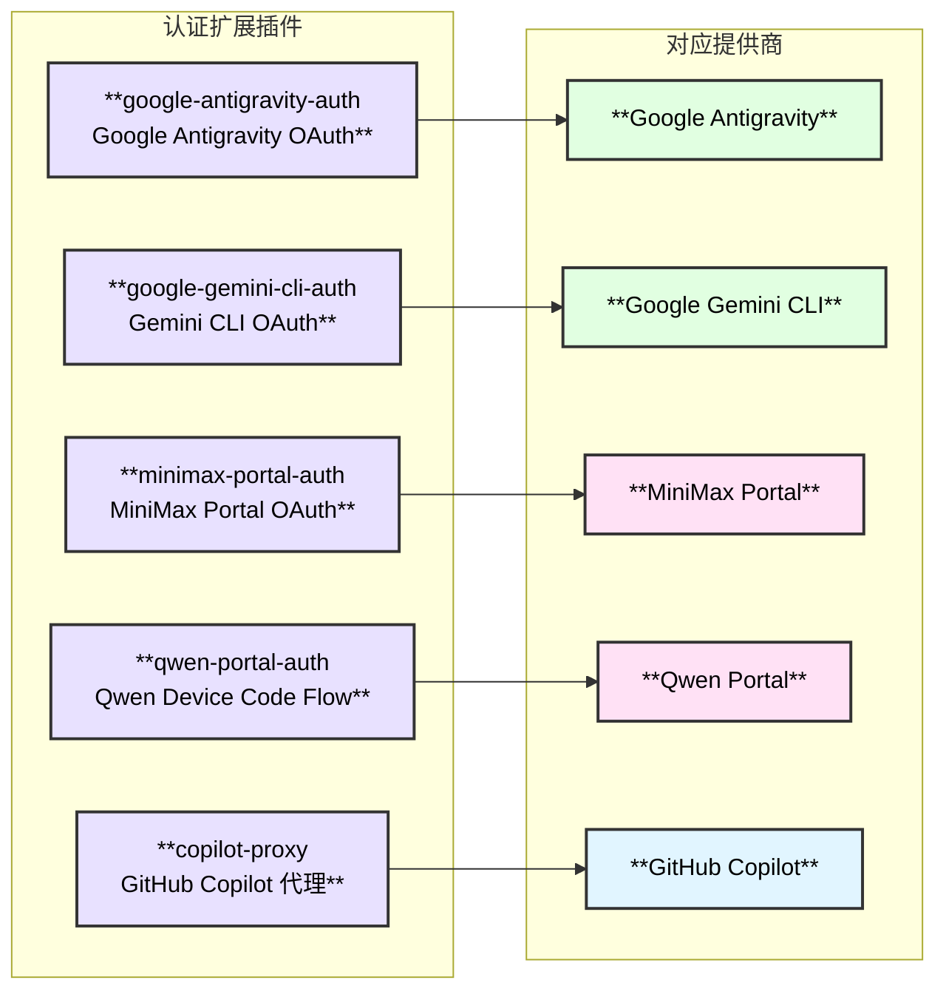
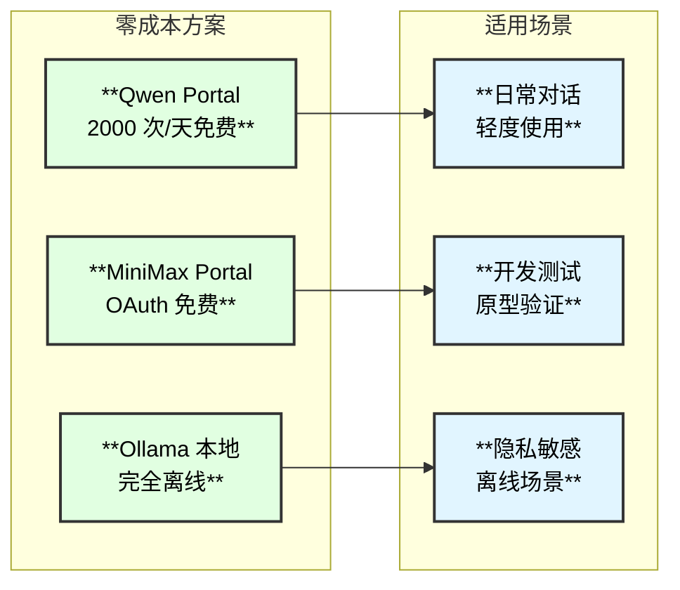

# 大模型支持

## 1. 概述

OpenClaw 支持 **29+ 种 LLM 提供商**，涵盖国际主流模型、国内模型、本地模型、聚合网关等多种接入方式。通过统一的 Provider 抽象层，所有模型共享相同的 Agent 工具链和会话管理能力。

| **属性** | **详情** |
|:---:|:---:|
| **提供商数量** | 29+ 内置/可配置 |
| **API 协议** | 6 种（OpenAI / Anthropic / Google / Bedrock / GitHub Copilot / OAuth） |
| **国内可用** | 7 个提供商直连（Moonshot / Kimi Coding / MiniMax / Qwen / 千帆 / 小米 MiMo） |
| **本地模型** | Ollama 本地部署 |
| **认证方式** | API Key / OAuth / AWS SDK / Token |

## 2. 提供商全景架构图

```mermaid
graph TB
    subgraph USR["用户请求"]
        U[**用户消息**]
    end

    subgraph CORE["OpenClaw Agent Runtime"]
        RT[**Pi Agent Core<br/>模型路由与调度**]
    end

    subgraph INTL["国际主流模型"]
        ANT[**Anthropic<br/>Claude Opus/Sonnet**]
        OAI[**OpenAI<br/>GPT-5.x / Codex**]
        GOG[**Google<br/>Gemini 3 Pro/Flash**]
        XAI[**xAI<br/>Grok**]
        MIS[**Mistral**]
    end

    subgraph GW["聚合网关"]
        OR[**OpenRouter<br/>多模型中转**]
        VER[**Vercel AI Gateway**]
        CF[**Cloudflare AI Gateway**]
        OC[**OpenCode Zen**]
        SYN[**Synthetic<br/>19 模型聚合**]
        VEN[**Venice AI<br/>25 模型/匿名代理**]
    end

    subgraph CN["国内可用模型"]
        MS[**Moonshot AI<br/>Kimi K2.5**]
        KC[**Kimi Coding**]
        MM[**MiniMax<br/>M2.1 / VL-01**]
        QW[**Qwen Portal<br/>通义千问**]
        QF[**千帆 Baidu<br/>DeepSeek/文心**]
        XM[**小米 MiMo<br/>mimo-v2-flash**]
    end

    subgraph INFRA["基础设施"]
        BED[**AWS Bedrock<br/>多模型托管**]
        GH[**GitHub Copilot<br/>OAuth 代理**]
        GRQ[**Groq<br/>硬件加速推理**]
        CER[**Cerebras<br/>超快推理**]
        OLL[**Ollama<br/>本地模型**]
    end

    subgraph OAUTH["OAuth 认证扩展"]
        GA[**google-antigravity-auth**]
        GC[**google-gemini-cli-auth**]
        MMA[**minimax-portal-auth**]
        QA[**qwen-portal-auth**]
        CP[**copilot-proxy**]
    end

    U --> RT
    RT --> ANT
    RT --> OAI
    RT --> GOG
    RT --> XAI
    RT --> MIS
    RT --> OR
    RT --> VER
    RT --> CF
    RT --> OC
    RT --> SYN
    RT --> VEN
    RT --> MS
    RT --> KC
    RT --> MM
    RT --> QW
    RT --> QF
    RT --> XM
    RT --> BED
    RT --> GH
    RT --> GRQ
    RT --> CER
    RT --> OLL

    GA -.-> GOG
    GC -.-> GOG
    MMA -.-> MM
    QA -.-> QW
    CP -.-> GH

    style U fill:#e1f5ff,stroke:#333,stroke-width:2px,color:#000
    style RT fill:#ffe1e1,stroke:#333,stroke-width:2px,color:#000
    style ANT fill:#e1ffe1,stroke:#333,stroke-width:2px,color:#000
    style OAI fill:#e1ffe1,stroke:#333,stroke-width:2px,color:#000
    style GOG fill:#e1ffe1,stroke:#333,stroke-width:2px,color:#000
    style XAI fill:#e1ffe1,stroke:#333,stroke-width:2px,color:#000
    style MIS fill:#e1ffe1,stroke:#333,stroke-width:2px,color:#000
    style OR fill:#fff3e1,stroke:#333,stroke-width:2px,color:#000
    style VER fill:#fff3e1,stroke:#333,stroke-width:2px,color:#000
    style CF fill:#fff3e1,stroke:#333,stroke-width:2px,color:#000
    style OC fill:#fff3e1,stroke:#333,stroke-width:2px,color:#000
    style SYN fill:#fff3e1,stroke:#333,stroke-width:2px,color:#000
    style VEN fill:#fff3e1,stroke:#333,stroke-width:2px,color:#000
    style MS fill:#ffe1f5,stroke:#333,stroke-width:2px,color:#000
    style KC fill:#ffe1f5,stroke:#333,stroke-width:2px,color:#000
    style MM fill:#ffe1f5,stroke:#333,stroke-width:2px,color:#000
    style QW fill:#ffe1f5,stroke:#333,stroke-width:2px,color:#000
    style QF fill:#ffe1f5,stroke:#333,stroke-width:2px,color:#000
    style XM fill:#ffe1f5,stroke:#333,stroke-width:2px,color:#000
    style BED fill:#f5e1ff,stroke:#333,stroke-width:2px,color:#000
    style GH fill:#f5e1ff,stroke:#333,stroke-width:2px,color:#000
    style GRQ fill:#f5e1ff,stroke:#333,stroke-width:2px,color:#000
    style CER fill:#f5e1ff,stroke:#333,stroke-width:2px,color:#000
    style OLL fill:#f5e1ff,stroke:#333,stroke-width:2px,color:#000
    style GA fill:#e8e1ff,stroke:#333,stroke-width:2px,color:#000
    style GC fill:#e8e1ff,stroke:#333,stroke-width:2px,color:#000
    style MMA fill:#e8e1ff,stroke:#333,stroke-width:2px,color:#000
    style QA fill:#e8e1ff,stroke:#333,stroke-width:2px,color:#000
    style CP fill:#e8e1ff,stroke:#333,stroke-width:2px,color:#000
```



## 3. 内置提供商详情

### 3.1 国际主流模型

| **提供商** | **Provider ID** | **API 协议** | **认证方式** | **代表模型** | **国内直连** |
|:---|:---:|:---:|:---:|:---|:---:|
| **Anthropic** | `anthropic` | anthropic-messages | API Key / OAuth Token | claude-opus-4-6, claude-sonnet-4-5 | 否 |
| **OpenAI** | `openai` | openai-completions / openai-responses | API Key | gpt-5.1-codex | 否 |
| **OpenAI Codex** | `openai-codex` | OAuth | OAuth（ChatGPT 登录） | gpt-5.3-codex | 否 |
| **Google Gemini** | `google` | google-generative-ai | API Key（GEMINI_API_KEY） | gemini-3-pro-preview, gemini-3-flash-preview | 否 |
| **Google Vertex** | `google-vertex` | google-generative-ai | gcloud ADC | 同 Gemini 系列 | 否 |
| **Google Antigravity** | `google-antigravity` | OAuth | OAuth（插件认证） | Gemini 系列 | 否 |
| **Google Gemini CLI** | `google-gemini-cli` | OAuth | OAuth（插件认证） | Gemini 系列 | 否 |
| **xAI** | `xai` | - | API Key（XAI_API_KEY） | Grok 系列 | 否 |
| **Mistral** | `mistral` | - | API Key（MISTRAL_API_KEY） | Mistral 系列 | 否 |

### 3.2 聚合网关 / 中转服务

| **提供商** | **Provider ID** | **特点** | **认证方式** | **示例模型引用** |
|:---|:---:|:---|:---:|:---|
| **OpenRouter** | `openrouter` | 多提供商中转，统一 API | API Key | `openrouter/anthropic/claude-sonnet-4-5` |
| **Vercel AI Gateway** | `vercel-ai-gateway` | Vercel 基础设施托管 | API Key | `vercel-ai-gateway/anthropic/claude-opus-4.6` |
| **Cloudflare AI Gateway** | `cloudflare-ai-gateway` | Cloudflare CDN 加速 | API Key + Account/Gateway ID | `cloudflare-ai-gateway/claude-sonnet-4-5` |
| **OpenCode Zen** | `opencode` | 开发者友好网关 | API Key | `opencode/claude-opus-4-6` |
| **Synthetic** | `synthetic` | 19 种模型聚合，含开源模型 | API Key | `hf:MiniMaxAI/MiniMax-M2.1` |
| **Venice AI** | `venice` | 25 模型，支持匿名代理 | API Key（vapi_...） | 匿名模式隐藏真实提供商 |

> **Venice AI 特殊能力**：提供 "private"（完全私有）和 "anonymized"（匿名代理）两种隐私模式。匿名模式下可使用 Claude、GPT、Gemini、Grok 等模型而不暴露身份。

### 3.3 国内可直连模型

| **提供商** | **Provider ID** | **API 协议** | **Base URL** | **代表模型** | **免费额度** |
|:---|:---:|:---:|:---|:---|:---:|
| **Moonshot AI** | `moonshot` | openai-completions | `api.moonshot.cn/v1` | kimi-k2.5, kimi-k2-thinking | - |
| **Kimi Coding** | `kimi-coding` | anthropic-messages | 内置 | k2p5 | - |
| **MiniMax** | `minimax` | openai / anthropic | `api.minimax.chat/v1` | MiniMax-M2.1, MiniMax-VL-01（视觉） | - |
| **MiniMax Portal** | `minimax-portal` | anthropic-messages | `api.minimaxi.com/anthropic`（CN） | MiniMax-M2.1 | OAuth 免费 |
| **Qwen Portal** | `qwen-portal` | openai-completions | `portal.qwen.ai/v1` | coder-model, vision-model | **2000 次/天** |
| **千帆 Baidu** | `qianfan` | openai-completions | `qianfan.baidubce.com/v2` | deepseek-v3.2, ernie-5.0-thinking | - |
| **小米 MiMo** | `xiaomi` | anthropic-messages | `api.xiaomimimo.com/anthropic` | mimo-v2-flash | - |

### 3.4 基础设施 / 推理加速

| **提供商** | **Provider ID** | **API 协议** | **特点** | **认证方式** |
|:---|:---:|:---:|:---|:---:|
| **AWS Bedrock** | `amazon-bedrock` | bedrock-converse-stream | AWS 多模型托管，自动发现 | AWS SDK |
| **GitHub Copilot** | `github-copilot` | github-copilot | 动态 Token 解析 | GH_TOKEN / GITHUB_TOKEN |
| **Groq** | `groq` | - | LPU 硬件加速，超低延迟 | API Key |
| **Cerebras** | `cerebras` | openai-compatible | 晶圆级芯片加速推理 | API Key |
| **Voyage** | `voyage` | - | 嵌入模型专用 | API Key |

### 3.5 本地模型

| **提供商** | **Provider ID** | **API 协议** | **Base URL** | **特点** |
|:---|:---:|:---:|:---|:---|
| **Ollama** | `ollama` | openai-completions | `http://127.0.0.1:11434/v1` | 自动发现本地模型，无需 API Key |

> **Ollama 特点**：默认禁用流式输出（streaming: false），上下文窗口 128K，模型从本地 Ollama 实例自动发现。

## 4. 模型路由与选择时序



## 5. 提供商配置格式

### 5.1 统一配置结构

所有提供商在 OpenClaw 配置文件中遵循统一的 `models` 配置结构：

```json5
{
  "models": {
    // merge = 合并到默认, replace = 完全替换
    "mode": "merge",
    "providers": {
      "provider-id": {
        "baseUrl": "https://api.example.com/v1",
        "apiKey": "${ENV_VAR}",
        "api": "openai-completions",
        "auth": "api-key",
        "models": [
          {
            "id": "model-id",
            "name": "模型显示名称",
            "reasoning": true,
            "input": ["text", "image"],
            "cost": {
              "input": 3.0,
              "output": 15.0,
              "cacheRead": 0.3,
              "cacheWrite": 3.75
            },
            "contextWindow": 128000,
            "maxTokens": 8192
          }
        ]
      }
    }
  }
}
```

### 5.2 支持的 API 协议

| **协议** | **说明** | **典型提供商** |
|:---|:---|:---|
| `openai-completions` | OpenAI Chat Completions 兼容 | OpenAI, Moonshot, Ollama, 千帆, Venice |
| `openai-responses` | OpenAI Responses API | OpenAI（新版） |
| `anthropic-messages` | Anthropic Messages API | Anthropic, Kimi Coding, MiniMax Portal, 小米 MiMo |
| `google-generative-ai` | Google Generative AI | Google Gemini, Google Vertex |
| `bedrock-converse-stream` | AWS Bedrock Converse | Amazon Bedrock |
| `github-copilot` | GitHub Copilot 专用 | GitHub Copilot |

### 5.3 模型引用格式

模型以 `provider/model-id` 格式引用：

```text
anthropic/claude-opus-4-6        # Anthropic Claude Opus 4.6
openai/gpt-5.1-codex             # OpenAI GPT-5.1 Codex
google/gemini-3-pro-preview      # Google Gemini 3 Pro
openrouter/anthropic/claude-sonnet-4-5  # 通过 OpenRouter 中转
moonshot/kimi-k2.5               # Moonshot Kimi K2.5
ollama/llama3                    # 本地 Ollama 模型
```

> **别名规则**：`z.ai/*` 和 `z-ai/*` 自动规范化为 `zai/*`

## 6. OAuth 认证扩展

OpenClaw 为部分提供商提供了内置 OAuth 认证插件，用户无需手动管理 API Key：



| **扩展** | **认证流程** | **目标提供商** | **国内可用** |
|:---|:---|:---:|:---:|
| `google-antigravity-auth` | OAuth 浏览器授权 | Google Antigravity | 否 |
| `google-gemini-cli-auth` | OAuth 浏览器授权 | Google Gemini CLI | 否 |
| `minimax-portal-auth` | OAuth（支持 Global + CN 端点） | MiniMax Portal | **是** |
| `qwen-portal-auth` | Device Code Flow（设备码授权） | Qwen Portal | **是** |
| `copilot-proxy` | GitHub Token 代理 | GitHub Copilot | 否 |

> **Qwen Portal 亮点**：通过设备码授权（Device Code Flow）登录，每天免费 2000 次请求，国内直连无障碍。

## 7. 国内部署推荐方案

### 7.1 零成本方案



### 7.2 付费方案（国内直连）

| **方案** | **提供商** | **优势** | **价格参考** |
|:---|:---|:---|:---|
| **最强推理** | Moonshot Kimi K2.5 | 256K 上下文，推理能力强 | 按 Token 计费 |
| **视觉多模态** | MiniMax VL-01 | 支持图像输入，200K 上下文 | 按 Token 计费 |
| **百度生态** | 千帆（DeepSeek / 文心） | 国内基础设施，低延迟 | 按 Token 计费 |
| **小米新锐** | MiMo v2-flash | 262K 超长上下文 | 按 Token 计费 |

### 7.3 混合方案（推荐）

对于国内开发者的最佳实践：

```json5
{
  "models": {
    "mode": "merge",
    "providers": {
      // 主力模型：国内 Moonshot
      "moonshot": {
        "baseUrl": "https://api.moonshot.cn/v1",
        "apiKey": "${MOONSHOT_API_KEY}",
        "api": "openai-completions",
        "models": [{
          "id": "kimi-k2.5",
          "name": "Kimi K2.5",
          "reasoning": true,
          "contextWindow": 256000
        }]
      },
      // 免费备选：Qwen Portal OAuth
      // （通过 qwen-portal-auth 插件自动认证）

      // 本地备选：Ollama（无需网络）
      "ollama": {
        "baseUrl": "http://127.0.0.1:11434/v1",
        "api": "openai-completions",
        "models": []  // 自动发现
      }
    }
  }
}
```

## 8. Synthetic 与 Venice 模型聚合

### 8.1 Synthetic — 开源模型聚合

Synthetic 聚合了 19 种模型，使用 HuggingFace 风格的模型 ID：

| **模型 ID** | **提供商/模型** | **类型** |
|:---|:---|:---:|
| `hf:MiniMaxAI/MiniMax-M2.1` | MiniMax M2.1 | 闭源 |
| `hf:moonshotai/Kimi-K2` | Kimi K2 | 闭源 |
| `hf:THUDM/GLM-4.7` | 智谱 GLM-4.7 | 开源 |
| `hf:deepseek-ai/DeepSeek-V3.2` | DeepSeek V3.2 | 开源 |
| `hf:Qwen/Qwen3-Coder` | 通义千问 Qwen3 Coder | 开源 |
| `hf:meta-llama/Llama-*` | Meta Llama 系列 | 开源 |

### 8.2 Venice AI — 隐私优先

Venice AI 提供独特的隐私保护模式：

| **模式** | **模型数量** | **特点** |
|:---|:---:|:---|
| **Private（私有）** | 15 | 完全私有运行，包括 Llama、Qwen、DeepSeek、GLM 等开源模型 |
| **Anonymized（匿名）** | 10 | 代理访问 Claude、GPT、Gemini、Grok 等闭源模型，隐藏用户身份 |

## 9. AWS Bedrock 自动发现

AWS Bedrock 提供商支持自动模型发现：

```json5
{
  "models": {
    "bedrockDiscovery": {
      "enabled": true,           // 开启自动发现
      "region": "us-east-1",     // AWS 区域
      "providerFilter": []       // 可选：过滤特定提供商
    }
  }
}
```

认证方式优先级：
1. `AWS_BEARER_TOKEN_BEDROCK` — Bearer Token 直接认证
2. `AWS_PROFILE` — AWS Profile 配置
3. `AWS_ACCESS_KEY_ID` + `AWS_SECRET_ACCESS_KEY` — Access Key 对
4. gcloud ADC — 默认凭证链

## 10. 关键配置文件索引

| **文件路径** | **用途** |
|:---|:---|
| `src/agents/pi-ai-catalog.ts` | 内置 Provider 目录定义 |
| `src/agents/pi-embedded-runner/models.ts` | 模型解析与 Provider 路由逻辑 |
| `src/agents/pi-embedded-runner/providers/` | 各 Provider 适配器实现 |
| `extensions/google-antigravity-auth/` | Google Antigravity OAuth 插件 |
| `extensions/google-gemini-cli-auth/` | Google Gemini CLI OAuth 插件 |
| `extensions/minimax-portal-auth/` | MiniMax Portal OAuth 插件 |
| `extensions/qwen-portal-auth/` | Qwen Portal OAuth 插件 |
| `extensions/copilot-proxy/` | GitHub Copilot 代理插件 |
