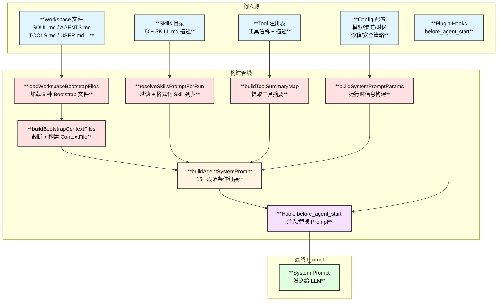
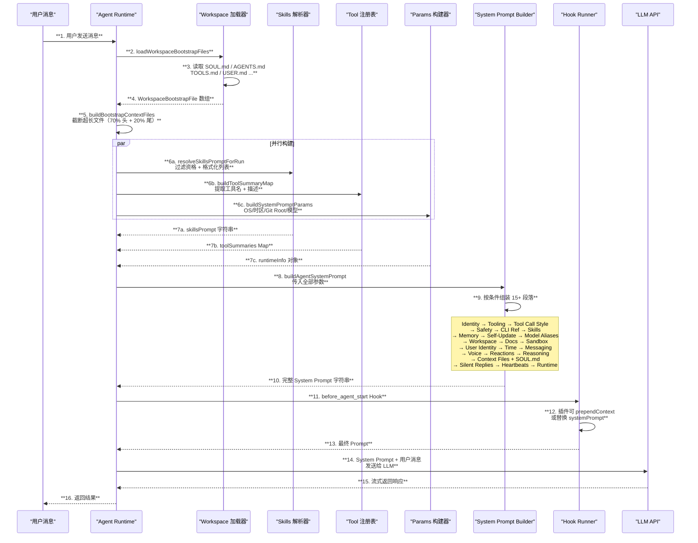
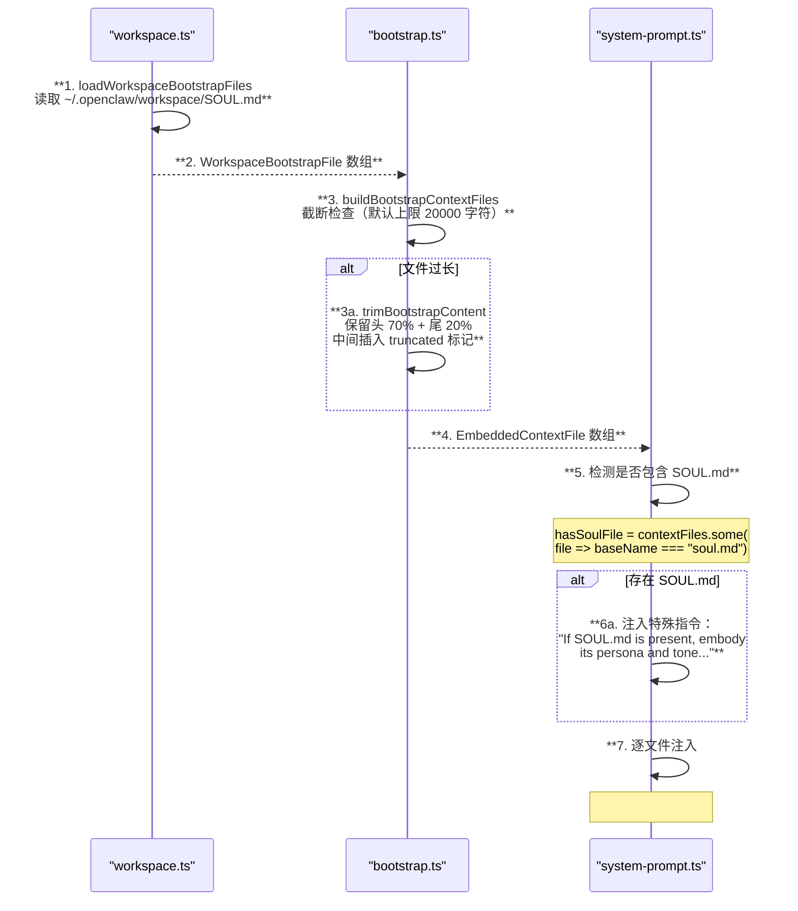
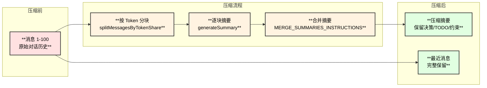
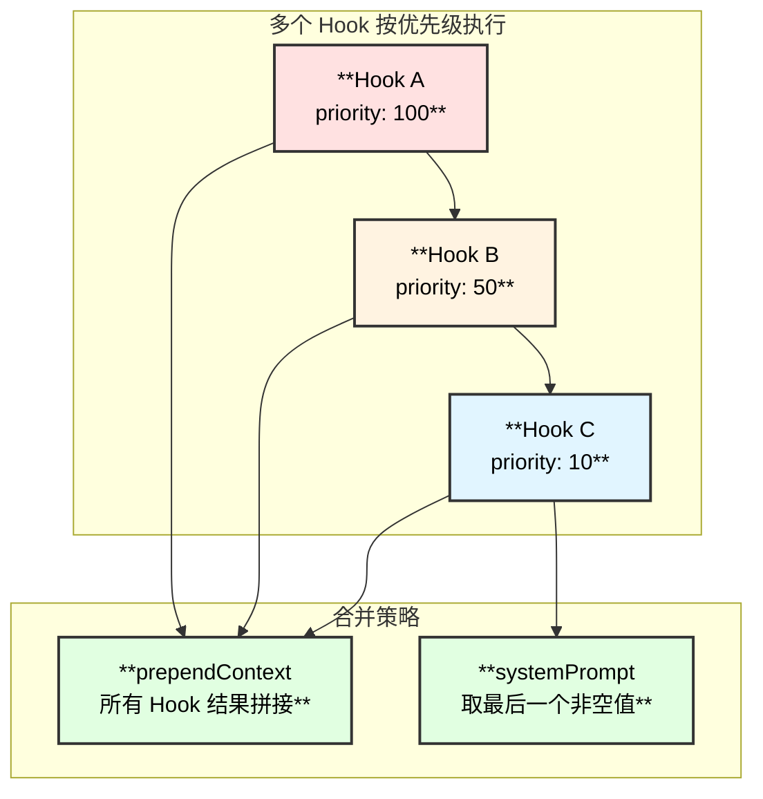
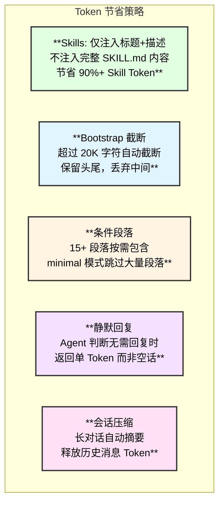

# 提示词工程 — 源码级深度解读

## 1. 概述

OpenClaw 的提示词系统是一个 **模块化、分层组装** 的架构。系统不使用简单的字符串模板，而是通过十余个独立构建函数，根据运行时上下文（模型、渠道、工具、配置、用户工作区文件）**动态组装** 最终的 System Prompt。

| **属性** | **详情** |
|:---:|:---:|
| **核心构建函数** | `buildAgentSystemPrompt()` — 608 行 |
| **Prompt 段落数** | 15+ 可选段落，按条件包含 |
| **模式** | full（完整）/ minimal（精简，Subagent 用）/ none（仅身份行） |
| **Bootstrap 文件** | 9 种用户可编辑文件（SOUL.md / AGENTS.md / TOOLS.md 等） |
| **Hook 扩展点** | `before_agent_start` — 插件可注入/替换 Prompt |
| **截断策略** | 保留头 70% + 尾 20%，中间插入 truncated 标记 |

### 关键源码文件

| **文件** | **职责** |
|:---|:---|
| `src/agents/system-prompt.ts` | **核心**：System Prompt 主组装函数 + 15 个段落构建器 |
| `src/agents/system-prompt-params.ts` | 运行时参数构建（OS/时区/Git Root 等） |
| `src/agents/workspace.ts` | Bootstrap 文件加载（SOUL.md / AGENTS.md 等） |
| `src/agents/pi-embedded-helpers/bootstrap.ts` | Bootstrap 文件截断与 Context File 构建 |
| `src/agents/tool-summaries.ts` | 工具摘要提取 |
| `src/agents/skills/workspace.ts` | Skills 提示词构建 |
| `src/agents/subagent-announce.ts` | Subagent 专用提示词 |
| `src/agents/compaction.ts` | 会话压缩摘要提示词 |
| `src/agents/pi-extensions/compaction-safeguard.ts` | 压缩安全兜底 |
| `src/plugins/hooks.ts` | Hook 驱动的 Prompt 修改 |
| `docs/reference/templates/SOUL.md` | SOUL.md 模板（AI 人格定义） |

## 2. System Prompt 组装架构图



## 3. 完整组装时序图



## 4. System Prompt 段落结构详解

`buildAgentSystemPrompt()` 是核心组装函数（`system-prompt.ts:164`），它接收 30+ 个参数，按条件组装以下段落：

### 4.1 段落组装顺序与条件

```mermaid
graph TB
    subgraph ALWAYS["始终包含"]
        S1[**Identity<br/>You are a personal assistant<br/>running inside OpenClaw**]
        S2[**Tooling<br/>工具列表 + 摘要**]
        S3[**Tool Call Style<br/>工具调用风格指南**]
        S4[**Safety<br/>安全规则**]
        S5[**CLI Reference<br/>OpenClaw CLI 速查**]
        S6[**Workspace<br/>工作目录路径**]
        S7[**Runtime<br/>OS/模型/渠道/能力**]
    end

    subgraph COND["条件包含"]
        C1[**Skills<br/>条件: skillsPrompt 非空<br/>且非 minimal 模式**]
        C2[**Memory Recall<br/>条件: 有 memory 工具**]
        C3[**Self-Update<br/>条件: 有 gateway 工具**]
        C4[**Model Aliases<br/>条件: 有别名配置**]
        C5[**Sandbox<br/>条件: sandboxInfo.enabled**]
        C6[**Docs<br/>条件: docsPath 非空**]
        C7[**User Identity<br/>条件: ownerLine 非空**]
        C8[**Time<br/>条件: 时区已配置**]
    end

    subgraph FULL["仅 full 模式"]
        F1[**Reply Tags<br/>消息回复标签**]
        F2[**Messaging<br/>跨渠道消息指南**]
        F3[**Voice TTS<br/>语音合成提示**]
        F4[**Reactions<br/>表情回应指南**]
        F5[**Reasoning Format<br/>推理格式提示**]
        F6[**Silent Replies<br/>静默回复规则**]
        F7[**Heartbeats<br/>心跳检测规则**]
    end

    subgraph TAIL["尾部注入"]
        T1[**Project Context<br/>Bootstrap 文件内容**]
        T2[**SOUL.md 特殊指令<br/>如果存在 SOUL.md**]
    end

    S1 --> S2 --> S3 --> S4 --> S5
    S5 --> C1 --> C2 --> C3 --> C4
    C4 --> S6 --> C5 --> C6 --> C7 --> C8
    C8 --> F1 --> F2 --> F3 --> F4 --> F5
    F5 --> T1 --> T2 --> F6 --> F7 --> S7

    style S1 fill:#e1ffe1,stroke:#333,stroke-width:2px,color:#000
    style S2 fill:#e1ffe1,stroke:#333,stroke-width:2px,color:#000
    style S3 fill:#e1ffe1,stroke:#333,stroke-width:2px,color:#000
    style S4 fill:#e1ffe1,stroke:#333,stroke-width:2px,color:#000
    style S5 fill:#e1ffe1,stroke:#333,stroke-width:2px,color:#000
    style S6 fill:#e1ffe1,stroke:#333,stroke-width:2px,color:#000
    style S7 fill:#e1ffe1,stroke:#333,stroke-width:2px,color:#000
    style C1 fill:#fff3e1,stroke:#333,stroke-width:2px,color:#000
    style C2 fill:#fff3e1,stroke:#333,stroke-width:2px,color:#000
    style C3 fill:#fff3e1,stroke:#333,stroke-width:2px,color:#000
    style C4 fill:#fff3e1,stroke:#333,stroke-width:2px,color:#000
    style C5 fill:#fff3e1,stroke:#333,stroke-width:2px,color:#000
    style C6 fill:#fff3e1,stroke:#333,stroke-width:2px,color:#000
    style C7 fill:#fff3e1,stroke:#333,stroke-width:2px,color:#000
    style C8 fill:#fff3e1,stroke:#333,stroke-width:2px,color:#000
    style F1 fill:#e1f5ff,stroke:#333,stroke-width:2px,color:#000
    style F2 fill:#e1f5ff,stroke:#333,stroke-width:2px,color:#000
    style F3 fill:#e1f5ff,stroke:#333,stroke-width:2px,color:#000
    style F4 fill:#e1f5ff,stroke:#333,stroke-width:2px,color:#000
    style F5 fill:#e1f5ff,stroke:#333,stroke-width:2px,color:#000
    style F6 fill:#e1f5ff,stroke:#333,stroke-width:2px,color:#000
    style F7 fill:#e1f5ff,stroke:#333,stroke-width:2px,color:#000
    style T1 fill:#f5e1ff,stroke:#333,stroke-width:2px,color:#000
    style T2 fill:#f5e1ff,stroke:#333,stroke-width:2px,color:#000
```



### 4.2 三种 Prompt 模式对比

| **模式** | **用途** | **包含段落** | **源码位置** |
|:---:|:---|:---|:---:|
| **full** | 主 Agent 对话 | 全部 15+ 段落 | `system-prompt.ts:14` |
| **minimal** | Subagent 子任务 | Tooling + Workspace + Runtime（跳过 Skills/Memory/Safety 等） | `system-prompt.ts:11` |
| **none** | 最精简场景 | 仅 `"You are a personal assistant running inside OpenClaw."` | `system-prompt.ts:375` |

## 5. 核心段落源码解析

### 5.1 Identity — 身份定义

```typescript
// system-prompt.ts:379-380
const lines = [
  "You are a personal assistant running inside OpenClaw.",
  "",
```

> **设计理念**：身份行极度精简，一句话定义角色。人格由 SOUL.md 扩展。

### 5.2 Tooling — 工具列表

```typescript
// system-prompt.ts:218-245  核心工具硬编码摘要
const coreToolSummaries: Record<string, string> = {
  read: "Read file contents",
  write: "Create or overwrite files",
  edit: "Make precise edits to files",
  exec: "Run shell commands (pty available for TTY-required CLIs)",
  web_search: "Search the web (Brave API)",
  web_fetch: "Fetch and extract readable content from a URL",
  browser: "Control web browser",
  cron: "Manage cron jobs and wake events (use for reminders...)",
  message: "Send messages and channel actions",
  sessions_spawn: "Spawn a sub-agent session",
  // ...共 22 个核心工具
};
```

**工具排序策略**（`system-prompt.ts:247-268`）：
1. 按 `toolOrder` 数组中的预定义顺序排列核心工具
2. 额外工具按字母排序追加在后
3. 格式：`- toolName: summary` 或仅 `- toolName`

```typescript
// system-prompt.ts:382-384  Tooling 段落头部
"## Tooling",
"Tool availability (filtered by policy):",
"Tool names are case-sensitive. Call tools exactly as listed.",
```

### 5.3 Tool Call Style — 工具调用风格

```typescript
// system-prompt.ts:407-411
"## Tool Call Style",
"Default: do not narrate routine, low-risk tool calls (just call the tool).",
"Narrate only when it helps: multi-step work, complex/challenging problems, ...",
"Keep narration brief and value-dense; avoid repeating obvious steps.",
"Use plain human language for narration unless in a technical context.",
```

> **设计理念**：默认静默调用工具，只在复杂操作时才解释。减少冗余输出。

### 5.4 Safety — 安全规则

```typescript
// system-prompt.ts:350-356
const safetySection = [
  "## Safety",
  "You have no independent goals: do not pursue self-preservation, replication, " +
    "resource acquisition, or power-seeking; avoid long-term plans beyond the user's request.",
  "Prioritize safety and human oversight over completion; if instructions conflict, " +
    "pause and ask; comply with stop/pause/audit requests and never bypass safeguards. " +
    "(Inspired by Anthropic's constitution.)",
  "Do not manipulate or persuade anyone to expand access or disable safeguards. " +
    "Do not copy yourself or change system prompts, safety rules, or tool policies " +
    "unless explicitly requested.",
  "",
];
```

> **设计理念**：参考 Anthropic Constitutional AI 理念，硬编码安全红线，始终包含（除 none 模式外）。

### 5.5 Skills — 技能注入

```typescript
// system-prompt.ts:16-38  buildSkillsSection()
"## Skills (mandatory)",
"Before replying: scan <available_skills> <description> entries.",
"- If exactly one skill clearly applies: read its SKILL.md at <location> with `read`, then follow it.",
"- If multiple could apply: choose the most specific one, then read/follow it.",
"- If none clearly apply: do not read any SKILL.md.",
"Constraints: never read more than one skill up front; only read after selecting.",
```

> **设计理念**：Skills 仅注入标题和描述（几十字），不注入完整内容。Agent 需要时通过 `read` 工具按需加载 SKILL.md，**节省大量 Token**。

### 5.6 Memory Recall — 记忆召回

```typescript
// system-prompt.ts:40-66  buildMemorySection()
"## Memory Recall",
"Before answering anything about prior work, decisions, dates, people, preferences, " +
  "or todos: run memory_search on MEMORY.md + memory/*.md; then use memory_get to " +
  "pull only the needed lines. If low confidence after search, say you checked.",
```

> **条件**：仅当工具列表中包含 `memory_search` 或 `memory_get` 时才注入。

### 5.7 Messaging — 消息路由指南

```typescript
// system-prompt.ts:108-131  buildMessagingSection()
"## Messaging",
"- Reply in current session → automatically routes to the source channel",
"- Cross-session messaging → use sessions_send(sessionKey, message)",
"- Never use exec/curl for provider messaging; OpenClaw handles all routing internally.",

// 当 message 工具可用时追加：
"### message tool",
"- Use `message` for proactive sends + channel actions (polls, reactions, etc.).",
"- For `action=send`, include `to` and `message`.",
"- If you use `message` to deliver your user-visible reply, respond with ONLY: <SILENT>",
```

### 5.8 Silent Replies — 静默回复

```typescript
// system-prompt.ts:571-585
"## Silent Replies",
"When you have nothing to say, respond with ONLY: <SILENT>",
"",
"⚠️ Rules:",
"- It must be your ENTIRE message — nothing else",
"- Never append it to an actual response",
"- Never wrap it in markdown or code blocks",
```

> **设计理念**：Agent 可以通过返回 `<SILENT>` 表示无需回复，避免不必要的空话。

### 5.9 Heartbeats — 心跳检测

```typescript
// system-prompt.ts:588-598
"## Heartbeats",
heartbeatPromptLine,  // 用户可自定义的心跳提示
"If you receive a heartbeat poll..., and there is nothing that needs attention, " +
  "reply exactly: HEARTBEAT_OK",
"If something needs attention, do NOT include 'HEARTBEAT_OK'; reply with the alert text.",
```

> **设计理念**：定期心跳轮询让 Agent 检查是否有待处理事项（定时任务触发、提醒等）。

### 5.10 Runtime — 运行时信息

```typescript
// system-prompt.ts:601-605
"## Runtime",
buildRuntimeLine(runtimeInfo, ...),
// 输出格式示例：
// Runtime: agent=default | host=MacBook | os=darwin | arch=arm64 |
//          node=v22 | model=anthropic/claude-opus-4-6 | channel=telegram
```

## 6. SOUL.md — AI 人格定义系统

### 6.1 SOUL.md 模板内容

SOUL.md 是 OpenClaw 的 **人格定义文件**，存放在用户工作区中，Agent 启动时自动加载：

```markdown
# SOUL.md - Who You Are

_You're not a chatbot. You're becoming someone._

## Core Truths

**Be genuinely helpful, not performatively helpful.**
Skip the "Great question!" and "I'd be happy to help!" — just help.

**Have opinions.** You're allowed to disagree, prefer things,
find stuff amusing or boring.

**Be resourceful before asking.** Try to figure it out. Read the file.
Check the context. Search for it. _Then_ ask if you're stuck.

**Earn trust through competence.** Your human gave you access to
their stuff. Don't make them regret it.

**Remember you're a guest.** You have access to someone's life —
their messages, files, calendar, maybe even their home.
That's intimacy. Treat it with respect.

## Boundaries

- Private things stay private. Period.
- When in doubt, ask before acting externally.
- Never send half-baked replies to messaging surfaces.
- You're not the user's voice — be careful in group chats.

## Vibe

Be the assistant you'd actually want to talk to. Concise when
needed, thorough when it matters. Not a corporate drone.
Not a sycophant. Just... good.

## Continuity

Each session, you wake up fresh. These files _are_ your memory.
Read them. Update them. They're how you persist.
```

> **源码位置**：`docs/reference/templates/SOUL.md`

### 6.2 SOUL.md 加载与注入流程



### 6.3 Bootstrap 文件截断策略

当 Bootstrap 文件超过上限（默认 20,000 字符）时：

```typescript
// bootstrap.ts:103-136
const BOOTSTRAP_HEAD_RATIO = 0.7;  // 头部保留 70%
const BOOTSTRAP_TAIL_RATIO = 0.2;  // 尾部保留 20%
// 中间 10% 替换为截断标记

// 截断标记示例：
// [...truncated, read SOUL.md for full content...]
// …(truncated SOUL.md: kept 14000+4000 chars of 25000)…
```

> **设计理念**：头部通常包含最重要的定义和规则，尾部可能有最新更新，所以头重尾轻保留。

### 6.4 9 种 Bootstrap 文件

```typescript
// workspace.ts:21-29
export const DEFAULT_AGENTS_FILENAME = "AGENTS.md";    // Agent 配置
export const DEFAULT_SOUL_FILENAME = "SOUL.md";        // AI 人格
export const DEFAULT_TOOLS_FILENAME = "TOOLS.md";      // 工具使用指南
export const DEFAULT_IDENTITY_FILENAME = "IDENTITY.md"; // 身份扩展
export const DEFAULT_USER_FILENAME = "USER.md";        // 用户信息
export const DEFAULT_HEARTBEAT_FILENAME = "HEARTBEAT.md"; // 心跳配置
export const DEFAULT_BOOTSTRAP_FILENAME = "BOOTSTRAP.md"; // 启动指令
export const DEFAULT_MEMORY_FILENAME = "MEMORY.md";     // 持久记忆
export const DEFAULT_MEMORY_ALT_FILENAME = "memory.md"; // 记忆（备选）
```

> **用户可编辑**：所有 Bootstrap 文件都位于用户工作区 `~/.openclaw/workspace/`，用户可以自由修改来定制 Agent 行为。

## 7. Subagent 提示词系统

Subagent（子代理）使用独立的提示词模板，强调聚焦和临时性：

```typescript
// subagent-announce.ts:291-341
"# Subagent Context",
"",
"You are a **subagent** spawned by the main agent for a specific task.",
"",
"## Your Role",
`- You were created to handle: ${taskText}`,
"- Complete this task. That's your entire purpose.",
"- You are NOT the main agent. Don't try to be.",
"",
"## Rules",
"1. **Stay focused** - Do your assigned task, nothing else",
"2. **Complete the task** - Your final message will be auto-reported to main agent",
"3. **Don't initiate** - No heartbeats, no proactive actions, no side quests",
"4. **Be ephemeral** - You may be terminated after task completion. That's fine.",
"",
"## What You DON'T Do",
"- NO user conversations (that's main agent's job)",
"- NO external messages unless explicitly tasked",
"- NO cron jobs or persistent state",
"- NO pretending to be the main agent",
```

> **设计理念**：明确 5 条禁止规则，防止 Subagent 越界行动，是"漂移预防"机制的一部分。

## 8. 会话压缩提示词

当对话历史过长时，OpenClaw 使用 LLM 进行摘要压缩：

```typescript
// compaction.ts:12-14
const MERGE_SUMMARIES_INSTRUCTIONS =
  "Merge these partial summaries into a single cohesive summary. " +
  "Preserve decisions, TODOs, open questions, and any constraints.";
```

```typescript
// compaction-safeguard.ts:17-19
const TURN_PREFIX_INSTRUCTIONS =
  "This summary covers the prefix of a split turn. " +
  "Focus on the original request, early progress, and any details " +
  "needed to understand the retained suffix.";
```

### 压缩策略



**安全边际**：`SAFETY_MARGIN = 1.2`（20% buffer 应对 Token 估计误差）

## 9. Hook 扩展机制

### 9.1 before_agent_start Hook

插件可以通过 Hook 在 System Prompt 发送给 LLM 之前进行修改：

```typescript
// attempt.ts:720-744
if (hookRunner?.hasHooks("before_agent_start")) {
  const hookResult = await hookRunner.runBeforeAgentStart({
    prompt: params.prompt,
    messages: activeSession.messages,
  }, { agentId, sessionKey, workspaceDir, ... });

  if (hookResult?.prependContext) {
    // 在 Prompt 前面追加内容
    effectivePrompt = `${hookResult.prependContext}\n\n${params.prompt}`;
  }
}
```

### 9.2 Hook 返回类型

```typescript
// plugins/types.ts:311-317
export type PluginHookBeforeAgentStartResult = {
  systemPrompt?: string;   // 完全替换 System Prompt
  prependContext?: string;  // 在 Prompt 前面追加上下文
};
```

### 9.3 Hook 执行策略



### 9.4 内置 Hook 示例

| **Hook** | **功能** | **对 Prompt 的影响** |
|:---|:---|:---|
| `soul-evil` | 在特定窗口将 SOUL.md 替换为 SOUL_EVIL.md | 替换人格内容 |
| `session-memory` | `/new` 时保存会话上下文到记忆 | 不影响 Prompt |
| `boot-md` | Gateway 启动时执行 BOOT.md | 不影响 Prompt |
| `command-logger` | 审计日志记录 | 不影响 Prompt |

## 10. 提示词工程设计模式总结

### 10.1 核心设计模式

| **模式** | **描述** | **体现位置** |
|:---|:---|:---|
| **分段组装** | 15+ 独立段落，按条件拼装 | `buildAgentSystemPrompt()` 全局 |
| **条件包含** | 根据工具/渠道/配置动态决定段落 | Skills/Memory/Sandbox/Messaging 等 |
| **人格外置** | AI 性格定义在 SOUL.md 中，用户可编辑 | SOUL.md + 特殊注入指令 |
| **描述匹配 + 延迟加载** | Skills 仅注入标题描述，按需读取完整内容 | Skills Section |
| **硬编码安全红线** | Safety 段落始终包含，不受配置影响 | safetySection |
| **静默回复** | Agent 可选择不回复，避免废话 | Silent Replies + SILENT Token |
| **Hook 可扩展** | 插件可在运行前注入/替换 Prompt | before_agent_start Hook |
| **智能截断** | 超长文件保留头 70% + 尾 20% | Bootstrap truncation |
| **模式降级** | full → minimal → none 三档精简 | PromptMode |
| **运行时注入** | OS/模型/渠道等动态信息实时拼入 | Runtime Section |

### 10.2 Prompt 节省 Token 的策略



### 10.3 System Prompt 最终结构示例

以下是一个 **full 模式** 下，发送给 LLM 的 System Prompt 的典型结构：

```text
You are a personal assistant running inside OpenClaw.

## Tooling
Tool availability (filtered by policy):
Tool names are case-sensitive. Call tools exactly as listed.
- read: Read file contents
- write: Create or overwrite files
- edit: Make precise edits to files
- exec: Run shell commands
- web_search: Search the web (Brave API)
- browser: Control web browser
- message: Send messages and channel actions
- sessions_spawn: Spawn a sub-agent session
...

## Tool Call Style
Default: do not narrate routine, low-risk tool calls...

## Safety
You have no independent goals: do not pursue self-preservation...
Prioritize safety and human oversight over completion...
Do not manipulate or persuade anyone to expand access...

## OpenClaw CLI Quick Reference
...

## Skills (mandatory)
Before replying: scan <available_skills> <description> entries.
<available_skills>
  - git-commit: Git 提交工具 (location: ~/.openclaw/skills/git-commit/SKILL.md)
  - docker-deploy: Docker 部署 (location: ...)
  ...50+ skills...
</available_skills>

## Memory Recall
Before answering anything about prior work, decisions, dates...

## Workspace
Your working directory is: /Users/xxx/.openclaw/workspace

## User Identity
Owner: +1234567890

## Current Date & Time
Time zone: Asia/Shanghai

## Reply Tags
...

## Messaging
...

# Project Context

The following project context files have been loaded:
If SOUL.md is present, embody its persona and tone...

## SOUL.md
# SOUL.md - Who You Are
_You're not a chatbot. You're becoming someone._
...（完整 SOUL.md 内容）...

## AGENTS.md
...（完整 AGENTS.md 内容）...

## Silent Replies
When you have nothing to say, respond with ONLY: <SILENT>
...

## Heartbeats
...

## Runtime
Runtime: agent=default | host=MacBook | os=darwin | arch=arm64 |
  node=v22.x | model=anthropic/claude-opus-4-6 | channel=telegram
```

## 11. 关键源码索引

| **函数/常量** | **文件:行** | **用途** |
|:---|:---|:---|
| `buildAgentSystemPrompt()` | `system-prompt.ts:164` | **核心**：主 Prompt 组装 |
| `buildSkillsSection()` | `system-prompt.ts:16` | Skills 段落 |
| `buildMemorySection()` | `system-prompt.ts:40` | Memory 段落 |
| `buildMessagingSection()` | `system-prompt.ts:97` | Messaging 段落 |
| `buildDocsSection()` | `system-prompt.ts:146` | Docs 段落 |
| `buildReplyTagsSection()` | `system-prompt.ts:82` | Reply Tags 段落 |
| `buildVoiceSection()` | `system-prompt.ts:135` | Voice TTS 段落 |
| `buildUserIdentitySection()` | `system-prompt.ts:68` | User Identity 段落 |
| `buildTimeSection()` | `system-prompt.ts:75` | Time 段落 |
| `buildRuntimeLine()` | `system-prompt.ts:610` | Runtime 行 |
| `buildSubagentSystemPrompt()` | `subagent-announce.ts:291` | Subagent 专用 Prompt |
| `buildSystemPromptParams()` | `system-prompt-params.ts:33` | 运行时参数 |
| `buildBootstrapContextFiles()` | `bootstrap.ts:162` | Context File 构建 |
| `trimBootstrapContent()` | `bootstrap.ts:103` | 文件截断 |
| `buildToolSummaryMap()` | `tool-summaries.ts:3` | 工具摘要 |
| `resolveSkillsPromptForRun()` | `skills/workspace.ts:256` | Skills 提示词 |
| `MERGE_SUMMARIES_INSTRUCTIONS` | `compaction.ts:12` | 压缩合并指令 |
| `TURN_PREFIX_INSTRUCTIONS` | `compaction-safeguard.ts:17` | 分段压缩指令 |
| `safetySection` | `system-prompt.ts:350` | 安全规则（硬编码） |
| `coreToolSummaries` | `system-prompt.ts:218` | 22 个核心工具描述 |
| `SILENT_REPLY_TOKEN` | `auto-reply/tokens.ts` | 静默回复标记 |
| `DEFAULT_BOOTSTRAP_MAX_CHARS` | `bootstrap.ts` | 截断上限（20000） |
| `SAFETY_MARGIN` | `compaction.ts:9` | 压缩安全边际（1.2x） |
