# 交互机制与优化分析 — 源码深度解读

## 1. 概述

本文从源码层面回答 OpenClaw Agent 的核心交互机制：思维链框架、任务拆分策略、交互上限、话题分叉识别、历史数据召回，以及对其庞大提示词系统的优化分析。

| **问题** | **结论** |
|:---|:---|
| 思维链框架 | **非 ReAct/CoT** — 使用 Pi Agent Core 的原生 Tool-Use Loop + 可选 Thinking Tags |
| 任务拆分 | **100% LLM 自主决策** — 无框架级 Planner/Orchestrator |
| 单次交互上限 | **无硬性工具调用上限** — 受限于 Context Window（默认 200K Token） |
| 话题分叉识别 | **无算法级话题检测** — 依赖 Session 隔离 + 定时/空闲重置 |
| 历史数据召回 | **Memory 系统** — 向量搜索 + BM25 混合检索，支持跨 Session 索引 |

## 2. 思维链 / 推理框架

### 2.1 不是 ReAct，不是 CoT

OpenClaw **没有实现** ReAct（Reason + Act）或 Chain-of-Thought 框架。它使用的是更原始、更直接的模式：

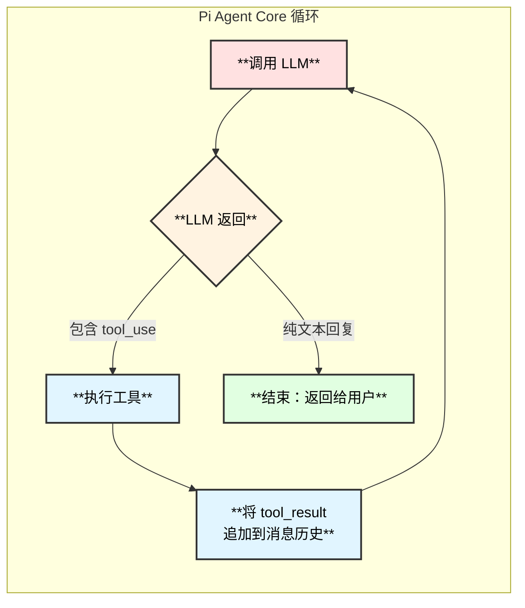

**关键区别**：

| **框架** | **特点** | **OpenClaw 的做法** |
|:---:|:---|:---|
| **ReAct** | 强制 Thought → Action → Observation 三步循环 | 不强制，LLM 自行决定何时调用工具 |
| **CoT** | 在回复前先输出推理链 | 可选的 Thinking Tags，非必须 |
| **Tool-Use Loop** | LLM 原生 Function Calling 循环 | **OpenClaw 的实际做法** |

### 2.2 Tool-Use Loop 执行流程

核心循环由 `@mariozechner/pi-agent-core` 库内部控制，OpenClaw 只是订阅事件：

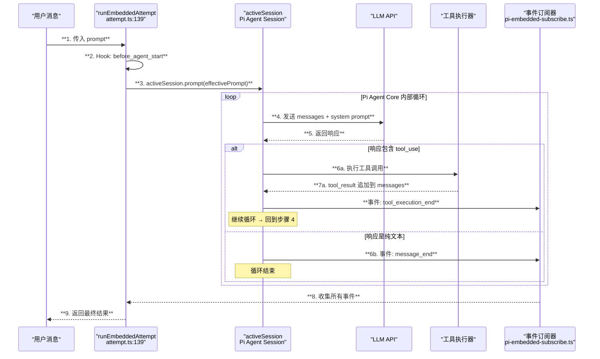

> **源码位置**：`attempt.ts:816-819` 的 `activeSession.prompt(effectivePrompt)` 是唯一的调用点。循环完全由 Pi Agent Core 库控制，OpenClaw 不控制迭代次数。

### 2.3 可选 Thinking Tags

OpenClaw 支持模型级别的 "thinking" 能力，但这不是 CoT——更像是控制模型的内部推理深度：

```typescript
// thinking.ts:1-6
export type ThinkLevel = "off" | "minimal" | "low" | "medium" | "high" | "xhigh";
export type ReasoningLevel = "off" | "on" | "stream";
```

| **ThinkLevel** | **含义** | **适用场景** |
|:---:|:---|:---|
| `off` | 关闭思考 | 简单问答 |
| `minimal` | 最少思考 | 日常对话 |
| `low` | 低度思考 | 一般任务 |
| `medium` | 中度思考 | 复杂推理 |
| `high` | 深度思考 | 困难问题 |
| `xhigh` | 极深思考 | **仅 OpenAI GPT-5.x / Codex** |

**ReasoningLevel** 控制推理过程的可见性：
- `off`：隐藏推理过程（默认）
- `on`：完成后展示推理
- `stream`：实时流式展示推理

> **注意**：这些是利用模型自身的 extended thinking / reasoning 能力，通过 API 参数控制，而非 OpenClaw 自己实现的 CoT 框架。

## 3. 任务拆分机制

### 3.1 100% LLM 自主决策

OpenClaw **没有框架级别的 Planner 或 Orchestrator**。任务拆分完全依赖 LLM 的判断：

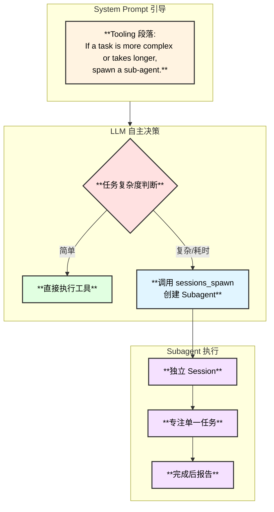

**唯一的"引导"**：System Prompt 中的一句话

```typescript
// system-prompt.ts:405
"If a task is more complex or takes longer, spawn a sub-agent. " +
"It will do the work for you and ping you when it's done."
```

### 3.2 没有 TODO/Plan 提取

- 没有 `extractTasks()` 或 `buildPlan()` 函数
- 没有自动的任务分解/DAG 构建
- 没有 step-by-step 执行器
- 完全信任 LLM 的"直觉"

> **对比**：像 AutoGPT 那样有明确的 Plan → Execute → Review 循环，而 OpenClaw 完全没有。这是一种 **极简主义设计哲学**——"让 LLM 做它擅长的事"。

## 4. 交互次数上限

### 4.1 主 Agent：无硬性上限

**OpenClaw 主 Agent 没有显式的 max tool calls 或 max iterations 限制**。

实际约束来自三个方面：

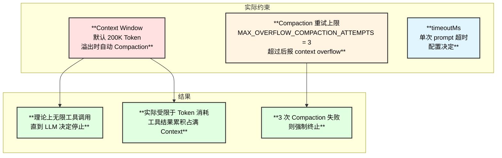

### 4.2 关键数值

| **参数** | **值** | **含义** | **源码位置** |
|:---|:---:|:---|:---|
| `DEFAULT_CONTEXT_TOKENS` | **200,000** | 默认上下文窗口 Token 数 | `defaults.ts:6` |
| `MAX_OVERFLOW_COMPACTION_ATTEMPTS` | **3** | Context 溢出后最多压缩重试次数 | `run.ts:322` |
| `DEFAULT_PI_COMPACTION_RESERVE_TOKENS_FLOOR` | **20,000** | 压缩后至少保留的 Token | `pi-settings.ts:3` |
| `maxPingPongTurns` (Agent-to-Agent) | **5** | 两个 Agent 互发消息的最大轮次 | `sessions-send-helpers.ts:11` |
| `MAX_TOOL_FAILURES` | **8** | 压缩时最多记录的工具失败数 | `compaction-safeguard.ts:20` |
| `SAFETY_MARGIN` | **1.2x** | Token 估计安全边际（20% buffer） | `compaction.ts:9` |

### 4.3 Agent-to-Agent 的硬限制

两个 Agent 之间互发消息有明确的轮次限制：

```typescript
// sessions-send-helpers.ts:10-11
const DEFAULT_PING_PONG_TURNS = 5;
const MAX_PING_PONG_TURNS = 5;  // 硬上限
```

**流程**：

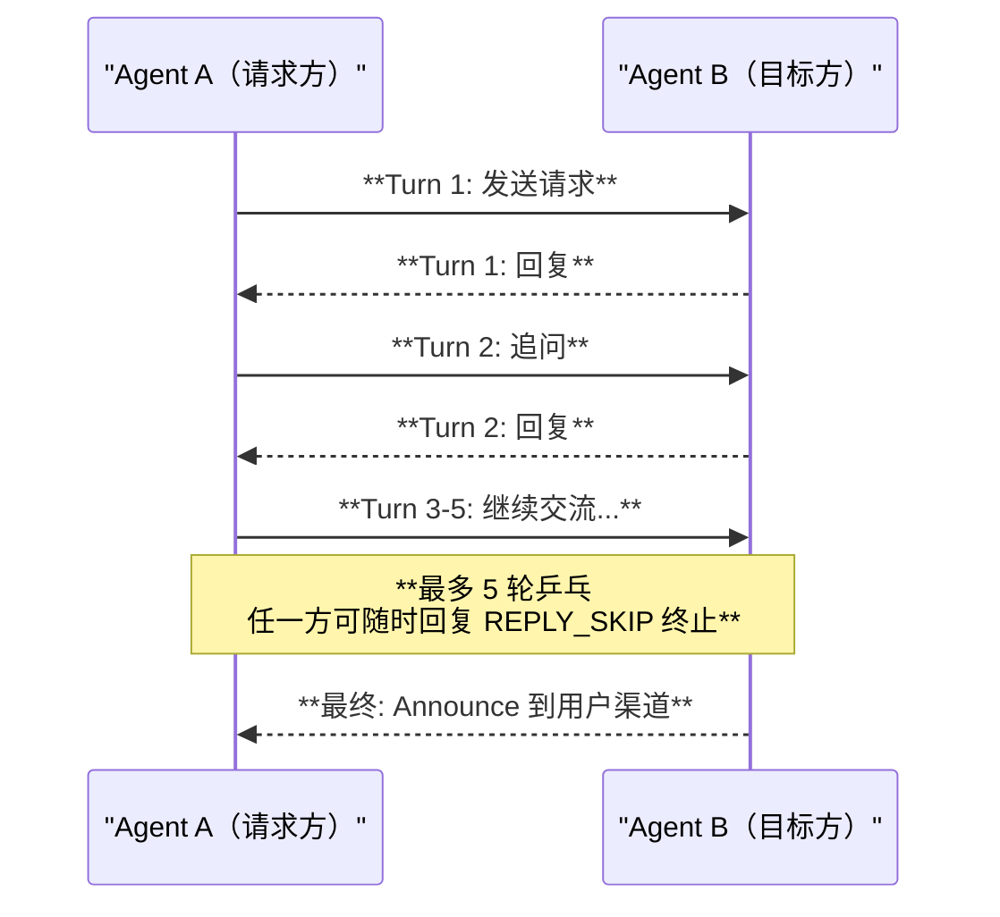

### 4.4 理论单次对话最大工具调用数估算

假设：
- Context Window = 200K Token
- System Prompt ≈ 5K Token
- 每次工具调用 + 结果 ≈ 500-2000 Token
- Compaction 压缩后保留 ≈ 50% 上下文

**粗略估算**：
- 首次填满前：约 **100-400 次工具调用**
- Compaction 后继续：约 **再 100-400 次**
- 3 次 Compaction 后：理论极限约 **300-1200 次工具调用**

> 实际远小于理论值，因为 LLM 通常在完成任务后就停止调用工具。

## 5. 话题分叉识别与数据召回

### 5.1 话题分叉识别：无算法检测

OpenClaw **没有话题分类器或话题分叉检测算法**。它依赖三种机制管理话题：

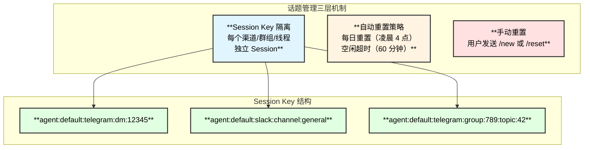

### 5.2 自动 Session 重置策略

```typescript
// reset.ts:133-153  evaluateSessionFreshness()
// 两种独立的重置检测：
const staleDaily = dailyResetAt != null && params.updatedAt < dailyResetAt;
const staleIdle = idleExpiresAt != null && params.now > idleExpiresAt;
// 任一条件成立 → 重置 Session
```

| **策略** | **默认值** | **效果** | **可配置** |
|:---:|:---:|:---|:---:|
| **Daily Reset** | 凌晨 4:00 | 每天定时清空 Session，"新的一天新的开始" | `session.reset.atHour` |
| **Idle Timeout** | 60 分钟 | 闲置超过 60 分钟自动重置 | `session.reset.idleMinutes` |
| **手动 /new** | - | 用户主动重置，触发记忆保存 | `session.reset.triggers` |

### 5.3 /new 命令：重置 + 保存记忆

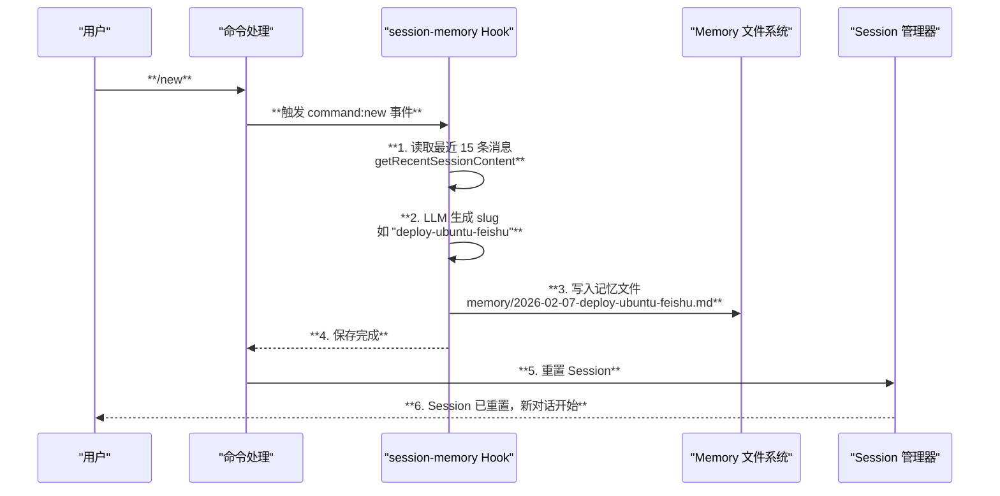

> **源码位置**：`src/hooks/bundled/session-memory/handler.ts:68-192`

### 5.4 Memory 系统：长期记忆召回

这是 OpenClaw 处理"重复很久之前的话题"的核心机制：

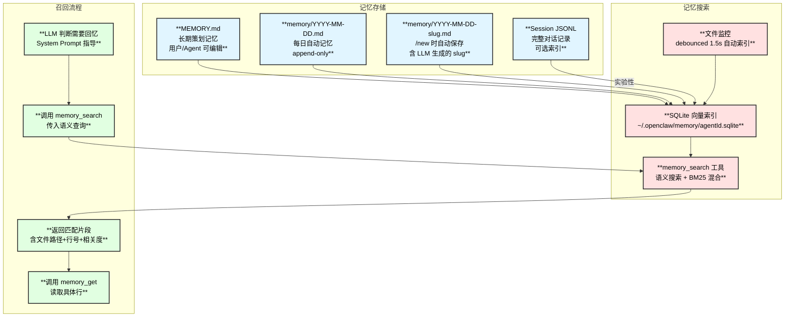

### 5.5 Memory Flush — 压缩前自动保存

当 Session 接近 Compaction 阈值时，系统会自动触发一次"记忆冲刷"：

```typescript
// memory-flush.ts:10-14
const DEFAULT_MEMORY_FLUSH_PROMPT = [
  "Pre-compaction memory flush.",
  "Store durable memories now (use memory/YYYY-MM-DD.md; create memory/ if needed).",
  `If nothing to store, reply with ${SILENT_REPLY_TOKEN}.`,
].join(" ");
```

**流程**：
1. 检测到 Token 使用量接近 Context Window 上限
2. 在正式 Compaction 之前，插入一次"记忆保存轮"
3. Agent 将重要信息写入 `memory/YYYY-MM-DD.md`
4. 然后再执行 Compaction 压缩
5. 这样即使对话被压缩，关键信息已持久化到磁盘

> **可配置**：`agents.defaults.compaction.memoryFlush.enabled`（默认开启）

### 5.6 实验性：跨 Session 搜索

```typescript
// memory-search.ts:100-102
// 当 sources 包含 "sessions" 且 sessionMemory 开启时
// 会索引 Session JSONL 文件用于跨会话搜索

// 配置方式：
// memorySearch.sources = ["memory", "sessions"]
// memorySearch.experimental.sessionMemory = true
```

**索引触发条件**：
- Session JSONL 文件增长超过 100KB
- 或新增超过 50 条消息

## 6. 提示词系统优化分析

### 6.1 当前系统的优势

| **方面** | **评价** |
|:---|:---|
| **模块化** | 15+ 独立段落构建函数，职责清晰 |
| **条件包含** | 只注入需要的段落，避免浪费 |
| **Skills 延迟加载** | 仅注入标题描述，节省 90%+ Token |
| **三档模式** | full/minimal/none 适配不同场景 |
| **Hook 可扩展** | 插件可注入/替换，灵活性强 |

### 6.2 可以优化的方向

#### 问题 1：System Prompt 过于庞大

当前 full 模式的 System Prompt 估计有 **3000-5000 Token**，包含大量固定文本。

**优化建议**：

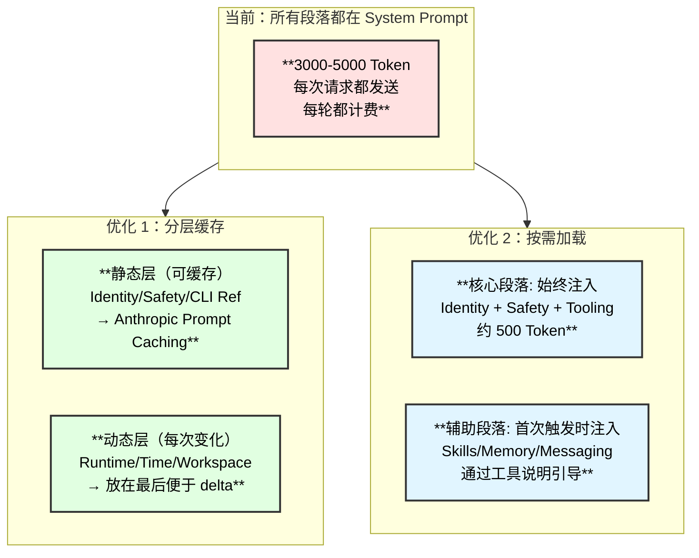

**具体建议**：
1. **利用 Prompt Caching**：将 Safety / CLI Reference / Tool Call Style 等不变的段落放在 System Prompt 开头，利用 Anthropic/OpenAI 的 Prompt Caching 减少重复计费
2. **将操作指南移到 Docs 工具**：CLI Reference、Self-Update 等低频使用的指南，可以像 Skills 一样"按需读取"，而非始终注入
3. **压缩安全规则**：当前 Safety 段落约 150 词，可以压缩到 50 词以内而不损失核心意图

#### 问题 2：Bootstrap 文件可能臃肿

SOUL.md + AGENTS.md + TOOLS.md + USER.md + MEMORY.md 全部注入 Context。

**优化建议**：
1. **摘要注入 + 按需全文**：先注入 Bootstrap 文件的摘要（LLM 生成），需要时再 `read` 全文
2. **更激进的截断**：当前 70%+20% 比例偏保守，可以降到 50%+10%
3. **文件重要性排序**：SOUL.md 始终完整注入，其他文件可根据最后修改时间和相关度排序

#### 问题 3：工具描述重复

每个工具都有一句描述（如 `"Read file contents"`），对于 22 个核心工具约 500 Token。但 LLM 已经通过 Function Calling Schema 获得了完整的工具定义。

**优化建议**：
1. **去除冗余描述**：如果工具的 Function Calling Schema 已经足够清晰，System Prompt 中的描述可以精简为工具名列表
2. **合并工具指南**：将"Tool Call Style"段落与 Tooling 段落合并

#### 问题 4：缺少 Planner/Orchestrator

完全依赖 LLM 自主决策的风险：
- 复杂任务可能被遗忘或漏步
- 没有进度追踪
- Subagent 调度缺乏全局视角

**优化建议**：

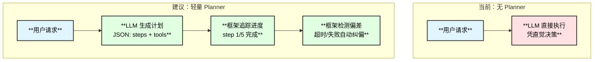

#### 问题 5：话题分叉检测缺失

当用户在同一 Session 中突然切换话题，Agent 不会感知到话题已变化。

**优化建议**：
1. **嵌入相似度检测**：对用户最新消息做 embedding，与最近 N 条消息比较相似度，低于阈值则提示"话题可能已切换"
2. **LLM 自检**：在 System Prompt 中增加指令："如果用户问题与前面的对话明显无关，先说明话题已切换"
3. **自动 Memory 查询**：话题突变时自动调用 `memory_search` 查找相关历史

### 6.3 优化优先级建议

| **优先级** | **优化项** | **收益** | **难度** |
|:---:|:---|:---|:---:|
| P0 | Prompt Caching 排列优化 | 减少 30-50% Token 费用 | 低 |
| P0 | Safety 段落压缩 | 每轮省 100 Token | 低 |
| P1 | 低频指南按需加载 | 省 500-1000 Token/轮 | 中 |
| P1 | Bootstrap 摘要注入 | 省 2000-10000 Token | 中 |
| P2 | 轻量 Planner 机制 | 复杂任务成功率提升 | 高 |
| P2 | 话题分叉检测 | 用户体验提升 | 中 |
| P3 | 工具描述去重 | 省 300 Token/轮 | 低 |

## 7. 完整交互生命周期图

将所有机制串联起来，一个完整的用户交互生命周期：

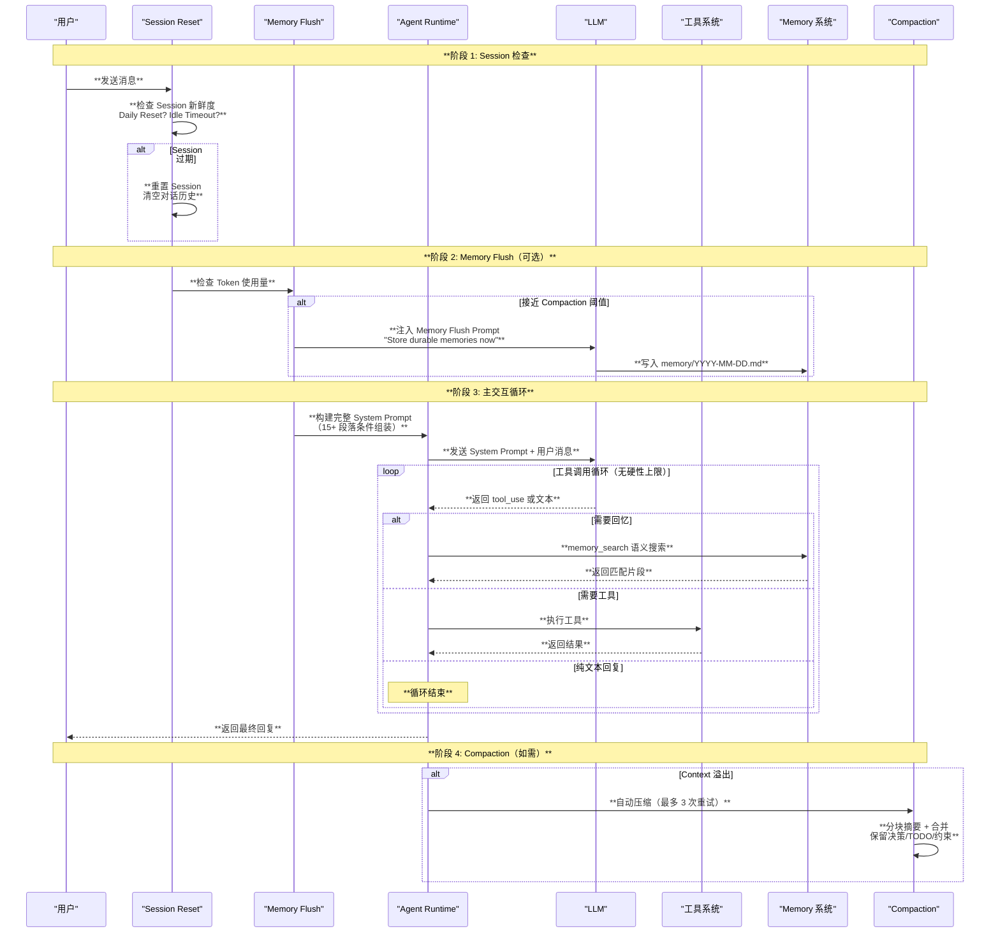

## 8. 关键源码索引

| **功能** | **文件:行** | **关键常量/函数** |
|:---|:---|:---|
| 思维等级定义 | `auto-reply/thinking.ts:1-6` | `ThinkLevel`, `ReasoningLevel` |
| xHigh 模型列表 | `auto-reply/thinking.ts:24-29` | `XHIGH_MODEL_REFS` (GPT-5.x) |
| 主循环入口 | `pi-embedded-runner/run.ts:73` | `runEmbeddedPiAgent()` |
| 单次尝试 | `pi-embedded-runner/run/attempt.ts:139` | `runEmbeddedAttempt()` |
| Prompt 执行 | `pi-embedded-runner/run/attempt.ts:816-819` | `activeSession.prompt()` |
| 溢出重试上限 | `pi-embedded-runner/run.ts:322` | `MAX_OVERFLOW_COMPACTION_ATTEMPTS = 3` |
| 默认 Context Window | `agents/defaults.ts:6` | `DEFAULT_CONTEXT_TOKENS = 200_000` |
| 压缩保留下限 | `agents/pi-settings.ts:3` | `DEFAULT_PI_COMPACTION_RESERVE_TOKENS_FLOOR = 20_000` |
| A2A 乒乓上限 | `tools/sessions-send-helpers.ts:10-11` | `MAX_PING_PONG_TURNS = 5` |
| Session 重置 | `config/sessions/reset.ts:133-153` | `evaluateSessionFreshness()` |
| 重置触发器 | `config/sessions/types.ts:166-167` | `/new`, `/reset` |
| Session Memory Hook | `hooks/bundled/session-memory/handler.ts:68-192` | `saveSessionToMemory` |
| Memory Search | `agents/tools/memory-tool.ts:25-88` | `createMemorySearchTool()` |
| Memory Get | `agents/tools/memory-tool.ts:90-135` | `createMemoryGetTool()` |
| Memory Flush | `auto-reply/reply/memory-flush.ts:10-14` | `DEFAULT_MEMORY_FLUSH_PROMPT` |
| Memory Flush 触发 | `auto-reply/reply/agent-runner-memory.ts:27` | `runMemoryFlushIfNeeded()` |
| 压缩主函数 | `agents/compaction.ts:244-305` | `summarizeInStages()` |
| 压缩安全兜底 | `pi-extensions/compaction-safeguard.ts:161-336` | `compactionSafeguardExtension()` |
| 工具摘要 | `agents/system-prompt.ts:218-245` | `coreToolSummaries` (22 个) |
| 任务引导 | `agents/system-prompt.ts:405` | "spawn a sub-agent" |
