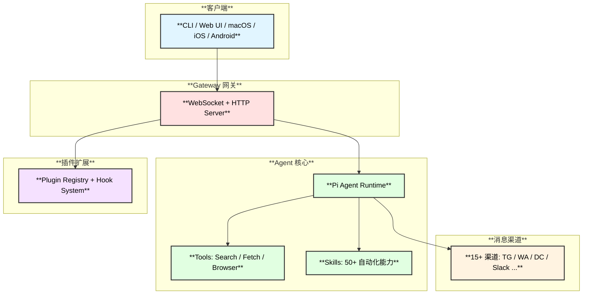

# OpenClaw 架构分析文档

> 基于 OpenClaw v2026.2.6-3 源码的深度架构分析

## 文档目录

| **序号** | **文档** | **内容概要** |
|:---:|:---|:---|
| 01 | [概述与架构](./01-概述与架构.md) | 项目简介、技术栈、整体架构图、目录结构、核心功能一览、部署架构 |
| 02 | [网关与通信协议](./02-网关与通信协议.md) | Gateway WebSocket 架构、连接握手时序图、协议帧结构、Agent 执行时序图 |
| 03 | [Agent 与工具系统](./03-Agent与工具系统.md) | Agent 生命周期、工具注册与执行、会话管理、模型配置 |
| 04 | [网页搜索与浏览器](./04-网页搜索与浏览器.md) | Web Search 实现（Brave/Perplexity）、**API 定价与国内可用性**、Web Fetch、浏览器自动化（**仅 Chromium 内核**）、两种运行模式对比 |
| 05 | [Skills 系统](./05-Skills系统.md) | SKILL.md 格式、多目录发现、资格检查、Agent 集成、50+ 内置 Skills |
| 06 | [插件与扩展系统](./06-插件与扩展系统.md) | Plugin SDK、Extension 结构、Hook 系统、插件生命周期 |
| 07 | [消息路由与频道系统](./07-消息路由与频道系统.md) | 消息流转、Channel Plugin 接口、白名单安全、渠道能力矩阵、**意图识别机制详解** |

## 核心架构概览

| 08 | [多Agent协作与编码能力](./08-多Agent协作与编码能力.md) | Subagent 系统、编码工具集、四层纠偏机制（Prompt 安全护栏/Compaction/Subagent 聚焦/自动修复） |
| 09 | [部署方案-Ubuntu飞书实战](./09-部署方案-Ubuntu飞书实战.md) | Ubuntu Mini 主机部署、**SearXNG 免费搜索原理**（为什么不需要代理）、飞书机器人集成、国内零代理方案 |
|| 10 | [大模型支持](./10-大模型支持.md) | **29+ 提供商全景**、6 种 API 协议、**7 个国内直连**、OAuth 认证扩展、Ollama 本地模型、配置格式详解 |

## 关键设计亮点

### 1. 网页搜索：Search → Fetch → Browse 三层架构
- **web_search** — 关键词搜索（Brave/Perplexity），发现相关 URL
- **web_fetch** — 抓取指定 URL 的可读内容（Readability.js + Markdown）
- **browser** — 完整浏览器自动化（Playwright + CDP），处理复杂交互

### 2. Skills 集成：描述匹配 + 延迟加载
- Skills 以 `SKILL.md` 定义，通过 YAML Frontmatter 声明元数据和依赖
- Agent 在 System Prompt 中仅注入 Skills 列表和描述
- 运行时 Agent 根据用户意图匹配描述 → 用 `read` 工具读取具体 SKILL.md → 按指令执行
- **核心优势**：避免一次性加载所有 Skill 内容，节省 Token

### 3. 插件系统：全能扩展接口
- 通过 `OpenClawPluginApi` 注册 Tools / Hooks / Channels / Providers / HTTP / CLI / Services
- 支持内置、全局、工作区三级插件路径
- Hook 系统提供 14 种生命周期事件，支持顺序和并行两种执行模式

### 4. 意图识别：规则匹配 + LLM 隐式理解（无独立 NLU）
- **无独立 Intent Classification 模型**，不使用传统 NLU
- 斜杠命令（`/new`、`/model`）通过正则/精确匹配处理，提前返回
- 普通文本消息发送给 LLM，由 System Prompt 引导 LLM 自主选择 Skill/工具/直接回复
- 设计哲学：**信任 LLM 的理解能力**，通过结构化 Prompt 引导而非硬编码规则

### 5. 消息路由：统一入站 → Agent → 出站
- 所有渠道消息统一进入 `dispatchInboundMessage`
- 构建标准化 `MsgContext` → 白名单检查 → Session 解析 → Agent 回复 → 渠道投递
- 每个渠道实现 `ChannelPlugin` 接口，通过适配器模式支持差异化能力

### 6. 浏览器自动化：仅 Chromium 内核 + 两种模式
- **仅支持 Chromium 内核浏览器**（Chrome / Edge / Brave / Vivaldi 等），不支持 Firefox/Safari
- Playwright 仅作为 CDP 客户端，通过 `chromium.connectOverCDP()` 连接
- **openclaw 模式**：启动独立隔离浏览器实例，干净环境
- **chrome 模式**：通过 Chrome 扩展中继控制用户现有浏览器，保留登录态和 Cookie

### 7. 大模型支持：29+ 提供商 + 国内直连
- **29+ 种 LLM 提供商**，覆盖 Anthropic / OpenAI / Google / xAI / Mistral 等国际模型
- **7 个国内可直连提供商**：Moonshot、Kimi Coding、MiniMax、Qwen Portal、千帆、小米 MiMo
- **Qwen Portal 免费额度**：每天 2000 次请求，Device Code Flow 授权，国内零障碍
- **Ollama 本地模型**：完全离线运行，自动发现本地模型
- **6 种 API 协议**统一抽象：OpenAI / Anthropic / Google / Bedrock / GitHub Copilot / OAuth
- **5 个 OAuth 认证插件**：免去手动管理 API Key 的麻烦
